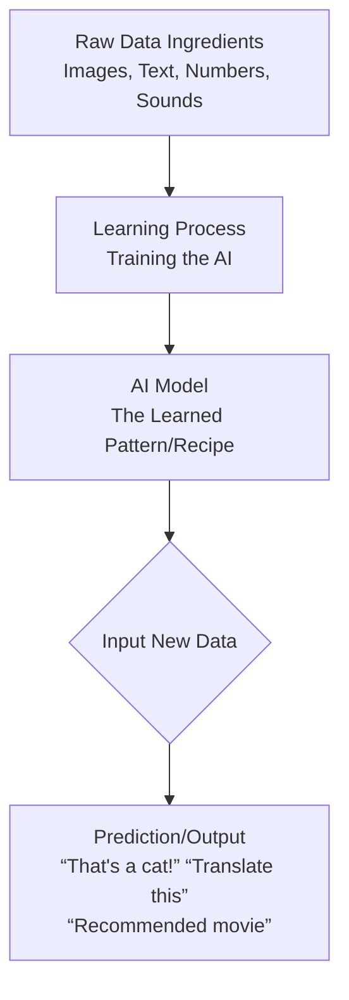
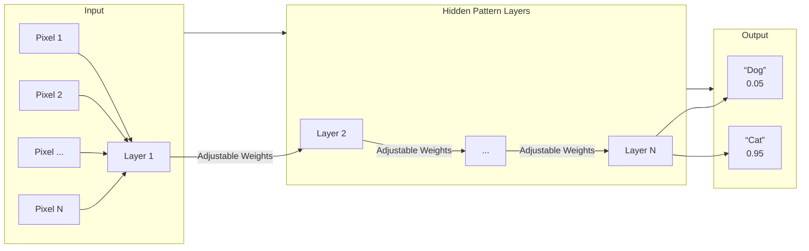
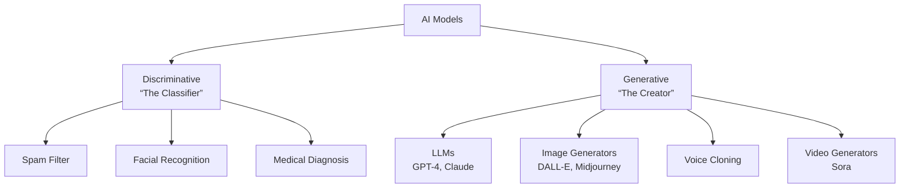
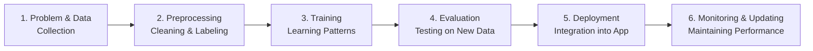

# The Complete Beginner's Guide to AI Models: A Bookish Explanation

## **Part 1: The Core Analogy – The Master Chef's Secret Recipe**

### **Chapter 1: What is an AI Model?**

Imagine you want to create a **Master Chef's Secret Recipe Book** that can automatically predict what delicious dish to make from any ingredients you have in your kitchen. 

You start by showing this "learning book" **thousands of example recipes**:
*   You show it pictures of apples, sugar, and flour, and write "Apple Pie" next to them.
*   You show it images of tomatoes, cheese, and dough, and label it "Pizza."
*   You show it eggs, butter, and milk, and call it "Scrambled Eggs."

You don't write the recipes yourself. Instead, the "book" (which is actually a complex mathematical program) starts to notice **patterns**:
*   "When I see round, red, juicy things (tomatoes) with dough, it often leads to Pizza."
*   "When I see sweet, round, green/red things (apples) with pastry, it often leads to Apple Pie."

After studying **millions of these examples**, the "book" creates its own internal **set of rules and patterns**. This internal, learned structure is what we call an **AI Model**.

**An AI Model is a mathematical file that has learned to recognize patterns and make predictions or decisions based on data it was trained on.** It is the "brain" or "recipe" that an AI system uses to perform its task.

### **Chapter 2: The Difference: AI Program vs. AI Model**

This is a crucial distinction that clarifies much confusion.

*   **An AI Program (or Algorithm):** This is the **learning process itself**. It's the step-by-step instructions for *how* to learn from the data. It's like the **Master Chef's training method**. "Look at 10,000 pictures of cats and dogs. For each one, adjust your internal knobs a little bit when you guess wrong. Repeat until you stop making mistakes."
    *   **Examples:** The **Backpropagation algorithm** (a method for learning from errors) or **Stochastic Gradient Descent** (a strategy for finding patterns).
    *   Think of it as the **recipe for creating a recipe**.

*   **An AI Model:** This is the **final, learned product**. It's the set of adjusted internal "knobs" (called weights and parameters) that resulted *after* the training program finished running on the data. It's the **completed Secret Recipe Book** that is now ready to be used.
    *   **Examples:** The `GPT-4` file, a facial recognition model on your phone, or the recommendation system inside Netflix.
    *   Think of it as the **finished, usable recipe book**.

**In essence:** You run a **Program** (training process) on **Data** (ingredients) to produce a **Model** (the final recipe book).

---

## **Part 2: The Anatomy of an AI Model**

### **Chapter 3: Neurons, Weights, and Layers – The "Brain Cells" of AI**

Most powerful modern AI models are built as **Artificial Neural Networks (ANNs)**, inspired loosely by the human brain.

*   **Neuron (or Node):** The fundamental unit. Imagine it as a tiny **decision-making lightbulb**. It receives one or more inputs, does a small calculation, and decides whether to "light up" (pass a signal forward).

*   **Weight:** The **importance of a connection** between two neurons. It's a number (like 0.7, -1.2, or 0.01). During training, the model constantly adjusts these weights.
    *   **Deep Dive:** If the input is "has whiskers," and the output should be "cat," the model will learn to give the "whiskers" input a very high, positive weight when connected to the "cat" neuron. If the input is "has gills," it will learn to give it a negative or zero weight for the "cat" neuron.

*   **Layer:** Neurons are organized in stacks called layers.
    *   **Input Layer:** This is where you feed the data (e.g., the pixels of an image, the words of a sentence).
    *   **Hidden Layers:** These are the internal, complex layers where the magic of pattern recognition happens. A model with many hidden layers is called a "deep" model, hence **Deep Learning**.
    *   **Output Layer:** This produces the final answer (e.g., "Cat" with 95% confidence, "Dog" with 5%).

### **Chapter 4: Parameters and Training – The Learning Journey**

*   **Parameters:** This is the collection of **all the weights and biases** (another small adjustment factor) in the model. They define what the model has "learned." A model's size is often described by its number of parameters.
    *   **Example:** GPT-3 has 175 billion parameters. Imagine 175 billion tiny dials, each finely tuned during training.

*   **The Training Process (How the Model Learns):**
    1.  **Forward Pass:** The training data (e.g., a picture of a cat) is fed into the input layer. The signal passes through all the layers, weights are applied, and a guess comes out the other end (e.g., "Dog").
    2.  **Calculate Loss (The "Oops!" Meter):** A **loss function** compares the model's guess ("Dog") to the correct answer ("Cat") and produces a number representing how wrong it was—the **loss** or **error**.
    3.  **Backward Pass (Backpropagation):** This is the core of learning. The algorithm works backward through the network, asking: **"Which weights are most responsible for this error?"** It calculates a gradient (a direction to adjust).
    4.  **Optimization (The Adjustment):** An **optimizer** (like a smart adjustment tool) uses this gradient to tweak *all the weights* just a tiny bit in the direction that would reduce the error.
    5.  **Repeat:** Do this for millions of examples, billions of times. With each tiny adjustment, the model's internal weights become better and better at mapping inputs to correct outputs. The "recipe book" is being written.

---

## **Part 3: The Taxonomy of AI Models – Different Tools for Different Jobs**

### **Chapter 5: Discriminative vs. Generative Models**

This is the most important high-level split.

*   **Discriminative Models: The Classifier.**
    *   **Purpose:** To **discriminate between or classify** existing things. They draw boundaries.
    *   **Question they answer:** "What *is* this?"
    *   **Analogy:** A **wine sommelier**. You give them a glass of wine, and they classify it: "This is a 2018 Pinot Noir from Burgundy."
    *   **Examples:**
        *   Is this email spam or not? (Classification)
        *   What object is in this image? (Computer Vision)
        *   Translate this sentence from English to French. (It's classifying the correct French sequence)

*   **Generative Models: The Creator.**
    *   **Purpose:** To **generate new data** that resembles the training data. They learn the underlying distribution of data to create something new.
    *   **Question they answer:** "What *could* this be?" or "What *might come next*?"
    *   **Analogy:** A **master wine maker**. They have learned the patterns of soil, grapes, and fermentation so deeply that they can *create* a new, plausible-tasting wine recipe.
    *   **Examples:**
        *   **GPT-4, Claude:** Generate the next word in a story (creating new text).
        *   **DALL-E, Midjourney:** Generate an image from a text description (creating new images).
        *   **Sora:** Generate a video from a description (creating new videos).

### **Chapter 6: Common Model Architectures (Blueprints)**

These are famous "blueprints" for arranging neurons and layers.

1.  **Large Language Models (LLMs) – e.g., GPT, Claude, Llama**
    *   **Architecture:** Primarily based on the **Transformer**. Its key innovation is the **attention mechanism**, which allows the model to weigh the importance of all words in a sentence when processing any single word.
    *   **What it does:** It is a **generative model** for text. It has learned a statistical representation of language from trillions of words. When you give it a prompt, it predicts the most probable next word, then the next, and so on, generating coherent text.

2.  **Convolutional Neural Networks (CNNs) – The Vision Specialists**
    *   **Architecture:** Uses special **convolutional layers** that act like digital filters scanning an image for features (edges, textures, shapes).
    *   **What it does:** Excellent for **discriminative** image tasks (e.g., "Is this a tumor on the X-ray?") and also forms the backbone of many **generative** image models.

3.  **Diffusion Models – The Modern Image Generators**
    *   **Architecture:** A **generative** process that works by learning to **reverse noise**. It's trained by taking clear images, adding noise step-by-step until they become pure static, and then learning how to reverse that process.
    *   **What it does:** To generate an image, it starts with random static and uses the learned model to "denoise" it step-by-step into a coherent image that matches the text prompt. This is how DALL-E 3 and Midjourney work.

---

## **Part 4: The Lifecycle and Practical Reality of an AI Model**

### **Chapter 7: From Data to Deployment – A Model's Journey**

1.  **Data Collection & Preparation:** The single most critical step. "Garbage in, garbage out." Data is cleaned, labeled (e.g., this image *is* a cat), and split into sets.
2.  **Training:** The computationally intensive process, often requiring powerful GPUs for days or months, where the model learns its parameters.
3.  **Evaluation & Testing:** The trained model is tested on **completely new, unseen data** (the test set) to see if it has truly *generalized* (learned the concept) or merely *memorized* the training data (a flaw called overfitting).
4.  **Deployment & Inference:** The model is packaged and integrated into an application. When you ask ChatGPT a question, you are performing **inference**—using the static, trained GPT-4 model to generate an output based on your new input.
5.  **Fine-tuning:** A pre-trained, general model (like GPT-4) can be further trained on a smaller, specific dataset (e.g., legal documents) to specialize it for a particular task, saving massive amounts of time and compute.

### **Chapter 8: Hallucinations, Bias, and Limits – The Model's Flaws**

An AI model is **not intelligent** in the human sense. It is a **pattern-matching machine**.

*   **Hallucination:** When a generative model (like an LLM) produces confident, plausible-sounding output that is completely fabricated. This happens because it is generating the most statistically likely sequence of words, not retrieving facts from a database.
*   **Bias:** If the training data contains societal biases (e.g., associating "doctor" more with men than women), the model will learn and **amplify** those biases in its outputs.
*   **The Limit:** A model has **no understanding, consciousness, or world model**. It does not "know" anything. It contains patterns and correlations, but not causation or truth.

---

## **Conclusion: The Model as a Reflection of Data**

An AI Model is a **mathematical mirror held up to a vast dataset**. It reflects the patterns, correlations, and—unfortunately—the flaws within that data. It is a powerful, transformative tool for automation, creation, and insight, but it is fundamentally a sophisticated pattern completion engine, not a mind.

Understanding models demystifies AI. It reveals it not as magic, but as a complex engineering discipline centered on data, statistics, and computation. As you interact with AI, remember you are consulting a deeply learned, yet ultimately static, **recipe book of patterns**.