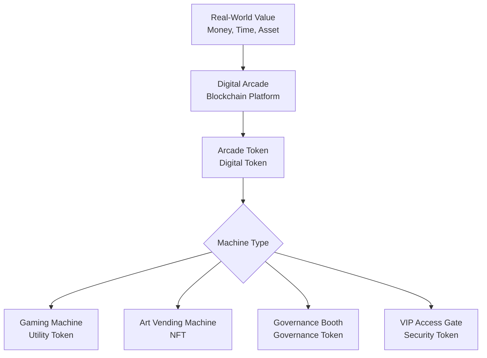
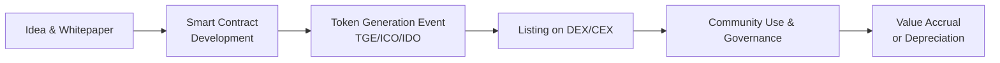

# The Complete Beginner's Guide to Tokens: A Digital Primer

## **Part 1: What is a Token? The Fundamental Concept**

### **Chapter 1: The Core Analogy – Arcade Tokens**

Imagine you walk into a vast, futuristic arcade called the **Digital World Arcade**. This isn't an ordinary arcade with just a few games. It has thousands of different machines: some are games, others are vending machines for digital art, some are voting booths for arcade governance, and others are special machines that let you prove you're a VIP member.

Now, the arcade doesn't accept cash or credit cards directly at the machines. Instead, you must first go to the central exchange counter. Here, you exchange your real-world money for **Arcade Tokens**.

These tokens are special because:
*   **They only work inside this specific arcade.** You can't use them at the pizza shop next door.
*   **They have a unified size and shape.** Every machine, regardless of its purpose, is built to accept this standard token.
*   **Their value is set by the arcade's economy.** The arcade management might decide that 1 token = $1, but that value can change based on demand.
*   **They represent a unit of value and function.** The token itself isn't the *game* or the *digital poster*; it's the key that unlocks access to it.

In the digital realm, **a Token is exactly this: a digital unit of value or function that operates within a specific ecosystem or platform.** It is a representation of *something* on a blockchain.

### **Chapter 2: Tokens vs. Coins – A Critical Distinction**

This is where many beginners get confused. Let's return to our arcade.

*   **A Token** is our **Arcade Token**. It is created *inside* and for the specific purpose of the Digital World Arcade's ecosystem. It relies on the arcade's existing infrastructure (power, token slots, security).
*   **A Coin** (like Bitcoin or Ether) is like the **official currency of the entire city** where the arcade is built. This city currency has its own independent rules, security, and infrastructure (its own power grid, mint, and laws). The arcade itself might be built using the city's utilities.

Technically:
*   **Coins** (e.g., Bitcoin, ETH) are native assets of their own independent **blockchain**. Bitcoin operates on the Bitcoin blockchain. Ether operates on the Ethereum blockchain. They are like "digital cash" for their respective networks, used to pay for transaction fees and security.
*   **Tokens** are digital assets built **on top of an existing blockchain**. Most tokens today are built on blockchains like Ethereum, Solana, or Polygon. They leverage the security and infrastructure of these "host" blockchains. If Ethereum is the operating system (like Windows), tokens are the applications (like Microsoft Word or a game) running on it.

**In short: All coins are tokens in a broad sense, but not all tokens are coins. Coins have their own homeland; tokens are residents living in that homeland.**

---

## **Part 2: The Anatomy of a Token – How Does It Work?**

### **Chapter 3: The Blueprint – Smart Contracts**

A token isn't a physical file like a JPEG. It is a set of **rules and data** recorded on a blockchain. These rules are written into a **Smart Contract**.

Think of the smart contract as the **arcade's central rulebook and ledger**, stored in an unchangeable, transparent vault.

*   **The Rulebook:** It contains all the logic:
    *   "The total number of tokens that will ever exist is 10,000."
    *   "When someone sends tokens to another person, decrease the sender's balance and increase the receiver's balance."
    *   "Only the token owner can spend their tokens."
*   **The Ledger:** It keeps a perfect, public record of every single token and who owns it. It looks like a massive spreadsheet that everyone can see but no one can cheat.

When you "own" a token, you own the right defined by that smart contract. The blockchain records that your unique digital wallet address holds a certain balance of that token or a specific token ID.

### **Chapter 4: The Standards – ERC-20, ERC-721, and More**

How does every machine in our arcade know how to accept a token? Because all tokens follow a **standard design template**.

The most famous templates are on the Ethereum blockchain, called **ERC Standards**.
*   **ERC-20:** The standard for **Fungible Tokens**. This is for tokens that are identical and interchangeable, just like our arcade tokens or traditional money. One $1 bill is equal to any other $1 bill. **DAI, USDC (stablecoins), UNI, LINK** are all ERC-20 tokens. They are perfect for currency, voting rights, or staking.
*   **ERC-721:** The standard for **Non-Fungible Tokens (NFTs)**. This is for tokens that are **unique**. Each token has a different value and properties. In our arcade, this is the ticket you get for winning a "Digital Art" machine. That ticket is for a *specific, one-of-a-kind digital poster*. It cannot be directly exchanged for another poster because they are different. It proves unique ownership of a digital (or physical) asset.
*   **ERC-1155:** A "multi-token" standard that can do both! It's like a vending machine that can dispense both unique collector's items (NFTs) and packs of interchangeable energy drinks (fungible tokens) from the same contract.

These standards ensure that all wallets (like your digital backpack) and exchanges (digital marketplaces) know how to display, transfer, and interact with these tokens properly.

---

## **Part 3: The Purposes of Tokens – Why Do They Exist?**

Tokens are tools. Their function is defined by their creators and community. Let's explore the main categories.

### **Chapter 5: Utility Tokens – The "Fuel" Token**

This is the most common type. A **Utility Token** provides access to a product or service within its native platform.

**Deep Dive:** Think of it as the **electricity meter** or **fuel pump** for the arcade's machines.
*   You need to insert tokens to make the "File Storage" machine work (like **Filecoin**).
*   You need tokens to pay the "Oracle" machine for real-world data (like **Chainlink**).
*   You stake (lock up) your tokens to earn the right to validate transactions on the network and earn rewards (like many **staking tokens**).

They are not primarily designed as investments, but as **digital keys** to a function. Their value is often linked to the usefulness and demand for that function.

### **Chapter 6: Security Tokens – The "Digital Stock" Token**

A **Security Token** is a digital representation of a traditional financial asset like a stock, bond, or real estate investment.

**Deep Dive:** Imagine if the Digital World Arcade wanted to raise money to build a new wing. Instead of going to a bank, it could issue digital **ownership shares** as tokens on the blockchain. If you buy these tokens:
*   You legally own a piece of the arcade.
*   You might be entitled to a share of its profits (dividends).
*   Your ownership is immutably recorded on the blockchain.

These tokens are subject to government securities regulations (like the SEC in the US). They aim to bring the efficiency and transparency of blockchain to traditional finance.

### **Chapter 7: Governance Tokens – The "Voting" Token**

A **Governance Token** gives its holder the right to participate in decision-making for a decentralized project.

**Deep Dive:** Remember the arcade's central rulebook (smart contract)? What if the community wanted to change a rule? For example, "Should we add a new type of game?" or "Should we change the token distribution?"

Holders of governance tokens (like **UNI** for Uniswap or **AAVE** for Aave) can:
*   **Propose** changes to the protocol.
*   **Vote** on proposals made by others.
*   The voting power is often proportional to the number of tokens you hold and choose to "lock up" for voting.

This moves power from a central company to the users of the protocol, enabling **decentralized autonomous organizations (DAOs)**.

### **Chapter 8: Non-Fungible Tokens (NFTs) – The "Deed" Token**

We touched on NFTs under ERC-721. They represent **unique ownership**.

**Deep Dive:** An NFT is less like a JPEG file and more like a **provable, unforgeable digital certificate of authenticity and ownership**, stored on a public ledger.
*   **Digital Art:** The NFT is the signed, numbered certificate for a digital artwork. The image file itself can be copied, but the ownership record cannot.
*   **In-Game Items:** A unique sword in a blockchain game. You truly own it and can potentially sell it on an open marketplace.
*   **Real-World Assets:** A deed to a house, a car title, or a concert ticket could be issued as an NFT to prevent fraud and streamline transfers.

The value comes from **scarcity, authenticity, and the utility/community** the NFT provides access to.

---

## **Part 4: The Token Lifecycle – From Creation to Use**

### **Chapter 9: Creation and Distribution**

1.  **Concept & Whitepaper:** The project team writes a document explaining the token's purpose, technology, and distribution plan.
2.  **Smart Contract Development:** Developers write and rigorously audit the code that will govern the token.
3.  **Initial Distribution:** This is how tokens first enter circulation. Common methods include:
    *   **Initial Coin Offering (ICO)/Token Generation Event (TGE):** A public sale where people buy the new tokens, often with established coins like ETH.
    *   **Initial DEX Offering (IDO):** Launching directly on a decentralized exchange (DEX).
    *   **Airdrops:** Free distribution to early supporters or users of a related platform.
    *   **Mining/Staking Rewards:** Tokens are created as rewards for people who secure the network.

### **Chapter 10: Storage and Interaction – Wallets**

You store tokens in a **cryptocurrency wallet**. Crucially, the tokens are not *inside* your wallet like files in a folder.

**Deep Dive:** Your wallet is a **set of cryptographic keys**.
*   **Private Key:** A master password that proves ownership and allows you to sign transactions. **NEVER SHARE THIS.**
*   **Public Key/Address:** A derived public identifier (like your arcade locker number) that people can send tokens to.

The tokens "live" on the blockchain ledger. Your wallet software simply reads the ledger to show you what your address owns and uses your private key to authorize transfers when you want to "move" them (i.e., update the ledger).

### **Chapter 11: Buying, Selling, and Trading**

*   **Centralized Exchanges (CEXs):** Like traditional stock exchanges (e.g., Coinbase, Binance). You deposit money, place orders, and the exchange matches buyers and sellers. You trust them to hold your tokens (like a bank).
*   **Decentralized Exchanges (DEXs):** Like autonomous, digital bartering squares (e.g., Uniswap, PancakeSwap). They run on smart contracts. You connect your personal wallet and trade directly with other users or liquidity pools, **never giving up custody** of your tokens. This aligns with the "self-custody" ethos of crypto.

---

## **Conclusion: The Token as a Building Block**

Tokens are more than just speculative assets. They are **the fundamental building blocks of a new digital economy**. They allow us to:
*   Represent value in a programmable way.
*   Align incentives between users, builders, and investors.
*   Create transparent and community-owned systems.
*   Digitize ownership of both virtual and physical assets.

Understanding tokens is understanding how value and function are being reimagined for the internet era. As you explore, always remember to **do your own research (DYOR)**, understand the token's *utility*, and never invest more than you can afford to lose. The world of tokens is a powerful toolset, and like any tool, its value depends on the knowledge and responsibility of the one who wields it.