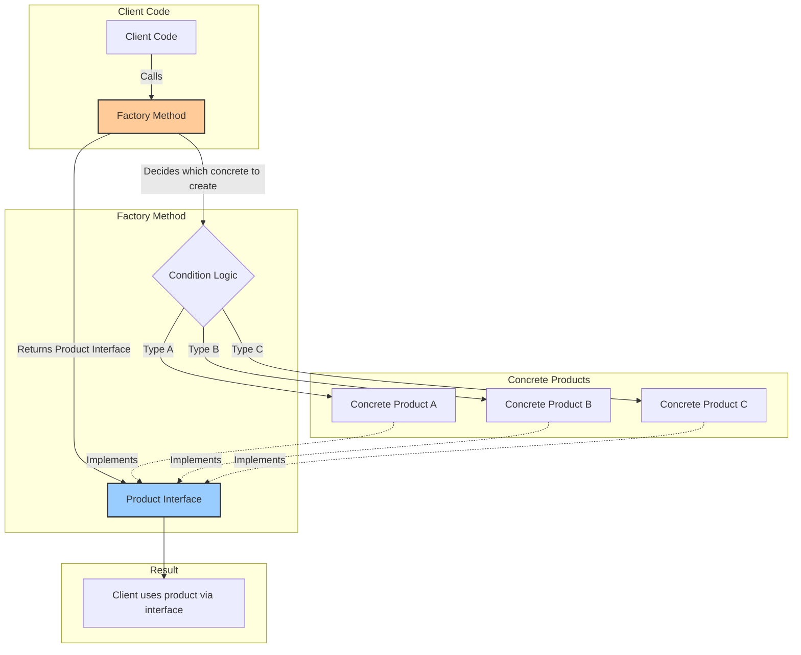
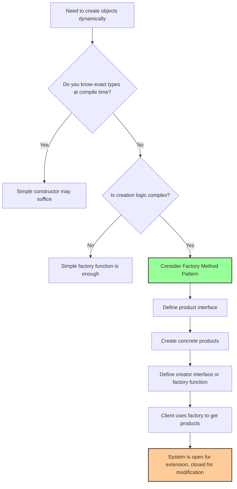

# A Gentle Introduction to the Factory Method Pattern in Go

## Chapter 1: Understanding the Problem That Factory Method Solves

Imagine you are building a simple shipping application. Your application needs to create different types of delivery vehicles—trucks for land delivery, ships for sea delivery, and airplanes for air delivery. In a naive approach, you might write code that looks like this: you check a string or an integer flag, and based on that value, you create a truck, a ship, or an airplane. This approach works for a small program, but as your application grows, you will find yourself writing the same conditional checks in many places throughout your codebase. Every time you add a new vehicle type, you must hunt down every file that creates vehicles and add another condition. This is tedious, error-prone, and violates a fundamental principle of good software design: the Open-Closed Principle, which states that software entities should be open for extension but closed for modification.

The Factory Method Pattern offers an elegant solution to this problem. Instead of scattering object creation logic throughout your code, you centralize it inside a special method known as a factory method. This method is responsible for deciding which concrete type to instantiate and returning it through a common interface. The rest of your code only depends on the interface, not on the specific concrete types. When you need to add a new vehicle type, you simply create a new struct that implements the interface and update the factory method to handle the new type. The existing code that uses the factory method remains untouched.



## Chapter 2: The Core Components of the Factory Method Pattern

To understand the Factory Method Pattern, you must grasp four essential components, each playing a distinct role in the overall design.

The first component is the **Product Interface**. This is a Go interface that declares the operations that all concrete products must provide. In our shipping example, the product interface might be called `Vehicle` and it would declare a method named `Deliver` that returns a string describing how the delivery is performed. The product interface represents the common language that the client code speaks. The client does not care whether it receives a truck or a ship; it only cares that the vehicle can deliver.

The second component is the **Concrete Product**. These are the actual structs that implement the product interface. For our shipping example, we would write a `Truck` struct, a `Ship` struct, and an `Airplane` struct. Each of these structs provides its own implementation of the `Deliver` method. The truck's deliver method might return "Delivering by land in a truck," while the ship's method returns "Delivering by sea in a ship." The concrete products contain the specific behavior that differs between types.

The third component is the **Creator**, which is sometimes called the factory itself. The creator can be a struct that holds a factory method, or it can simply be a standalone function. The creator's responsibility is to declare the factory method that returns objects of type product interface. The creator may also contain other business logic that works with the product interface.

The fourth component is the **Concrete Creator**. This is an optional but common variation where you have different creator structs, each responsible for creating a specific concrete product. For example, you might have a `TruckFactory` struct with a `CreateVehicle` method that always returns a truck, and a `ShipFactory` struct that always returns a ship. This variation is useful when you want to encapsulate creation logic within dedicated factory structs.

## Chapter 3: A Simple Example to Illustrate the Pattern

Let us build a complete, working example from the ground up. We will create a notification system that can send messages through different channels: email, SMS, and push notification. The Factory Method Pattern will allow us to add new notification channels without modifying the existing code that sends notifications.

First, we define the product interface. We will call it `Notification`.

```go
package main

import "fmt"

// Notification is the product interface.
// It declares the method that all concrete notifications must implement.
type Notification interface {
    Send(message string) error
    GetType() string
}
```

Now we create the concrete products. Each struct implements the Notification interface in its own way.

```go
// EmailNotification sends messages via email.
type EmailNotification struct {
    recipientEmail string
}

func (e *EmailNotification) Send(message string) error {
    fmt.Printf("Sending email to %s: %s\n", e.recipientEmail, message)
    return nil
}

func (e *EmailNotification) GetType() string {
    return "email"
}

// SMSNotification sends messages via text message.
type SMSNotification struct {
    phoneNumber string
}

func (s *SMSNotification) Send(message string) error {
    fmt.Printf("Sending SMS to %s: %s\n", s.phoneNumber, message)
    return nil
}

func (s *SMSNotification) GetType() string {
    return "sms"
}

// PushNotification sends messages via mobile push notification.
type PushNotification struct {
    deviceToken string
}

func (p *PushNotification) Send(message string) error {
    fmt.Printf("Sending push notification to device %s: %s\n", p.deviceToken, message)
    return nil
}

func (p *PushNotification) GetType() string {
    return "push"
}
```

Now we create the factory. In its simplest form, a factory can be a plain function that takes a type identifier and returns the appropriate Notification.

```go
// NotificationFactory is a function that creates notifications based on the type.
// This is the heart of the Factory Method Pattern.
func NotificationFactory(notificationType string, recipient string) (Notification, error) {
    switch notificationType {
    case "email":
        return &EmailNotification{recipientEmail: recipient}, nil
    case "sms":
        return &SMSNotification{phoneNumber: recipient}, nil
    case "push":
        return &PushNotification{deviceToken: recipient}, nil
    default:
        return nil, fmt.Errorf("unknown notification type: %s", notificationType)
    }
}
```

Finally, we write the client code that uses the factory. Notice how the client code has no idea about the concrete structs like EmailNotification or SMSNotification. It only knows about the Notification interface.

```go
func main() {
    // The client only knows the type as a string and the recipient address.
    // The factory handles the complex creation logic.
    
    emailNotif, _ := NotificationFactory("email", "user@example.com")
    emailNotif.Send("Your order has been shipped!")
    fmt.Println("Notification type:", emailNotif.GetType())
    
    smsNotif, _ := NotificationFactory("sms", "+1234567890")
    smsNotif.Send("Your verification code is 123456")
    fmt.Println("Notification type:", smsNotif.GetType())
    
    pushNotif, _ := NotificationFactory("push", "device_abc123")
    pushNotif.Send("New message from Alice")
    fmt.Println("Notification type:", pushNotif.GetType())
    
    // Attempting to create an unknown type returns an error
    unknown, err := NotificationFactory("fax", "12345")
    if err != nil {
        fmt.Println("Error:", err)
    } else {
        unknown.Send("This will not be sent")
    }
}
```

When you run this program, you will see output demonstrating that each notification works correctly. The beauty of this approach is that if you later decide to add a Slack notification or a WhatsApp notification, you simply create a new struct that implements the Notification interface and add one more case to the factory's switch statement. None of the existing notification sending code needs to change.

## Chapter 4: The Factory Method Pattern with Struct Creators

Sometimes, you want to organize your factories into structs rather than using standalone functions. This is especially useful when factories themselves need to hold configuration or state. Let us explore this variation using a payment processing example.

Consider an e-commerce application that supports different payment gateways: PayPal, Stripe, and a custom bank processor. Each gateway requires different credentials and has different initialization logic. We can create a factory struct for each gateway type.

```go
package main

import "fmt"

// PaymentProcessor is the product interface.
type PaymentProcessor interface {
    Pay(amount float64) error
    Refund(transactionID string, amount float64) error
}

// PayPalProcessor is a concrete product.
type PayPalProcessor struct {
    clientID     string
    clientSecret string
}

func (p *PayPalProcessor) Pay(amount float64) error {
    fmt.Printf("Processing PayPal payment of $%.2f\n", amount)
    return nil
}

func (p *PayPalProcessor) Refund(transactionID string, amount float64) error {
    fmt.Printf("Refunding $%.2f via PayPal for transaction %s\n", amount, transactionID)
    return nil
}

// StripeProcessor is another concrete product.
type StripeProcessor struct {
    apiKey string
}

func (s *StripeProcessor) Pay(amount float64) error {
    fmt.Printf("Processing Stripe payment of $%.2f\n", amount)
    return nil
}

func (s *StripeProcessor) Refund(transactionID string, amount float64) error {
    fmt.Printf("Refunding $%.2f via Stripe for transaction %s\n", amount, transactionID)
    return nil
}

// PaymentFactory is the creator interface.
type PaymentFactory interface {
    CreateProcessor() PaymentProcessor
}

// PayPalFactory is a concrete creator that produces PayPal processors.
type PayPalFactory struct {
    clientID     string
    clientSecret string
}

func (f *PayPalFactory) CreateProcessor() PaymentProcessor {
    return &PayPalProcessor{
        clientID:     f.clientID,
        clientSecret: f.clientSecret,
    }
}

// StripeFactory is a concrete creator that produces Stripe processors.
type StripeFactory struct {
    apiKey string
}

func (f *StripeFactory) CreateProcessor() PaymentProcessor {
    return &StripeProcessor{
        apiKey: f.apiKey,
    }
}

// Client code that uses the factory.
func ProcessOrder(amount float64, factory PaymentFactory) {
    processor := factory.CreateProcessor()
    processor.Pay(amount)
    // After successful payment, store transaction ID and later we could refund
}

func main() {
    paypalFactory := &PayPalFactory{
        clientID:     "paypal-client-123",
        clientSecret: "paypal-secret-456",
    }
    
    stripeFactory := &StripeFactory{
        apiKey: "stripe-api-key-789",
    }
    
    // Process an order using PayPal
    ProcessOrder(99.95, paypalFactory)
    
    // Process another order using Stripe
    ProcessOrder(49.99, stripeFactory)
}
```

This struct-based approach is more flexible because each factory can carry its own configuration. The `ProcessOrder` function does not need to know which payment gateway it is using; it simply accepts any `PaymentFactory` and calls its `CreateProcessor` method. This is a perfect example of dependency inversion—high-level modules do not depend on low-level modules; both depend on abstractions.

## Chapter 5: Comparing Simple Factory versus Factory Method

Beginners often confuse the Simple Factory pattern (also known as the Static Factory) with the true Factory Method pattern. The distinction is subtle but important. The Simple Factory is what we demonstrated first—a single function with a switch statement that returns different products based on input. This is perfectly adequate for many situations, but it violates the Open-Closed Principle because adding a new product requires modifying the factory function itself.

The true Factory Method pattern, as defined by the Gang of Four, uses inheritance or interfaces to delegate the creation responsibility to subclasses (or in Go, to different structs that implement a factory interface). The example with PayPalFactory and StripeFactory demonstrates the true Factory Method pattern because you can add a new payment gateway by creating a new factory struct that implements the PaymentFactory interface, without modifying any existing factory code.

In practice, Go programmers often use the term "Factory Method" loosely to refer to any function that creates and returns objects. This is acceptable as long as you understand the theoretical distinction. For most real-world Go applications, a simple factory function is sufficient and idiomatic. Reserve the full Factory Method pattern with multiple factory structs for situations where you genuinely need the extensibility.

## Chapter 6: Practical Example from the Real World

Let us build a more substantial example that mirrors a real production scenario. Imagine you are building a data export system that can export reports in multiple formats: CSV, JSON, and Excel. Each format requires different handling of data types, different streaming approaches, and different file headers. Using the Factory Method pattern, we can create an elegant system that is easy to extend.

```go
package main

import (
    "encoding/csv"
    "encoding/json"
    "fmt"
    "os"
)

// DataExporter is the product interface.
type DataExporter interface {
    Export(data [][]string, filename string) error
    GetFormatName() string
}

// CSVExporter exports data as comma-separated values.
type CSVExporter struct{}

func (c *CSVExporter) Export(data [][]string, filename string) error {
    file, err := os.Create(filename + ".csv")
    if err != nil {
        return err
    }
    defer file.Close()
    
    writer := csv.NewWriter(file)
    defer writer.Flush()
    
    for _, record := range data {
        if err := writer.Write(record); err != nil {
            return err
        }
    }
    return nil
}

func (c *CSVExporter) GetFormatName() string {
    return "CSV"
}

// JSONExporter exports data as JSON array.
type JSONExporter struct{}

func (j *JSONExporter) Export(data [][]string, filename string) error {
    // Convert data to a slice of maps for better JSON representation
    var jsonData []map[string]string
    
    if len(data) > 0 {
        headers := data[0]
        for i := 1; i < len(data); i++ {
            record := make(map[string]string)
            for j, value := range data[i] {
                if j < len(headers) {
                    record[headers[j]] = value
                }
            }
            jsonData = append(jsonData, record)
        }
    }
    
    file, err := os.Create(filename + ".json")
    if err != nil {
        return err
    }
    defer file.Close()
    
    encoder := json.NewEncoder(file)
    encoder.SetIndent("", "  ")
    return encoder.Encode(jsonData)
}

func (j *JSONExporter) GetFormatName() string {
    return "JSON"
}

// ExcelExporter would be a more complex implementation using a library like excelize.
// For demonstration, we show a simplified version.
type ExcelExporter struct{}

func (e *ExcelExporter) Export(data [][]string, filename string) error {
    fmt.Printf("Exporting %d records to Excel file %s.xlsx\n", len(data), filename)
    // In a real implementation, you would use a library to create an Excel file
    return nil
}

func (e *ExcelExporter) GetFormatName() string {
    return "Excel"
}

// The factory function that creates exporters.
func ExporterFactory(format string) (DataExporter, error) {
    switch format {
    case "csv":
        return &CSVExporter{}, nil
    case "json":
        return &JSONExporter{}, nil
    case "excel":
        return &ExcelExporter{}, nil
    default:
        return nil, fmt.Errorf("unsupported export format: %s", format)
    }
}

// Client code that uses the factory.
func main() {
    // Sample data: headers and rows
    data := [][]string{
        {"Name", "Age", "City"},
        {"Alice", "30", "New York"},
        {"Bob", "25", "Los Angeles"},
        {"Charlie", "35", "Chicago"},
    }
    
    formats := []string{"csv", "json", "excel"}
    
    for _, format := range formats {
        exporter, err := ExporterFactory(format)
        if err != nil {
            fmt.Println("Error:", err)
            continue
        }
        
        filename := fmt.Sprintf("report_%s", exporter.GetFormatName())
        if err := exporter.Export(data, filename); err != nil {
            fmt.Printf("Failed to export as %s: %v\n", format, err)
        } else {
            fmt.Printf("Successfully exported as %s\n", format)
        }
    }
}
```

This example demonstrates how the Factory Method pattern simplifies the addition of new export formats. If a product manager requests support for XML export next month, you simply create an `XMLExporter` struct that implements the `DataExporter` interface, add one case to the `ExporterFactory` switch statement, and the entire system immediately supports the new format without any other changes.

## Chapter 7: Common Pitfalls and How to Avoid Them

When implementing the Factory Method pattern in Go, beginners often encounter several pitfalls. The most common mistake is returning concrete types instead of interfaces. The entire purpose of the pattern is to hide the concrete types behind an interface, allowing the client code to remain ignorant of the specific implementation. If your factory returns `*EmailNotification` instead of `Notification`, you have defeated the purpose because client code would need to import the package containing the concrete type.

Another frequent error is making the factory method too complex. The factory method should be responsible solely for object creation. It should not contain business logic, validation beyond basic input checks, or calls to external services. If you find yourself needing to perform complex setup for a product, consider creating a builder pattern or a separate initialization method on the product itself.

A third pitfall is the proliferation of factory methods for every tiny variation. Not every creation scenario requires the Factory Method pattern. For simple structs with no variations, a plain constructor function is perfectly acceptable. As the wise engineer knows, patterns are tools to solve specific problems, not decorations to be applied indiscriminately.

The fourth pitfall relates to error handling. When a factory method fails, it should return a meaningful error that helps the caller understand why creation failed. Returning a nil product with a generic "creation failed" error forces the caller to guess what went wrong. Instead, provide specific error types or descriptive messages that indicate whether the failure was due to an unknown type, invalid parameters, or missing dependencies.

## Chapter 8: When to Use the Factory Method Pattern

The Factory Method pattern proves most valuable in specific circumstances. You should consider using it when you do not know ahead of time exactly which concrete types your program will need to create. This situation arises frequently in plugin architectures, where the available types are discovered at runtime through configuration files or user input.

You should also use the Factory Method pattern when you want to localize the knowledge of how products are created. Without a factory, creating a complex product might require many lines of code scattered throughout your application. The factory centralizes this knowledge, making the code more maintainable and reducing duplication.

Another appropriate use case is when you want to give library users a way to extend your code. By defining a product interface and a factory interface, you allow other developers to provide their own implementations of your interfaces without modifying your library's source code. This is how many popular Go libraries, such as database drivers and logging adapters, achieve extensibility.

Finally, use the Factory Method pattern when the creation process involves significant complexity, such as reading configuration files, setting up network connections, or initializing multiple dependent objects. Encapsulating this complexity inside a factory keeps your business logic clean and focused on its primary responsibility.

## Chapter 9: Conclusion

The Factory Method pattern stands as a cornerstone of flexible, maintainable software design. By separating the responsibility of object creation from the responsibility of object usage, it allows programs to adapt to new requirements with minimal disruption. In Go, the pattern manifests naturally through interfaces and functions, fitting seamlessly with the language's pragmatic philosophy. The examples we have explored—notification systems, payment processors, and data exporters—demonstrate how this pattern tames complexity and anticipates future growth. The beginning programmer who masters the Factory Method pattern gains not merely a coding technique but a way of thinking about software as a system of interchangeable, loosely coupled components. Armed with this understanding, you are now prepared to recognize situations where a factory would improve your designs and to implement factories with confidence and clarity.



Thus concludes our gentle exploration of the Factory Method pattern in Go. The reader is encouraged to practice by implementing a simple shape factory that creates circles, rectangles, and triangles, or a logger factory that produces file loggers, console loggers, and network loggers. Through such practice, the pattern becomes not a foreign concept but a familiar tool in the programmer's workshop.