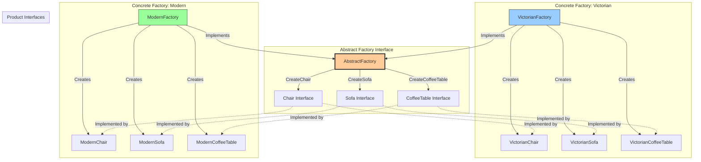
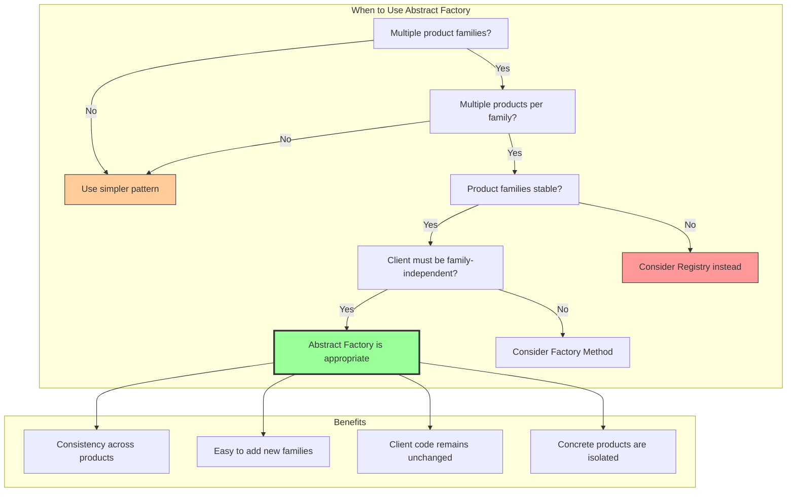

Here is a complete, beginner-friendly explanation of the Abstract Factory Pattern in Go, written in simple, bookish language with detailed diagrams and practical examples.

---

# A Thorough Exploration of the Abstract Factory Pattern in Go

## Chapter 1: The Conceptual Foundation of Abstract Factory

Imagine you are tasked with building a furniture shop application that sells complete furniture sets. A furniture set might include a chair, a sofa, and a coffee table. However, your shop offers multiple distinct styles: Victorian style, Modern style, and Art Deco style. The challenge before you is that a Victorian chair is quite different from a Modern chair, and a Victorian sofa bears little resemblance to an Art Deco sofa. Moreover, you must ensure that when a customer orders a Victorian furniture set, they receive a Victorian chair, a Victorian sofa, and a Victorian coffee table—not a mixture of styles. Mixing styles would produce an aesthetically disastrous result.

The Abstract Factory Pattern provides an elegant solution to exactly this kind of problem. While the Factory Method pattern creates a single family of products (one type of product at a time), the Abstract Factory pattern creates entire families of related products that are designed to work together. In essence, the Abstract Factory is a factory that creates other factories, or more precisely, it is an interface that declares methods for creating each product in a family. Each concrete factory implements these methods to produce products from a specific family, guaranteeing that all products from that factory are compatible with each other.



## Chapter 2: Distinguishing Abstract Factory from Factory Method

The beginner often confuses the Abstract Factory pattern with the Factory Method pattern because both patterns deal with object creation. However, the distinction is crucial and can be understood through a simple analogy. The Factory Method pattern is like having a single machine that can produce different types of screws based on settings you provide. You tell the machine "produce a Phillips head screw" or "produce a flat head screw," and it gives you that screw. The Abstract Factory pattern, on the other hand, is like having separate production lines for different types of products. One production line produces all the components of a Victorian furniture set—chairs, sofas, and tables—while another production line produces all the components of a Modern furniture set.

More formally, the Factory Method pattern focuses on creating a single product, and it uses inheritance or a simple conditional to decide which concrete product to instantiate. The Abstract Factory pattern focuses on creating families of related products, and it uses composition or a factory interface with multiple creation methods. In Go terms, a Factory Method is often just a function that returns an interface, whereas an Abstract Factory is a struct or interface that contains several methods, each returning a different product interface.

The Abstract Factory pattern becomes necessary when you have multiple dimensions of variation. In our furniture example, the two dimensions are product type (chair, sofa, table) and product family (Victorian, Modern, Art Deco). The Abstract Factory pattern allows you to vary either dimension independently, without causing chaos in your client code.

## Chapter 3: A Complete Working Example in Go

Let us build the furniture shop example completely from scratch. We will create all the interfaces, concrete products, and factories, and then demonstrate how a client can use the Abstract Factory pattern to produce consistent furniture sets.

First, we define the product interfaces for each type of furniture.

```go
package main

import "fmt"

// Chair is the product interface for chairs.
type Chair interface {
    SitOn() string
    HasLegs() int
}

// Sofa is the product interface for sofas.
type Sofa interface {
    LieOn() string
    SeatingCapacity() int
}

// CoffeeTable is the product interface for coffee tables.
type CoffeeTable interface {
    PutThingsOn() string
    GetShape() string
}
```

Now we create the Victorian family of products. Each struct implements the appropriate interface in a distinctly Victorian manner.

```go
// VictorianChair implements the Chair interface.
type VictorianChair struct{}

func (v *VictorianChair) SitOn() string {
    return "You sit on a beautifully carved Victorian chair with velvet upholstery."
}

func (v *VictorianChair) HasLegs() int {
    return 4 // Victorian chairs traditionally have four ornate legs
}

// VictorianSofa implements the Sofa interface.
type VictorianSofa struct{}

func (v *VictorianSofa) LieOn() string {
    return "You recline on a luxurious Victorian sofa with deep button tufting."
}

func (v *VictorianSofa) SeatingCapacity() int {
    return 3 // Victorian sofas typically seat three people
}

// VictorianCoffeeTable implements the CoffeeTable interface.
type VictorianCoffeeTable struct{}

func (v *VictorianCoffeeTable) PutThingsOn() string {
    return "You place your tea cup on an ornate Victorian coffee table with mahogany finish."
}

func (v *VictorianCoffeeTable) GetShape() string {
    return "rectangular with curved edges"
}
```

Next, we create the Modern family of products. Notice how the modern products implement the same interfaces but with completely different behavior.

```go
// ModernChair implements the Chair interface.
type ModernChair struct{}

func (m *ModernChair) SitOn() string {
    return "You sit on a sleek Modern chair with minimalistic design and chrome legs."
}

func (m *ModernChair) HasLegs() int {
    return 3 // Modern chairs often have three legs for minimalistic appearance
}

// ModernSofa implements the Sofa interface.
type ModernSofa struct{}

func (m *ModernSofa) LieOn() string {
    return "You lounge on a low-profile Modern sofa with clean lines and neutral fabric."
}

func (m *ModernSofa) SeatingCapacity() int {
    return 4 // Modern sofas often feature extended seating
}

// ModernCoffeeTable implements the CoffeeTable interface.
type ModernCoffeeTable struct{}

func (m *ModernCoffeeTable) PutThingsOn() string {
    return "You place your laptop on a glass-top Modern coffee table with geometric legs."
}

func (m *ModernCoffeeTable) GetShape() string {
    return "circular"
}
```

Now comes the heart of the Abstract Factory pattern: the factory interface and its concrete implementations.

```go
// FurnitureFactory is the abstract factory interface.
// It declares methods for creating each product in the furniture family.
type FurnitureFactory interface {
    CreateChair() Chair
    CreateSofa() Sofa
    CreateCoffeeTable() CoffeeTable
}

// VictorianFurnitureFactory is a concrete factory that creates Victorian furniture.
type VictorianFurnitureFactory struct{}

func (v *VictorianFurnitureFactory) CreateChair() Chair {
    return &VictorianChair{}
}

func (v *VictorianFurnitureFactory) CreateSofa() Sofa {
    return &VictorianSofa{}
}

func (v *VictorianFurnitureFactory) CreateCoffeeTable() CoffeeTable {
    return &VictorianCoffeeTable{}
}

// ModernFurnitureFactory is a concrete factory that creates Modern furniture.
type ModernFurnitureFactory struct{}

func (m *ModernFurnitureFactory) CreateChair() Chair {
    return &ModernChair{}
}

func (m *ModernFurnitureFactory) CreateSofa() Sofa {
    return &ModernSofa{}
}

func (m *ModernFurnitureFactory) CreateCoffeeTable() CoffeeTable {
    return &ModernCoffeeTable{}
}
```

Finally, we write client code that uses the abstract factory. Notice how the client code never mentions any concrete product types like `VictorianChair` or `ModernSofa`. It works entirely through the interfaces.

```go
// FurnitureStore is the client that uses the abstract factory.
// It does not know anything about concrete factories or products.
type FurnitureStore struct {
    factory FurnitureFactory
}

func NewFurnitureStore(factory FurnitureFactory) *FurnitureStore {
    return &FurnitureStore{factory: factory}
}

func (s *FurnitureStore) CreateFurnitureSet() {
    chair := s.factory.CreateChair()
    sofa := s.factory.CreateSofa()
    coffeeTable := s.factory.CreateCoffeeTable()
    
    fmt.Println("Furniture set created:")
    fmt.Printf("  Chair: %s (Legs: %d)\n", chair.SitOn(), chair.HasLegs())
    fmt.Printf("  Sofa: %s (Seats: %d)\n", sofa.LieOn(), sofa.SeatingCapacity())
    fmt.Printf("  Coffee Table: %s (Shape: %s)\n", coffeeTable.PutThingsOn(), coffeeTable.GetShape())
    fmt.Println()
}

func main() {
    // Create a Victorian furniture store
    victorianFactory := &VictorianFurnitureFactory{}
    victorianStore := NewFurnitureStore(victorianFactory)
    fmt.Println("=== Victorian Collection ===")
    victorianStore.CreateFurnitureSet()
    
    // Create a Modern furniture store
    modernFactory := &ModernFurnitureFactory{}
    modernStore := NewFurnitureStore(modernFactory)
    fmt.Println("=== Modern Collection ===")
    modernStore.CreateFurnitureSet()
}
```

When you run this program, you will see that each store produces a consistent set of furniture from its chosen family. The Victorian store produces all Victorian pieces, and the Modern store produces all Modern pieces. There is no risk of accidentally mixing a Victorian chair with a Modern sofa.

## Chapter 4: A Real-World Example with Database Drivers

The furniture example, while illustrative, might feel distant from the problems faced in production Go applications. Let us therefore explore a more realistic scenario: building a data access layer that must work with multiple database systems. Imagine you are writing an application that needs to support both PostgreSQL and MongoDB. Each database has its own way of handling connections, queries, transactions, and result sets. The Abstract Factory pattern allows you to write database-agnostic code that can switch between databases by simply changing the factory used.

```go
package main

import (
    "context"
    "fmt"
)

// Record represents a generic data record.
type Record struct {
    ID    string
    Name  string
    Value int
}

// Connection is the product interface for database connections.
type Connection interface {
    Connect() error
    Close() error
    IsConnected() bool
}

// QueryBuilder is another product interface for building queries.
type QueryBuilder interface {
    Select(table string, fields []string) string
    Insert(table string, record Record) string
    Update(table string, id string, updates map[string]interface{}) string
    Delete(table string, id string) string
}

// Transaction is a third product interface for database transactions.
type Transaction interface {
    Begin() error
    Commit() error
    Rollback() error
}

// DatabaseFactory is the abstract factory interface.
type DatabaseFactory interface {
    CreateConnection() Connection
    CreateQueryBuilder() QueryBuilder
    CreateTransaction() Transaction
}

// --- PostgreSQL Implementation ---
type PostgresConnection struct {
    connected bool
}

func (p *PostgresConnection) Connect() error {
    fmt.Println("PostgreSQL: Establishing connection with host:port and SSL mode")
    p.connected = true
    return nil
}

func (p *PostgresConnection) Close() error {
    fmt.Println("PostgreSQL: Closing connection gracefully")
    p.connected = false
    return nil
}

func (p *PostgresConnection) IsConnected() bool {
    return p.connected
}

type PostgresQueryBuilder struct{}

func (p *PostgresQueryBuilder) Select(table string, fields []string) string {
    return fmt.Sprintf("SELECT %s FROM %s;", joinFields(fields), table)
}

func (p *PostgresQueryBuilder) Insert(table string, record Record) string {
    return fmt.Sprintf("INSERT INTO %s (id, name, value) VALUES ('%s', '%s', %d);",
        table, record.ID, record.Name, record.Value)
}

func (p *PostgresQueryBuilder) Update(table string, id string, updates map[string]interface{}) string {
    return fmt.Sprintf("UPDATE %s SET name = '%s', value = %v WHERE id = '%s';",
        table, updates["name"], updates["value"], id)
}

func (p *PostgresQueryBuilder) Delete(table string, id string) string {
    return fmt.Sprintf("DELETE FROM %s WHERE id = '%s';", table, id)
}

type PostgresTransaction struct {
    active bool
}

func (p *PostgresTransaction) Begin() error {
    fmt.Println("PostgreSQL: BEGIN transaction")
    p.active = true
    return nil
}

func (p *PostgresTransaction) Commit() error {
    fmt.Println("PostgreSQL: COMMIT transaction")
    p.active = false
    return nil
}

func (p *PostgresTransaction) Rollback() error {
    fmt.Println("PostgreSQL: ROLLBACK transaction")
    p.active = false
    return nil
}

type PostgresFactory struct{}

func (p *PostgresFactory) CreateConnection() Connection {
    return &PostgresConnection{}
}

func (p *PostgresFactory) CreateQueryBuilder() QueryBuilder {
    return &PostgresQueryBuilder{}
}

func (p *PostgresFactory) CreateTransaction() Transaction {
    return &PostgresTransaction{}
}

// --- MongoDB Implementation ---
type MongoConnection struct {
    connected bool
}

func (m *MongoConnection) Connect() error {
    fmt.Println("MongoDB: Establishing connection with connection string")
    m.connected = true
    return nil
}

func (m *MongoConnection) Close() error {
    fmt.Println("MongoDB: Closing connection")
    m.connected = false
    return nil
}

func (m *MongoConnection) IsConnected() bool {
    return m.connected
}

type MongoQueryBuilder struct{}

func (m *MongoQueryBuilder) Select(table string, fields []string) string {
    return fmt.Sprintf("db.%s.find({}, {%s})", table, joinFieldsWithOne(fields))
}

func (m *MongoQueryBuilder) Insert(table string, record Record) string {
    return fmt.Sprintf("db.%s.insertOne({_id: '%s', name: '%s', value: %d})",
        table, record.ID, record.Name, record.Value)
}

func (m *MongoQueryBuilder) Update(table string, id string, updates map[string]interface{}) string {
    return fmt.Sprintf("db.%s.updateOne({_id: '%s'}, {$set: {name: '%s', value: %v}})",
        table, id, updates["name"], updates["value"])
}

func (m *MongoQueryBuilder) Delete(table string, id string) string {
    return fmt.Sprintf("db.%s.deleteOne({_id: '%s'})", table, id)
}

type MongoTransaction struct {
    sessionID string
}

func (m *MongoTransaction) Begin() error {
    fmt.Println("MongoDB: Starting transaction session")
    m.sessionID = "session_123"
    return nil
}

func (m *MongoTransaction) Commit() error {
    fmt.Println("MongoDB: Committing transaction")
    m.sessionID = ""
    return nil
}

func (m *MongoTransaction) Rollback() error {
    fmt.Println("MongoDB: Aborting transaction")
    m.sessionID = ""
    return nil
}

type MongoFactory struct{}

func (m *MongoFactory) CreateConnection() Connection {
    return &MongoConnection{}
}

func (m *MongoFactory) CreateQueryBuilder() QueryBuilder {
    return &MongoQueryBuilder{}
}

func (m *MongoFactory) CreateTransaction() Transaction {
    return &MongoTransaction{}
}

// --- Helper Functions ---
func joinFields(fields []string) string {
    result := ""
    for i, f := range fields {
        if i > 0 {
            result += ", "
        }
        result += f
    }
    return result
}

func joinFieldsWithOne(fields []string) string {
    result := ""
    for i, f := range fields {
        if i > 0 {
            result += ", "
        }
        result += f + ": 1"
    }
    return result
}

// DatabaseLayer is the client that uses the abstract factory.
type DatabaseLayer struct {
    factory DatabaseFactory
    conn    Connection
}

func NewDatabaseLayer(factory DatabaseFactory) *DatabaseLayer {
    return &DatabaseLayer{
        factory: factory,
    }
}

func (d *DatabaseLayer) Initialize() error {
    d.conn = d.factory.CreateConnection()
    return d.conn.Connect()
}

func (d *DatabaseLayer) Close() error {
    return d.conn.Close()
}

func (d *DatabaseLayer) InsertRecord(table string, record Record) {
    queryBuilder := d.factory.CreateQueryBuilder()
    query := queryBuilder.Insert(table, record)
    fmt.Printf("Executing: %s\n", query)
}

func (d *DatabaseLayer) PerformTransaction(table string, record Record) {
    tx := d.factory.CreateTransaction()
    tx.Begin()
    
    // Perform multiple operations
    queryBuilder := d.factory.CreateQueryBuilder()
    insertQuery := queryBuilder.Insert(table, record)
    fmt.Printf("Executing: %s\n", insertQuery)
    
    updateQuery := queryBuilder.Update(table, record.ID, map[string]interface{}{
        "name":  record.Name + "_updated",
        "value": record.Value + 100,
    })
    fmt.Printf("Executing: %s\n", updateQuery)
    
    tx.Commit()
}

func main() {
    fmt.Println("=== Working with PostgreSQL ===")
    postgresLayer := NewDatabaseLayer(&PostgresFactory{})
    postgresLayer.Initialize()
    postgresLayer.InsertRecord("users", Record{ID: "1", Name: "Alice", Value: 100})
    postgresLayer.PerformTransaction("users", Record{ID: "2", Name: "Bob", Value: 200})
    postgresLayer.Close()
    
    fmt.Println("\n=== Working with MongoDB ===")
    mongoLayer := NewDatabaseLayer(&MongoFactory{})
    mongoLayer.Initialize()
    mongoLayer.InsertRecord("users", Record{ID: "1", Name: "Alice", Value: 100})
    mongoLayer.PerformTransaction("users", Record{ID: "2", Name: "Bob", Value: 200})
    mongoLayer.Close()
}
```

This database example powerfully demonstrates the value of the Abstract Factory pattern. The `DatabaseLayer` client code is completely unaware of whether it is talking to PostgreSQL or MongoDB. It simply calls methods on the factory interfaces. Adding support for MySQL or Cassandra would require nothing more than creating a new factory struct and its associated product implementations, with zero changes to the `DatabaseLayer` code.

## Chapter 5: Advanced Topics and Variations

The Abstract Factory pattern, while powerful, has several advanced considerations that the production engineer must understand. The first consideration is the complexity of adding new products. In our furniture example, adding a new product type, such as a bookshelf, would require modifying the abstract factory interface to add a `CreateBookshelf` method, and then implementing that method in every concrete factory. This is a significant drawback if product types change frequently. However, in well-designed domains, product families are relatively stable.

The second consideration is the use of the Builder pattern in conjunction with Abstract Factory. When product creation involves numerous parameters or complex initialization, you might combine Abstract Factory with Builder. The factory would return a builder configured for a particular family, and the client would then use that builder to construct the final product.

The third consideration is the implementation of a registry of factories. Instead of hardcoding which factory to use, you can maintain a map of factory names to factory instances. This allows you to select a factory at runtime based on configuration files or user input. Here is a brief illustration:

```go
var factoryRegistry = map[string]FurnitureFactory{
    "victorian": &VictorianFurnitureFactory{},
    "modern":    &ModernFurnitureFactory{},
}

func GetFurnitureFactory(style string) (FurnitureFactory, error) {
    factory, exists := factoryRegistry[style]
    if !exists {
        return nil, fmt.Errorf("unknown furniture style: %s", style)
    }
    return factory, nil
}

// In your main function
func main() {
    style := os.Getenv("FURNITURE_STYLE") // "victorian" or "modern"
    factory, err := GetFurnitureFactory(style)
    if err != nil {
        panic(err)
    }
    store := NewFurnitureStore(factory)
    store.CreateFurnitureSet()
}
```

## Chapter 6: Common Pitfalls and Their Remedies

The Abstract Factory pattern introduces several pitfalls that can confuse the beginning engineer. The most common pitfall is creating an abstract factory interface that is too broad, forcing all concrete factories to implement methods that do not make sense for them. If you have a family of products that includes a product that only exists in one family, you should reconsider your design. Perhaps that product belongs in a separate factory, or perhaps you need to refactor your product hierarchy.

Another pitfall is over-engineering. If you only have one family of products, or if you have families but only one product type, the Abstract Factory pattern is unnecessarily complex. A simple factory function or the Factory Method pattern would suffice. The Abstract Factory pattern shines precisely when you have multiple families and multiple product types within each family.

A third pitfall is leaking concrete product details through the abstract factory interface. All product creation methods should return interface types, not concrete types. Returning a concrete type like `*VictorianChair` couples the client to the concrete family, defeating the purpose of the abstract factory.

The fourth pitfall is related to testing. Testing code that uses an abstract factory is straightforward because you can create a mock factory that returns mock products. However, testing the concrete factories themselves requires ensuring that they produce correctly configured products. Write dedicated tests for each concrete factory, verifying that the products they create meet the required specifications.

## Chapter 7: When to Use Abstract Factory

The discerning engineer should reach for the Abstract Factory pattern when three conditions hold true. First, your system must be independent of how its products are created, composed, or represented. Second, you need to work with multiple families of related products, and you want to enforce consistency among products from the same family. Third, you plan to add new families of products in the future, but you do not anticipate adding new product types frequently.

Concrete scenarios that call for Abstract Factory include cross-platform user interface toolkits (Windows factory, Mac factory, Linux factory each producing buttons, windows, scrollbars), game development where different level themes produce theme-appropriate enemies, obstacles, and power-ups, and cloud provider abstraction layers (AWS factory, Azure factory, GCP factory each producing compute instances, storage buckets, message queues).

When these conditions are not met, a simpler creational pattern is usually more appropriate. The Factory Method pattern suffices for a single family of products. The Builder pattern suffices for complex objects regardless of families. The Prototype pattern suffices when objects can be cloned rather than created from scratch.

## Chapter 8: Conclusion

The Abstract Factory pattern stands as a testament to the power of abstraction in software design. By encapsulating families of related products behind a common interface, it liberates client code from concrete dependencies and enables graceful evolution as new families are added. The pattern is particularly well-suited to Go's interface system, which provides exactly the mechanism needed to declare abstract factories and products. Through the furniture example and the database example, we have seen how the pattern promotes consistency, reduces coupling, and simplifies maintenance. The beginning programmer who masters the Abstract Factory pattern gains the ability to write code that can adapt to entirely new contexts without rewriting existing logic—a skill that distinguishes the novice from the expert. Armed with this understanding, you are now prepared to recognize opportunities for applying Abstract Factory in your own projects and to implement factories that stand the test of changing requirements.



Thus concludes our comprehensive examination of the Abstract Factory pattern in Go. The reader is encouraged to practice by implementing a cross-platform GUI factory that creates buttons, text boxes, and checkboxes for Windows, Mac, and Linux, or a game enemy factory that creates different types of enemies for forest, desert, and ice levels. Through such practice, the Abstract Factory pattern will become a trusted tool in your design repertoire.