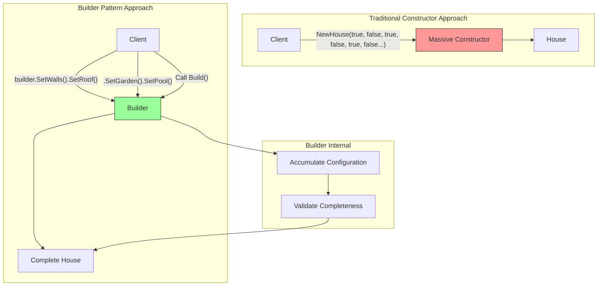
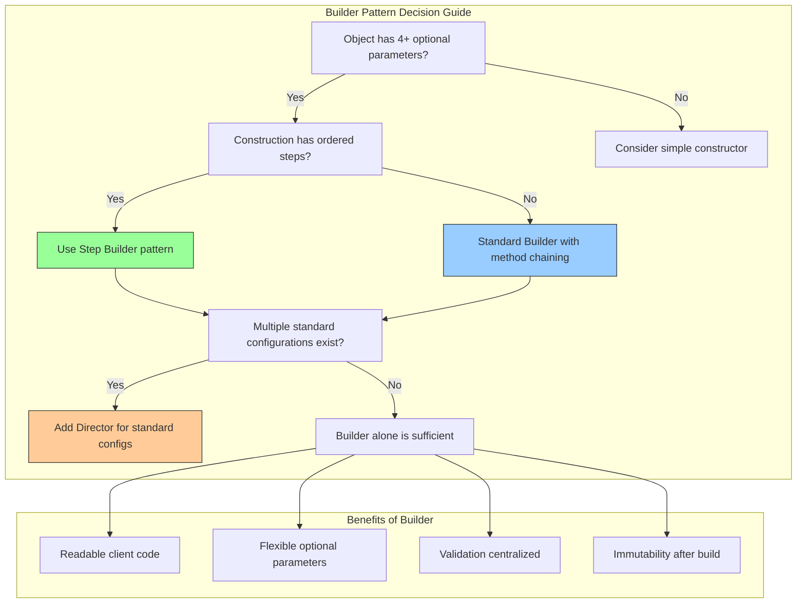

Here is a complete, beginner-friendly explanation of the Builder Pattern in Go, written in simple, bookish language with detailed diagrams and practical examples.

---

# A Comprehensive Guide to the Builder Pattern in Go

## Chapter 1: Understanding the Problem That Builder Pattern Solves

Imagine you are tasked with constructing a complex house. A simple house might have four walls, a door, and a roof. But a truly magnificent house could have a swimming pool, a garden, a garage, a fireplace, a home theater system, solar panels, and a security system. Now imagine that each of these features is optional, and they can be added in any order. Furthermore, the construction process requires careful coordination: the foundation must be laid before the walls, and the roof must be added before the solar panels. If you attempted to create a single constructor function that accepted thirty boolean parameters to represent every possible feature, you would quickly drive yourself and any programmer who uses your code to madness. This anti-pattern is known as the telescoping constructor problem.

The Builder Pattern offers an elegant solution to this construction complexity. Instead of providing a single massive constructor, the Builder Pattern separates the construction of a complex object from its representation. A builder object accumulates the desired features step by step, and only when the client calls a final `Build` method does the builder construct the complete object. This approach allows the same construction process to create different representations of the object, and it makes the client code readable and self-documenting. Each call to a builder method clearly indicates what feature is being added, eliminating the confusion of boolean parameters.



## Chapter 2: The Core Components of the Builder Pattern

To fully grasp the Builder Pattern, one must understand its four essential components, each playing a distinct role in the construction process.

The first component is the **Product**. This is the complex object being constructed. In our example, the product would be a `House` struct with many optional fields. The product typically has no logic related to its own construction; it is a plain data container, often called a Data Transfer Object or a Plain Old Go Struct. The product should have a private constructor or be unexported to ensure that clients can only create it through the builder.

The second component is the **Builder Interface**. This interface declares the construction steps that are common to all builders. For a house, the builder interface might declare methods like `BuildWalls()`, `BuildRoof()`, `AddGarden()`, `AddPool()`, and finally `Build()`. The builder interface allows the same construction process to be used with different concrete builders, a feature known as the Director pattern which we will explore later.

The third component is the **Concrete Builder**. This is a struct that implements the builder interface. It maintains an internal representation of the product under construction, accumulating the configuration as methods are called. The concrete builder also contains the logic for validating that the construction is complete and in a valid state before returning the final product.

The fourth component is the **Director**. This optional component orchestrates the construction process by calling builder methods in a specific order to create a standard product configuration. For example, a `HouseDirector` might have a method called `BuildStandardHouse` that calls `BuildWalls()`, then `BuildRoof()`, then `BuildDoor()`, but not `AddPool()`. A different method, `BuildLuxuryHouse`, would include additional steps. The director is useful when you have predefined configurations that are reused across your application.

## Chapter 3: A Simple Builder Example Without Director

Let us begin with a straightforward implementation of the Builder Pattern without a director, as this is the most common usage pattern in Go. We will construct a `Computer` struct that represents a custom-built personal computer with many optional components.

```go
package main

import "fmt"

// Computer is the product that we want to build.
// It is a complex object with many optional components.
type Computer struct {
    CPU         string
    GPU         string
    RAM         string
    Storage     string
    Motherboard string
    PowerSupply string
    Cooling     string
    HasWiFi     bool
    HasBluetooth bool
    RGBLighting  bool
}

// String implements the fmt.Stringer interface for pretty printing.
func (c *Computer) String() string {
    return fmt.Sprintf(`
Computer Configuration:
  CPU: %s
  GPU: %s
  RAM: %s
  Storage: %s
  Motherboard: %s
  Power Supply: %s
  Cooling: %s
  WiFi: %v
  Bluetooth: %v
  RGB Lighting: %v
`, c.CPU, c.GPU, c.RAM, c.Storage, c.Motherboard, c.PowerSupply, c.Cooling,
        c.HasWiFi, c.HasBluetooth, c.RGBLighting)
}

// ComputerBuilder is the builder that constructs Computer objects.
type ComputerBuilder struct {
    computer Computer
}

// NewComputerBuilder creates a new builder instance with default values.
func NewComputerBuilder() *ComputerBuilder {
    return &ComputerBuilder{
        computer: Computer{
            CPU:         "Default Intel i3",
            GPU:         "Integrated Graphics",
            RAM:         "4GB",
            Storage:     "256GB HDD",
            Motherboard: "Standard Motherboard",
            PowerSupply: "300W",
            Cooling:     "Standard Fan",
            HasWiFi:     false,
            HasBluetooth: false,
            RGBLighting:  false,
        },
    }
}

// SetCPU sets the CPU component.
func (b *ComputerBuilder) SetCPU(cpu string) *ComputerBuilder {
    b.computer.CPU = cpu
    return b // Return the builder for method chaining
}

// SetGPU sets the GPU component.
func (b *ComputerBuilder) SetGPU(gpu string) *ComputerBuilder {
    b.computer.GPU = gpu
    return b
}

// SetRAM sets the RAM size.
func (b *ComputerBuilder) SetRAM(ram string) *ComputerBuilder {
    b.computer.RAM = ram
    return b
}

// SetStorage sets the storage device.
func (b *ComputerBuilder) SetStorage(storage string) *ComputerBuilder {
    b.computer.Storage = storage
    return b
}

// SetMotherboard sets the motherboard model.
func (b *ComputerBuilder) SetMotherboard(motherboard string) *ComputerBuilder {
    b.computer.Motherboard = motherboard
    return b
}

// SetPowerSupply sets the power supply unit.
func (b *ComputerBuilder) SetPowerSupply(powerSupply string) *ComputerBuilder {
    b.computer.PowerSupply = powerSupply
    return b
}

// SetCooling sets the cooling system.
func (b *ComputerBuilder) SetCooling(cooling string) *ComputerBuilder {
    b.computer.Cooling = cooling
    return b
}

// EnableWiFi adds WiFi capability.
func (b *ComputerBuilder) EnableWiFi() *ComputerBuilder {
    b.computer.HasWiFi = true
    return b
}

// EnableBluetooth adds Bluetooth capability.
func (b *ComputerBuilder) EnableBluetooth() *ComputerBuilder {
    b.computer.HasBluetooth = true
    return b
}

// EnableRGBLighting adds RGB lighting for gaming aesthetics.
func (b *ComputerBuilder) EnableRGBLighting() *ComputerBuilder {
    b.computer.RGBLighting = true
    return b
}

// Build returns the final Computer product.
// This method can also include validation logic.
func (b *ComputerBuilder) Build() (*Computer, error) {
    // Perform validation before returning the product
    if b.computer.CPU == "" {
        return nil, fmt.Errorf("CPU cannot be empty")
    }
    if b.computer.RAM == "" {
        return nil, fmt.Errorf("RAM cannot be empty")
    }
    // Add more validations as needed
    return &b.computer, nil
}

func main() {
    // Build a basic office computer
    officeComputer, _ := NewComputerBuilder().
        SetCPU("Intel i5").
        SetRAM("8GB").
        SetStorage("512GB SSD").
        EnableWiFi().
        EnableBluetooth().
        Build()
    
    fmt.Println("=== Office Computer ===")
    fmt.Println(officeComputer)
    
    // Build a high-end gaming computer
    gamingComputer, _ := NewComputerBuilder().
        SetCPU("Intel i9-13900K").
        SetGPU("NVIDIA RTX 4090").
        SetRAM("32GB DDR5").
        SetStorage("2TB NVMe SSD").
        SetMotherboard("ASUS ROG Maximus").
        SetPowerSupply("1000W Gold").
        SetCooling("Liquid Cooling").
        EnableWiFi().
        EnableBluetooth().
        EnableRGBLighting().
        Build()
    
    fmt.Println("=== Gaming Computer ===")
    fmt.Println(gamingComputer)
}
```

Notice how the builder methods return the builder itself. This design, known as method chaining or fluent interface, allows the client to chain method calls together in a natural, readable sequence. The code reads almost like an English sentence: "Create a new computer builder, set the CPU, set the RAM, set the storage, enable WiFi, build."

## Chapter 4: The Director Pattern for Predefined Configurations

When your application has several standard configurations that are used repeatedly across many places in the code, the Director pattern provides a way to encapsulate these standard construction processes. The director knows which steps to call on a builder to create a particular standard product, but it does not know or care about the concrete builder type. This allows you to use different builder implementations with the same director.

Let us extend our computer example with a director that can create standard computer configurations.

```go
package main

import "fmt"

// ComputerDirector orchestrates the construction of computers.
type ComputerDirector struct {
    builder *ComputerBuilder
}

// NewComputerDirector creates a new director with a given builder.
func NewComputerDirector(builder *ComputerBuilder) *ComputerDirector {
    return &ComputerDirector{builder: builder}
}

// SetBuilder allows changing the builder at runtime.
func (d *ComputerDirector) SetBuilder(builder *ComputerBuilder) {
    d.builder = builder
}

// BuildOfficeComputer creates a standard office computer configuration.
func (d *ComputerDirector) BuildOfficeComputer() (*Computer, error) {
    return d.builder.
        SetCPU("Intel i5").
        SetRAM("8GB").
        SetStorage("512GB SSD").
        SetPowerSupply("450W").
        EnableWiFi().
        Build()
}

// BuildDeveloperComputer creates a configuration suitable for software development.
func (d *ComputerDirector) BuildDeveloperComputer() (*Computer, error) {
    return d.builder.
        SetCPU("Intel i7").
        SetRAM("16GB").
        SetStorage("1TB SSD").
        SetGPU("RTX 3060").
        SetPowerSupply("650W").
        EnableWiFi().
        EnableBluetooth().
        Build()
}

// BuildGamingComputer creates a high-end gaming configuration.
func (d *ComputerDirector) BuildGamingComputer() (*Computer, error) {
    return d.builder.
        SetCPU("Intel i9").
        SetRAM("32GB").
        SetStorage("2TB NVMe SSD").
        SetGPU("RTX 4090").
        SetMotherboard("Gaming Motherboard").
        SetPowerSupply("1000W").
        SetCooling("Liquid Cooling").
        EnableWiFi().
        EnableBluetooth().
        EnableRGBLighting().
        Build()
}

func main() {
    // Create a builder
    builder := NewComputerBuilder()
    
    // Create a director with the builder
    director := NewComputerDirector(builder)
    
    // Build standard office computer
    office, _ := director.BuildOfficeComputer()
    fmt.Println("=== Office Computer (via Director) ===")
    fmt.Println(office)
    
    // Build developer computer using the same builder
    dev, _ := director.BuildDeveloperComputer()
    fmt.Println("=== Developer Computer (via Director) ===")
    fmt.Println(dev)
    
    // Build gaming computer
    gaming, _ := director.BuildGamingComputer()
    fmt.Println("=== Gaming Computer (via Director) ===")
    fmt.Println(gaming)
}
```

The director pattern is particularly valuable when you have a team of developers who need to create consistent product configurations. Instead of each developer remembering the exact sequence of builder calls, they simply call the appropriate director method. If the standard configuration changes in the future, you only need to modify the director method in one place, not hundreds of locations throughout the codebase.

## Chapter 5: A Real-World Example with HTTP Request Builder

Let us now explore a practical example that you might actually use in production Go applications: building HTTP requests. The standard `http.Request` struct in Go has many fields, and constructing a request with headers, cookies, query parameters, and a body can become verbose and error-prone. A request builder simplifies this process immensely.

```go
package main

import (
    "bytes"
    "encoding/json"
    "fmt"
    "io"
    "net/http"
    "strings"
)

// RequestBuilder helps construct HTTP requests with a fluent interface.
type RequestBuilder struct {
    method  string
    url     string
    body    io.Reader
    headers map[string]string
    cookies []*http.Cookie
    query   map[string]string
}

// NewRequestBuilder creates a new request builder for the given method and URL.
func NewRequestBuilder(method, url string) *RequestBuilder {
    return &RequestBuilder{
        method:  method,
        url:     url,
        headers: make(map[string]string),
        cookies: make([]*http.Cookie, 0),
        query:   make(map[string]string),
    }
}

// WithHeader adds a single HTTP header.
func (rb *RequestBuilder) WithHeader(key, value string) *RequestBuilder {
    rb.headers[key] = value
    return rb
}

// WithHeaders adds multiple headers at once.
func (rb *RequestBuilder) WithHeaders(headers map[string]string) *RequestBuilder {
    for k, v := range headers {
        rb.headers[k] = v
    }
    return rb
}

// WithCookie adds an HTTP cookie.
func (rb *RequestBuilder) WithCookie(name, value string) *RequestBuilder {
    rb.cookies = append(rb.cookies, &http.Cookie{
        Name:  name,
        Value: value,
    })
    return rb
}

// WithQueryParam adds a single query parameter.
func (rb *RequestBuilder) WithQueryParam(key, value string) *RequestBuilder {
    rb.query[key] = value
    return rb
}

// WithQueryParams adds multiple query parameters at once.
func (rb *RequestBuilder) WithQueryParams(params map[string]string) *RequestBuilder {
    for k, v := range params {
        rb.query[k] = v
    }
    return rb
}

// WithJSONBody sets the request body to the JSON encoding of the provided data.
func (rb *RequestBuilder) WithJSONBody(data interface{}) *RequestBuilder {
    jsonBytes, err := json.Marshal(data)
    if err != nil {
        // In a real implementation, you might store the error for later
        return rb
    }
    rb.body = bytes.NewReader(jsonBytes)
    rb.headers["Content-Type"] = "application/json"
    return rb
}

// WithStringBody sets the request body to a plain string.
func (rb *RequestBuilder) WithStringBody(body string) *RequestBuilder {
    rb.body = strings.NewReader(body)
    return rb
}

// WithBytesBody sets the request body to raw bytes.
func (rb *RequestBuilder) WithBytesBody(body []byte) *RequestBuilder {
    rb.body = bytes.NewReader(body)
    return rb
}

// Build constructs the final http.Request object.
func (rb *RequestBuilder) Build() (*http.Request, error) {
    // Build the URL with query parameters
    finalURL := rb.url
    if len(rb.query) > 0 {
        queryParts := make([]string, 0, len(rb.query))
        for k, v := range rb.query {
            queryParts = append(queryParts, fmt.Sprintf("%s=%s", k, v))
        }
        finalURL = fmt.Sprintf("%s?%s", rb.url, strings.Join(queryParts, "&"))
    }
    
    // Create the request
    req, err := http.NewRequest(rb.method, finalURL, rb.body)
    if err != nil {
        return nil, err
    }
    
    // Add headers
    for k, v := range rb.headers {
        req.Header.Set(k, v)
    }
    
    // Add cookies
    for _, cookie := range rb.cookies {
        req.AddCookie(cookie)
    }
    
    return req, nil
}

// MustBuild is like Build but panics on error.
func (rb *RequestBuilder) MustBuild() *http.Request {
    req, err := rb.Build()
    if err != nil {
        panic(err)
    }
    return req
}

func main() {
    // Build a GET request with query parameters
    getReq := NewRequestBuilder("GET", "https://api.example.com/users").
        WithQueryParam("page", "2").
        WithQueryParam("limit", "10").
        WithHeader("Accept", "application/json").
        WithCookie("session_id", "abc123").
        MustBuild()
    
    fmt.Printf("GET Request: %s %s\n", getReq.Method, getReq.URL)
    fmt.Printf("Headers: %v\n", getReq.Header)
    
    // Build a POST request with JSON body
    userData := map[string]interface{}{
        "name":  "John Doe",
        "email": "john@example.com",
        "age":   30,
    }
    
    postReq := NewRequestBuilder("POST", "https://api.example.com/users").
        WithJSONBody(userData).
        WithHeader("Authorization", "Bearer token123").
        WithHeader("X-Request-ID", "req-456").
        MustBuild()
    
    fmt.Printf("\nPOST Request: %s %s\n", postReq.Method, postReq.URL)
    fmt.Printf("Headers: %v\n", postReq.Header)
    
    // Read the body to verify
    bodyBytes, _ := io.ReadAll(postReq.Body)
    fmt.Printf("Body: %s\n", string(bodyBytes))
}
```

This HTTP request builder demonstrates the true power of the Builder pattern. Without the builder, constructing a request with headers, cookies, query parameters, and a JSON body would require several lines of code and careful error handling. With the builder, the construction is concise, readable, and self-documenting.

## Chapter 6: Advanced Builder Techniques

The Builder pattern can be extended in several sophisticated ways to accommodate more complex requirements. One such extension is the use of **functional options** combined with the builder pattern. This hybrid approach gives the client maximum flexibility while keeping the API clean.

Another advanced technique is the **builder with validation stages**. In this design, the builder returns different interfaces at different stages of construction. For example, a builder for a database query might have a `WhereBuilder` that only appears after calling `Select`. This technique, known as the step builder or staged builder, makes it impossible for the client to call methods in the wrong order.

Let us implement a step builder for constructing SQL queries. This example will show how you can guide the user through the construction process using Go interfaces.

```go
package main

import (
    "fmt"
    "strings"
)

// SQLQuery is the final product.
type SQLQuery struct {
    SelectColumns []string
    FromTable     string
    WhereClauses  []string
    OrderByColumns []string
    LimitCount    int
}

func (q *SQLQuery) String() string {
    var builder strings.Builder
    
    builder.WriteString("SELECT ")
    builder.WriteString(strings.Join(q.SelectColumns, ", "))
    builder.WriteString(" FROM ")
    builder.WriteString(q.FromTable)
    
    if len(q.WhereClauses) > 0 {
        builder.WriteString(" WHERE ")
        builder.WriteString(strings.Join(q.WhereClauses, " AND "))
    }
    
    if len(q.OrderByColumns) > 0 {
        builder.WriteString(" ORDER BY ")
        builder.WriteString(strings.Join(q.OrderByColumns, ", "))
    }
    
    if q.LimitCount > 0 {
        builder.WriteString(fmt.Sprintf(" LIMIT %d", q.LimitCount))
    }
    
    return builder.String()
}

// SelectBuilder is the first stage of the builder.
type SelectBuilder interface {
    From(table string) FromBuilder
}

// FromBuilder is the second stage after selecting columns.
type FromBuilder interface {
    Where(condition string) WhereBuilder
    OrderBy(columns ...string) OrderByBuilder
    Limit(limit int) FinalBuilder
    Build() SQLQuery
}

// WhereBuilder is the stage for adding where clauses.
type WhereBuilder interface {
    And(condition string) WhereBuilder
    Or(condition string) WhereBuilder
    OrderBy(columns ...string) OrderByBuilder
    Limit(limit int) FinalBuilder
    Build() SQLQuery
}

// OrderByBuilder is the stage for ordering.
type OrderByBuilder interface {
    Limit(limit int) FinalBuilder
    Build() SQLQuery
}

// FinalBuilder is the terminal stage.
type FinalBuilder interface {
    Build() SQLQuery
}

// queryBuilder is the concrete implementation.
type queryBuilder struct {
    query SQLQuery
}

// NewQueryBuilder creates a new query builder.
func NewQueryBuilder() SelectBuilder {
    return &queryBuilder{
        query: SQLQuery{
            SelectColumns: []string{},
            WhereClauses:  []string{},
            OrderByColumns: []string{},
        },
    }
}

func (qb *queryBuilder) From(table string) FromBuilder {
    qb.query.FromTable = table
    return qb
}

func (qb *queryBuilder) Where(condition string) WhereBuilder {
    qb.query.WhereClauses = append(qb.query.WhereClauses, condition)
    return qb
}

func (qb *queryBuilder) And(condition string) WhereBuilder {
    qb.query.WhereClauses = append(qb.query.WhereClauses, condition)
    return qb
}

func (qb *queryBuilder) Or(condition string) WhereBuilder {
    // For simplicity, we treat OR as just another condition.
    // In a real implementation, you would handle parenthetical grouping.
    qb.query.WhereClauses = append(qb.query.WhereClauses, fmt.Sprintf("(%s)", condition))
    return qb
}

func (qb *queryBuilder) OrderBy(columns ...string) OrderByBuilder {
    qb.query.OrderByColumns = columns
    return qb
}

func (qb *queryBuilder) Limit(limit int) FinalBuilder {
    qb.query.LimitCount = limit
    return qb
}

func (qb *queryBuilder) Build() SQLQuery {
    return qb.query
}

// Select method on the initial builder (this would be called differently)
// For simplicity, we add a method to set select columns.
func (qb *queryBuilder) Select(columns ...string) SelectBuilder {
    qb.query.SelectColumns = columns
    return qb
}

func main() {
    // The step builder guides the user through the construction process.
    // Notice how the methods must be called in a valid order.
    
    query := NewQueryBuilder().
        Select("id", "name", "email").
        From("users").
        Where("age > 18").
        And("status = 'active'").
        OrderBy("created_at DESC").
        Limit(10).
        Build()
    
    fmt.Println("Generated SQL:", query.String())
    
    // You cannot call Where before From because the interface changes.
    // This code would not compile:
    // query2 := NewQueryBuilder().Where("age > 18").Select("id").From("users")
}
```

This step builder pattern is one of the most sophisticated applications of the Builder pattern. By returning different interface types at each stage, you create a fluent API that enforces the correct order of operations at compile time. The user cannot accidentally call `Where` before `From` because the `SelectBuilder` interface does not have a `Where` method.

## Chapter 7: Common Pitfalls and Best Practices

The Builder pattern, while powerful, comes with several pitfalls that the careful engineer must avoid. The most common mistake is making the builder stateful and not thread-safe. If multiple goroutines access the same builder instance concurrently, the results are unpredictable. Always create a new builder instance for each construction, or protect the builder with synchronization if reuse is absolutely necessary.

Another pitfall is forgetting to validate the product before returning it from the `Build` method. The builder should check that all required fields are set and that the product is in a consistent state. Returning an invalid product leads to errors far from the construction site, making debugging difficult. Perform validation in the `Build` method and return a clear error when validation fails.

A third pitfall is creating builders for simple objects that do not need them. The Builder pattern adds complexity and should only be used when the object has at least four optional parameters or when the construction process has multiple steps. For simple structs with two or three fields, a constructor function or even a struct literal is perfectly adequate.

The fourth pitfall relates to error handling in fluent interfaces. Traditional builder methods that return the builder cannot return errors. If a builder method can fail, consider returning a tuple `(*Builder, error)` or storing the error internally and checking it in the `Build` method. The latter approach is often cleaner because it keeps the fluent interface intact while still allowing error accumulation.

## Chapter 8: When to Use the Builder Pattern

The wise engineer employs the Builder pattern when faced with specific circumstances. The first and most obvious use case is when an object has many optional parameters, especially when those parameters have default values. The builder eliminates the need for multiple constructors or the telescoping constructor anti-pattern.

The second use case is when the construction process involves several steps that must be performed in a specific order. The Builder pattern can encode these ordering constraints into the API, as demonstrated with the step builder example.

The third use case is when the same construction process should produce different representations of the product. For example, the same builder that constructs an office computer could be used with a different director to construct a gaming computer, or the builder could be configured to output a different representation entirely, such as an XML or JSON serialization of the product.

The fourth use case is when you need to isolate complex construction logic from the product itself. Following the Single Responsibility Principle, the product should contain only business logic, while the builder contains only construction logic. This separation makes both components easier to test and maintain.

## Chapter 9: Comparison with Other Creational Patterns

The Builder pattern is often compared with the Factory Method and Abstract Factory patterns because all three are creational patterns. The distinctions are worth understanding. The Factory Method creates a single object, but it does not offer step-by-step construction. The Abstract Factory creates families of related objects, but it does not allow fine-grained control over the construction of each individual object. The Builder pattern, in contrast, constructs a single complex object step by step, with the client controlling each step.

The Builder pattern can be combined with the other patterns. For example, a builder might use a factory to create subcomponents, or an abstract factory might return a builder configured for a particular family. These combinations are powerful but should be used judiciously to avoid unnecessary complexity.

## Chapter 10: Conclusion

The Builder pattern stands as an indispensable tool in the Go programmer's repertoire for constructing complex objects. By separating the construction process from the representation, it brings clarity, flexibility, and safety to code that would otherwise be burdened with dozens of constructor parameters or scattered initialization logic. Through the computer builder, the HTTP request builder, and the SQL query builder, we have seen how the pattern adapts to different domains while maintaining its core essence: a fluent interface that guides the client through the construction process and produces a valid product at the end. The beginning programmer who masters the Builder pattern gains the ability to write APIs that are both powerful and pleasant to use, APIs that guide the user toward correct usage while making mistakes difficult or impossible. Armed with this understanding, you are now prepared to recognize opportunities for applying the Builder pattern in your own projects and to construct builders that stand as models of clarity and robustness.



Thus concludes our thorough examination of the Builder pattern in Go. The reader is encouraged to practice by implementing a builder for a pizza order (with size, crust type, toppings, cheese, sauce, etc.), a builder for an email message (with subject, body, recipients, CC, BCC, attachments), or a builder for a container specification in a container orchestration system. Through such practice, the Builder pattern will become a natural and valued part of your design vocabulary.