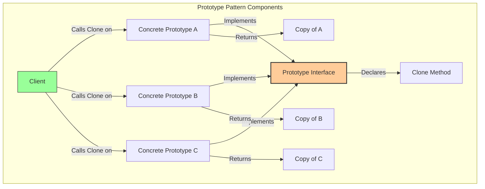
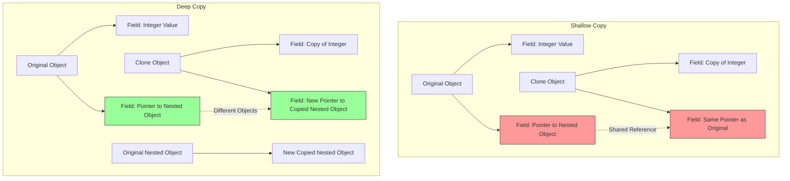
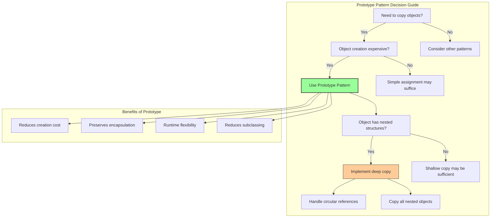

# A Complete Exploration of the Prototype Pattern in Go

## Chapter 1: Understanding the Problem That Prototype Pattern Solves

Imagine you are tasked with creating a complex document in a word processor. This document contains elaborate formatting, embedded images, custom fonts, tables with calculated values, and numerous annotations. Now imagine you need to create a second document that is almost identical to the first, differing only in a few minor details—perhaps the title and a couple of paragraphs. If you were to construct the second document from scratch, you would waste considerable time and computational resources. If you attempted to copy the document field by field, you would need to write tedious and error-prone code that would break whenever the document structure changed. Furthermore, the document might contain private fields that are inaccessible from outside, or it might have circular references that make naive copying dangerous.

The Prototype Pattern offers an elegant solution to this copying problem. Instead of constructing a new object from scratch or manually copying each field, the Prototype Pattern delegates the copying responsibility to the object itself. The object provides a `Clone` method that returns an exact copy of itself. This method knows the internal structure of the object and can perform a proper deep copy, handling private fields, nested objects, and circular references correctly. The client that needs a copy simply calls the `Clone` method, without needing to know anything about the object's internal implementation. This approach is particularly valuable when object creation is expensive, when objects have many possible configurations, or when the system should be independent of how its objects are created and represented.

```mermaid
graph TD
    subgraph "Traditional Copying Problem"
        A[Original Object] -->|Manual field-by-field copy| B[Error-prone Code]
        B --> C[Shallow Copy Issues]
        B --> D[Private Fields Inaccessible]
        B --> E[Breaks When Structure Changes]
        style B fill:#ff9999,stroke:#333
    end
    
    subgraph "Prototype Pattern Solution"
        F[Original Object] -->|Call Clone()| G[Clone Method]
        G -->|Knows internal structure| H[Handles nested objects]
        G -->|Can access private fields| I[Creates proper copy]
        H --> J[New Object - Independent Copy]
        I --> J
    end
    
    subgraph "Client Benefits"
        F -->|Client only knows Clone()| K[No internal knowledge needed]
        K --> L[Works with any prototype]
        K --> M[Encapsulation preserved]
    end
    
    style G fill:#99ff99,stroke:#333,stroke-width:2px
    style J fill:#99ccff,stroke:#333
```

## Chapter 2: The Core Components of the Prototype Pattern

To fully understand the Prototype Pattern, one must grasp its three essential components, each serving a distinct purpose in the copying architecture.

The first component is the **Prototype Interface**. This is a Go interface that declares the `Clone` method. Any struct that can be cloned must implement this interface. The `Clone` method typically returns the interface type itself, allowing the client to treat the clone polymorphically. In Go, this interface is often very simple, containing only a single method. The existence of this interface allows the client to work with any prototype without knowing its concrete type.

The second component is the **Concrete Prototype**. These are the actual structs that implement the prototype interface. Each concrete prototype provides its own implementation of the `Clone` method, tailored to its specific internal structure. The clone method must decide whether to perform a shallow copy (copying only pointers and references) or a deep copy (creating new instances of nested objects). The choice depends on the semantics of the object and the requirements of the application.

The third component is the **Client**. The client is any code that needs to create copies of objects. The client does not need to know the concrete type of the object it is copying; it only needs to know that the object implements the `Clone` method of the prototype interface. This decoupling allows the client to work with a registry of prototypes, selecting which one to clone at runtime based on configuration or user input.



## Chapter 3: Shallow Copy Versus Deep Copy

Before diving into code examples, one must understand the critical distinction between shallow copy and deep copy, as this decision fundamentally affects the behavior of the prototype pattern.

A **shallow copy** creates a new object but does not create copies of nested objects. Instead, it copies the references (pointers) to those nested objects. After a shallow copy, the original and the clone share the same nested objects. Modifying a nested object in the clone will also affect the original, which is often undesirable. Shallow copying is fast and memory-efficient, but it can lead to subtle bugs when shared state is modified unexpectedly.

A **deep copy** creates a new object and recursively creates copies of all nested objects. After a deep copy, the original and the clone are completely independent. Changes to the clone do not affect the original, and vice versa. Deep copying is safer but consumes more memory and processing time, especially for large or deeply nested object graphs.

In Go, implementing deep copy requires careful attention because the language does not provide a built-in deep copy mechanism. You must explicitly decide which fields should be copied by value, which by reference, and which require recursive cloning. For structs that contain slices, maps, channels, or pointers, you must manually create new instances of these nested structures.



## Chapter 4: A Simple Prototype Example

Let us begin with a straightforward implementation of the Prototype Pattern. We will create a `Document` struct that represents a text document with various properties, and we will implement a clone method that performs both shallow and deep copying to illustrate the difference.

```go
package main

import (
    "fmt"
    "strings"
)

// Cloneable is the prototype interface that all clonable objects must implement.
type Cloneable interface {
    Clone() Cloneable
}

// Author represents the author of a document.
type Author struct {
    Name  string
    Email string
}

// Document represents a text document with metadata and content.
type Document struct {
    Title      string
    Content    string
    Author     *Author
    Tags       []string
    WordCount  int
    IsPublished bool
}

// Clone creates a shallow copy of the document.
// This method is part of the Cloneable interface.
func (d *Document) Clone() Cloneable {
    // Shallow copy: slices and pointers are copied by value,
    // meaning they still reference the same underlying data.
    clone := *d
    return &clone
}

// DeepClone creates a completely independent deep copy of the document.
// This method is not part of the interface but demonstrates deep copying.
func (d *Document) DeepClone() *Document {
    // Create a new document as a base
    clone := &Document{
        Title:      d.Title,
        Content:    d.Content,
        WordCount:  d.WordCount,
        IsPublished: d.IsPublished,
    }
    
    // Deep copy the Author (create a new Author struct)
    if d.Author != nil {
        clone.Author = &Author{
            Name:  d.Author.Name,
            Email: d.Author.Email,
        }
    }
    
    // Deep copy the Tags slice (create a new slice with copied elements)
    if d.Tags != nil {
        clone.Tags = make([]string, len(d.Tags))
        copy(clone.Tags, d.Tags)
    }
    
    return clone
}

// String returns a string representation of the document.
func (d *Document) String() string {
    authorName := "Unknown"
    if d.Author != nil {
        authorName = d.Author.Name
    }
    return fmt.Sprintf("Document{Title: '%s', Author: '%s', Tags: %v, Published: %v}",
        d.Title, authorName, d.Tags, d.IsPublished)
}

func main() {
    // Create an original document
    original := &Document{
        Title:   "Prototype Pattern Guide",
        Content: "This document explains the Prototype Pattern...",
        Author: &Author{
            Name:  "Jane Doe",
            Email: "jane@example.com",
        },
        Tags:       []string{"design-patterns", "go", "tutorial"},
        WordCount:  2500,
        IsPublished: false,
    }
    
    fmt.Println("=== Original Document ===")
    fmt.Println(original)
    fmt.Printf("Author memory address: %p\n", original.Author)
    fmt.Printf("Tags memory address (underlying array): %p\n", &original.Tags[0])
    
    // Perform shallow copy using the Clone method
    shallowClone := original.Clone().(*Document)
    
    fmt.Println("\n=== Shallow Clone (after creation) ===")
    fmt.Println(shallowClone)
    fmt.Printf("Author memory address: %p (SAME as original!)\n", shallowClone.Author)
    fmt.Printf("Tags memory address (underlying array): %p (SAME as original!)\n", &shallowClone.Tags[0])
    
    // Perform deep copy
    deepClone := original.DeepClone()
    
    fmt.Println("\n=== Deep Clone (after creation) ===")
    fmt.Println(deepClone)
    fmt.Printf("Author memory address: %p (DIFFERENT from original)\n", deepClone.Author)
    fmt.Printf("Tags memory address (underlying array): %p (DIFFERENT from original)\n", &deepClone.Tags[0])
    
    // Demonstrate the consequences of shallow vs deep copy
    fmt.Println("\n=== Modifying the clones ===")
    
    // Modify the shallow clone's author
    shallowClone.Author.Name = "Jane Modified"
    shallowClone.Tags[0] = "modified-tag"
    
    fmt.Println("After modifying shallow clone:")
    fmt.Printf("  Original author name: %s (CHANGED!)\n", original.Author.Name)
    fmt.Printf("  Original first tag: %s (CHANGED!)\n", original.Tags[0])
    
    // Reset for deep copy demonstration
    deepClone.Author.Name = "Jane Deep Modified"
    deepClone.Tags[0] = "deep-modified-tag"
    
    fmt.Println("\nAfter modifying deep clone:")
    fmt.Printf("  Original author name: %s (UNCHANGED - good)\n", original.Author.Name)
    fmt.Printf("  Original first tag: %s (UNCHANGED - good)\n", original.Tags[0])
}
```

This example clearly demonstrates the critical difference between shallow and deep copying. The shallow clone shares the same `Author` object and `Tags` slice with the original, so modifications to the clone affect the original—a behavior that is often undesirable. The deep clone, however, creates completely independent copies of all nested structures, ensuring that modifications to the clone do not affect the original.

## Chapter 5: A Real-World Example with Configuration Objects

In production Go applications, the Prototype Pattern is particularly valuable for managing configuration objects. Configuration often has complex nested structures, and you may need to create variations of a base configuration for different environments, users, or deployment scenarios. Cloning a configuration prototype is far more efficient than rebuilding it from scratch.

Let us build a configuration system for a web application that uses the Prototype Pattern to create environment-specific configurations.

```go
package main

import (
    "encoding/json"
    "fmt"
)

// DatabaseConfig holds the configuration for a database connection.
type DatabaseConfig struct {
    Host     string
    Port     int
    Username string
    Password string
    Database string
    SSLMode  string
    MaxConnections int
}

// Clone creates a deep copy of the DatabaseConfig.
func (d *DatabaseConfig) Clone() *DatabaseConfig {
    return &DatabaseConfig{
        Host:     d.Host,
        Port:     d.Port,
        Username: d.Username,
        Password: d.Password,
        Database: d.Database,
        SSLMode:  d.SSLMode,
        MaxConnections: d.MaxConnections,
    }
}

// CacheConfig holds the configuration for a caching layer.
type CacheConfig struct {
    Type     string // "redis", "memcached", or "inmemory"
    Address  string
    Password string
    DB       int
    TTLSeconds int
}

// Clone creates a deep copy of the CacheConfig.
func (c *CacheConfig) Clone() *CacheConfig {
    return &CacheConfig{
        Type:       c.Type,
        Address:    c.Address,
        Password:   c.Password,
        DB:         c.DB,
        TTLSeconds: c.TTLSeconds,
    }
}

// AppConfig is the main application configuration with nested structures.
type AppConfig struct {
    AppName     string
    Environment string // "development", "staging", "production"
    Port        int
    Debug       bool
    
    Database    *DatabaseConfig
    Cache       *CacheConfig
    
    AllowedOrigins []string
    FeatureFlags   map[string]bool
}

// Clone creates a deep copy of the entire AppConfig.
// This implements the prototype pattern for the main configuration.
func (a *AppConfig) Clone() *AppConfig {
    clone := &AppConfig{
        AppName:     a.AppName,
        Environment: a.Environment,
        Port:        a.Port,
        Debug:       a.Debug,
    }
    
    // Deep copy nested Database config
    if a.Database != nil {
        clone.Database = a.Database.Clone()
    }
    
    // Deep copy nested Cache config
    if a.Cache != nil {
        clone.Cache = a.Cache.Clone()
    }
    
    // Deep copy slice
    if a.AllowedOrigins != nil {
        clone.AllowedOrigins = make([]string, len(a.AllowedOrigins))
        copy(clone.AllowedOrigins, a.AllowedOrigins)
    }
    
    // Deep copy map
    if a.FeatureFlags != nil {
        clone.FeatureFlags = make(map[string]bool)
        for k, v := range a.FeatureFlags {
            clone.FeatureFlags[k] = v
        }
    }
    
    return clone
}

// String returns a JSON representation of the configuration.
func (a *AppConfig) String() string {
    b, _ := json.MarshalIndent(a, "", "  ")
    return string(b)
}

// ConfigRegistry maintains a registry of prototype configurations.
// This is an optional enhancement that allows selecting configurations by name.
type ConfigRegistry struct {
    prototypes map[string]*AppConfig
}

func NewConfigRegistry() *ConfigRegistry {
    return &ConfigRegistry{
        prototypes: make(map[string]*AppConfig),
    }
}

func (r *ConfigRegistry) Register(name string, config *AppConfig) {
    r.prototypes[name] = config
}

func (r *ConfigRegistry) GetPrototype(name string) (*AppConfig, error) {
    prototype, exists := r.prototypes[name]
    if !exists {
        return nil, fmt.Errorf("prototype '%s' not found", name)
    }
    return prototype.Clone(), nil
}

func main() {
    // Create a base development configuration
    devConfig := &AppConfig{
        AppName:     "MyWebApp",
        Environment: "development",
        Port:        8080,
        Debug:       true,
        Database: &DatabaseConfig{
            Host:     "localhost",
            Port:     5432,
            Username: "dev_user",
            Password: "dev_password",
            Database: "app_dev",
            SSLMode:  "disable",
            MaxConnections: 10,
        },
        Cache: &CacheConfig{
            Type:       "inmemory",
            Address:    "",
            Password:   "",
            DB:         0,
            TTLSeconds: 300,
        },
        AllowedOrigins: []string{"http://localhost:3000"},
        FeatureFlags: map[string]bool{
            "new_dashboard": true,
            "beta_api":      false,
            "analytics":     true,
        },
    }
    
    // Create a registry and register the development prototype
    registry := NewConfigRegistry()
    registry.Register("development", devConfig)
    
    // Create staging configuration by cloning development and modifying
    stagingConfig, _ := registry.GetPrototype("development")
    stagingConfig.Environment = "staging"
    stagingConfig.Port = 8088
    stagingConfig.Debug = false
    stagingConfig.Database.Host = "staging-db.example.com"
    stagingConfig.Database.Password = "staging_secure_password"
    stagingConfig.Database.MaxConnections = 50
    stagingConfig.Cache.Type = "redis"
    stagingConfig.Cache.Address = "redis://staging-cache:6379"
    stagingConfig.AllowedOrigins = []string{"https://staging.myapp.com"}
    
    // Register the staging prototype for future use
    registry.Register("staging", stagingConfig)
    
    // Create production configuration by cloning staging and modifying
    prodConfig, _ := registry.GetPrototype("staging")
    prodConfig.Environment = "production"
    prodConfig.Port = 443
    prodConfig.Database.Host = "prod-db.example.com"
    prodConfig.Database.Password = "prod_very_secure_password"
    prodConfig.Database.MaxConnections = 100
    prodConfig.AllowedOrigins = []string{"https://myapp.com", "https://www.myapp.com"}
    prodConfig.FeatureFlags["beta_api"] = true // Enable beta API in production
    prodConfig.FeatureFlags["new_dashboard"] = false // Disable new dashboard in production
    
    // Register the production prototype
    registry.Register("production", prodConfig)
    
    // Demonstrate usage
    fmt.Println("=== Development Configuration ===")
    dev, _ := registry.GetPrototype("development")
    fmt.Println(dev)
    
    fmt.Println("\n=== Staging Configuration ===")
    staging, _ := registry.GetPrototype("staging")
    fmt.Println(staging)
    
    fmt.Println("\n=== Production Configuration ===")
    production, _ := registry.GetPrototype("production")
    fmt.Println(production)
    
    // Demonstrate independence of clones
    fmt.Println("\n=== Demonstrating Independence ===")
    clone1, _ := registry.GetPrototype("development")
    clone2, _ := registry.GetPrototype("development")
    
    clone1.Database.Host = "changed_host"
    clone2.Database.Host = "another_host"
    
    fmt.Printf("Clone1 database host: %s\n", clone1.Database.Host)
    fmt.Printf("Clone2 database host: %s\n", clone2.Database.Host)
    fmt.Printf("Original prototype in registry (unmodified): %s\n", 
        registry.prototypes["development"].Database.Host)
}
```

This configuration example demonstrates the true power of the Prototype Pattern in production systems. By maintaining a registry of configuration prototypes, you can create environment-specific configurations with minimal code duplication. Each clone is independent, allowing you to safely modify configuration for one environment without affecting others. This approach is far more maintainable than having separate configuration files for each environment, as common values are defined once in the prototype and inherited by all clones.

## Chapter 6: Advanced Prototype Techniques

The Prototype Pattern can be extended in several sophisticated ways to handle more complex scenarios. One such extension is the **Prototype Manager**, which maintains a registry of named prototypes and allows cloning them by name. We demonstrated this in the configuration example with the `ConfigRegistry`. The prototype manager is particularly useful when the set of prototypes is determined at runtime, such as when loading plugins or when the application supports user-defined templates.

Another advanced technique is the **Cloning Factory**, which uses a prototype to create new objects without specifying their concrete classes. The factory holds a reference to a prototype and uses it to create all new instances. By changing the prototype, you can change the behavior of the entire factory at runtime.

Let us implement a shape drawing application that uses a prototype manager and a cloning factory to create different shapes.

```go
package main

import (
    "fmt"
    "math"
)

// Shape is the prototype interface for all shapes.
type Shape interface {
    Clone() Shape
    Draw() string
    Area() float64
    GetType() string
}

// Point represents a 2D point.
type Point struct {
    X, Y float64
}

// Clone creates a copy of the point.
func (p *Point) Clone() *Point {
    return &Point{X: p.X, Y: p.Y}
}

// Circle implements the Shape interface.
type Circle struct {
    Center *Point
    Radius float64
    Color  string
}

func (c *Circle) Clone() Shape {
    // Deep copy of the Circle
    clone := &Circle{
        Center: c.Center.Clone(),
        Radius: c.Radius,
        Color:  c.Color,
    }
    return clone
}

func (c *Circle) Draw() string {
    return fmt.Sprintf("Drawing a %s circle at (%.1f, %.1f) with radius %.1f",
        c.Color, c.Center.X, c.Center.Y, c.Radius)
}

func (c *Circle) Area() float64 {
    return math.Pi * c.Radius * c.Radius
}

func (c *Circle) GetType() string {
    return "Circle"
}

// Rectangle implements the Shape interface.
type Rectangle struct {
    TopLeft     *Point
    Width, Height float64
    Color       string
}

func (r *Rectangle) Clone() Shape {
    clone := &Rectangle{
        TopLeft: r.TopLeft.Clone(),
        Width:   r.Width,
        Height:  r.Height,
        Color:   r.Color,
    }
    return clone
}

func (r *Rectangle) Draw() string {
    return fmt.Sprintf("Drawing a %s rectangle at (%.1f, %.1f) with width %.1f and height %.1f",
        r.Color, r.TopLeft.X, r.TopLeft.Y, r.Width, r.Height)
}

func (r *Rectangle) Area() float64 {
    return r.Width * r.Height
}

func (r *Rectangle) GetType() string {
    return "Rectangle"
}

// ShapePrototypeManager manages named shape prototypes.
type ShapePrototypeManager struct {
    prototypes map[string]Shape
}

func NewShapePrototypeManager() *ShapePrototypeManager {
    return &ShapePrototypeManager{
        prototypes: make(map[string]Shape),
    }
}

func (m *ShapePrototypeManager) Register(name string, shape Shape) {
    m.prototypes[name] = shape
}

func (m *ShapePrototypeManager) Create(name string) (Shape, error) {
    prototype, exists := m.prototypes[name]
    if !exists {
        return nil, fmt.Errorf("shape prototype '%s' not found", name)
    }
    return prototype.Clone(), nil
}

// ShapeFactory uses a prototype to create shapes.
type ShapeFactory struct {
    prototype Shape
}

func NewShapeFactory(prototype Shape) *ShapeFactory {
    return &ShapeFactory{prototype: prototype}
}

func (f *ShapeFactory) SetPrototype(prototype Shape) {
    f.prototype = prototype
}

func (f *ShapeFactory) CreateShape() Shape {
    return f.prototype.Clone()
}

func main() {
    // Create a prototype manager
    manager := NewShapePrototypeManager()
    
    // Register default shape prototypes
    manager.Register("default_circle", &Circle{
        Center: &Point{X: 0, Y: 0},
        Radius: 5,
        Color:  "red",
    })
    
    manager.Register("default_rectangle", &Rectangle{
        TopLeft: &Point{X: 0, Y: 0},
        Width:   10,
        Height:  20,
        Color:   "blue",
    })
    
    manager.Register("large_circle", &Circle{
        Center: &Point{X: 100, Y: 100},
        Radius: 50,
        Color:  "yellow",
    })
    
    // Create shapes using the prototype manager
    circle1, _ := manager.Create("default_circle")
    circle2, _ := manager.Create("default_circle")
    rectangle1, _ := manager.Create("default_rectangle")
    largeCircle, _ := manager.Create("large_circle")
    
    // Modify the cloned shapes independently
    circle1.(*Circle).Color = "green"
    circle1.(*Circle).Center.X = 10
    circle1.(*Circle).Center.Y = 20
    
    circle2.(*Circle).Radius = 15
    
    fmt.Println("=== Shapes Created from Prototype Manager ===")
    fmt.Println(circle1.Draw())
    fmt.Printf("Area: %.2f\n\n", circle1.Area())
    
    fmt.Println(circle2.Draw())
    fmt.Printf("Area: %.2f\n\n", circle2.Area())
    
    fmt.Println(rectangle1.Draw())
    fmt.Printf("Area: %.2f\n\n", rectangle1.Area())
    
    fmt.Println(largeCircle.Draw())
    fmt.Printf("Area: %.2f\n\n", largeCircle.Area())
    
    // Demonstrate cloning factory
    fmt.Println("=== Shape Factory Using Prototype ===")
    factory := NewShapeFactory(circle1) // Use the modified circle as prototype
    factoryCircle := factory.CreateShape()
    fmt.Println(factoryCircle.Draw())
    
    // Change the factory's prototype at runtime
    factory.SetPrototype(rectangle1)
    factoryRectangle := factory.CreateShape()
    fmt.Println(factoryRectangle.Draw())
}
```

## Chapter 7: Common Pitfalls and Best Practices

The Prototype Pattern, while powerful, contains several pitfalls that the careful engineer must avoid. The most significant pitfall is implementing shallow copy when deep copy is expected. Many programmers mistakenly believe that simply assigning a struct to a new variable creates an independent copy. While Go's assignment does copy the fields, slices and pointers are copied by value, meaning the new struct references the same underlying data. Always document whether your `Clone` method performs shallow or deep copying, and consider providing separate methods for each when both are useful.

Another pitfall is forgetting to handle circular references. If your object graph contains cycles, a naive deep copy implementation will recurse infinitely, eventually causing a stack overflow. To handle circular references, you must maintain a map of already-copied objects and reuse the copies when encountering a reference to an already-copied object. This technique, known as copy-on-write or memoization, is advanced but necessary for certain domains such as graph structures or doubly-linked lists.

A third pitfall is making the prototype mutable after registration. When you register a prototype in a manager, you must ensure that the prototype is not modified later, as modifications would affect all future clones. The safest approach is to register prototypes that are immutable, or to clone the prototype before storing it in the registry. Alternatively, ensure that the registry returns a clone rather than the original prototype, as we did in the configuration example.

A fourth pitfall relates to performance. Deep copying can be expensive for large objects. If you are cloning objects frequently, consider whether a shallow copy would suffice, or whether you can use copy-on-write semantics. In some cases, using an object pool may be more efficient than repeatedly cloning prototypes.

## Chapter 8: When to Use the Prototype Pattern

The wise engineer employs the Prototype Pattern when specific circumstances arise. The first and most compelling use case is when the classes to be instantiated are specified at runtime through discovery or configuration. For example, a plugin system might load available plugins and register their prototypes, then clone them as needed without knowing their concrete types.

The second use case is when the creation of an object is more expensive than copying it. If constructing an object requires reading a file, making a network request, performing complex calculations, or initializing expensive resources, cloning an existing instance can be dramatically faster. This is especially true when you need many similar objects, such as in game development where hundreds of enemies share the same base characteristics.

The third use case is when you want to avoid building a hierarchy of factories that parallels the hierarchy of products. Without the Prototype Pattern, adding a new product sometimes requires adding a new factory class. With prototypes, you simply register an instance of the new product as a prototype, and the existing cloning infrastructure handles the rest.

The fourth use case is when the system should be independent of how its objects are created, composed, and represented. The Prototype Pattern supports this by moving the creation responsibility into the objects themselves, reducing coupling between the client and the concrete product classes.

## Chapter 9: Comparison with Other Creational Patterns

The Prototype Pattern is often compared with the Factory Method and Builder patterns, as all three are creational patterns. The key distinction lies in their approach to object creation. The Factory Method creates objects using a dedicated method that encapsulates creation logic, often involving conditional checks or subclassing. The Builder constructs objects step by step, giving fine-grained control over the construction process. The Prototype creates objects by copying an existing object, which is particularly useful when the initial configuration is complex or expensive to produce.

The Prototype Pattern complements the other creational patterns. A factory might use a prototype to create its products, or a builder might start with a prototype and then modify the clone. The choice of which pattern to use depends on the specific requirements of your system: use Factory Method when creation logic is simple and product types are limited; use Builder when construction requires many steps or when products have many optional components; use Prototype when initial objects are expensive to create and many similar objects are needed.

## Chapter 10: Conclusion

The Prototype Pattern stands as an elegant solution to the problem of creating complex objects efficiently and flexibly. By delegating the copying responsibility to the objects themselves, it preserves encapsulation, reduces coupling, and enables runtime selection of object types. Through the document example, the configuration system, and the shape drawing application, we have seen how the pattern adapts to different domains while maintaining its core essence: a clone method that creates independent copies of objects without exposing their internal structure. The beginning programmer who masters the Prototype Pattern gains the ability to implement systems that can clone objects with ease, whether for configuration management, game development, plugin architectures, or any domain where copying is preferable to constructing from scratch. Armed with this understanding, you are now prepared to recognize opportunities for applying the Prototype Pattern in your own projects and to implement clone methods that handle both shallow and deep copying correctly, ensuring that your clones are truly independent when independence is required.



Thus concludes our thorough examination of the Prototype Pattern in Go. The reader is encouraged to practice by implementing a prototype for a complex form with nested fields, a prototype for a game character with equipment and stats, or a prototype for a report with embedded charts and tables. Through such practice, the Prototype Pattern will become a natural and valued part of your design repertoire, ready to be deployed whenever copying proves superior to constructing anew.