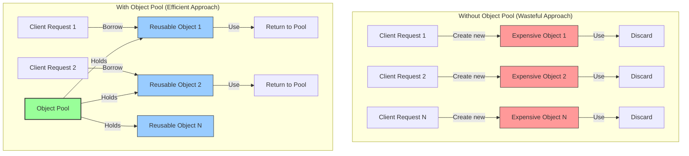
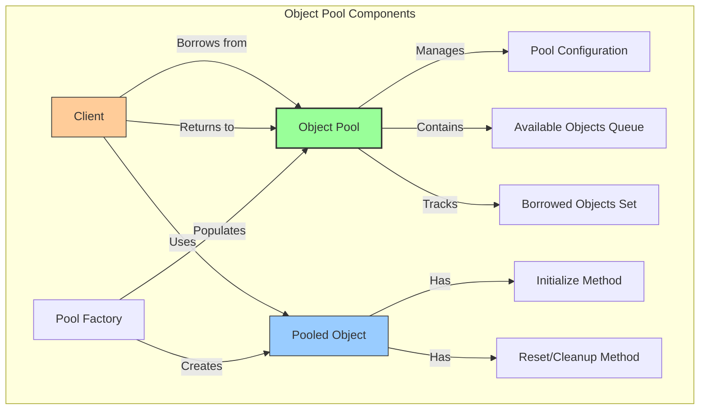
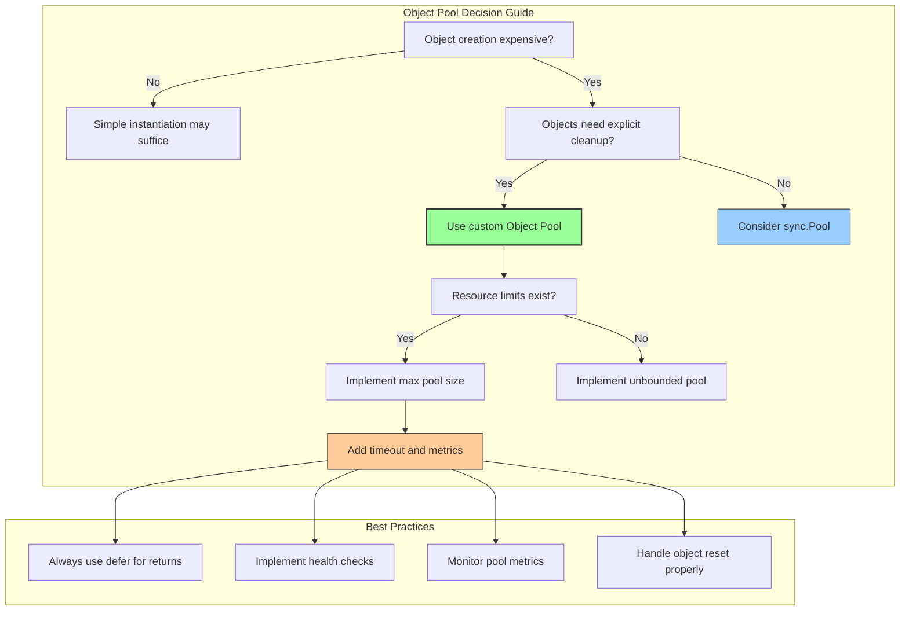

Here is a complete, beginner-friendly explanation of the Object Pool Pattern in Go, written in simple, bookish language with detailed diagrams and practical examples.

---

# A Comprehensive Guide to the Object Pool Pattern in Go

## Chapter 1: Understanding the Problem That Object Pool Pattern Solves

Imagine you are managing a busy public library. Each day, hundreds of patrons arrive to borrow books. If every patron who entered the library demanded that a new book be printed from scratch just for them, the library would quickly run out of paper, ink, and binding resources. The printing process is slow and expensive. After the patron returns the book, the library would simply discard it, only to print another copy for the next patron. This approach is enormously wasteful.

In the real world, libraries solve this problem differently. They maintain a fixed collection of books. When a patron wants a book, the library lends an existing copy from its collection. When the patron returns the book, the library does not destroy it; instead, the book goes back into the collection, ready to be lent to the next patron. The library may have multiple copies of popular books, but the total number of copies is limited and controlled.

The Object Pool Pattern applies this same wisdom to software development. It addresses the problem of creating and destroying objects that are expensive to initialize. Such objects might include database connections, network sockets, large buffers, thread pools, or any resource that requires significant time or memory to create. Instead of creating a new object every time one is needed and discarding it immediately after use, the object pool maintains a collection of pre-initialized, reusable objects. When a client requests an object, the pool lends an available object from its collection. When the client finishes using the object, it returns the object to the pool, where it becomes available for future requests.



## Chapter 2: The Core Components of the Object Pool Pattern

To fully understand the Object Pool Pattern, one must grasp its four essential components, each playing a distinct role in the pooling architecture.

The first component is the **Pooled Object**. This is the resource that is expensive to create and therefore worth reusing. Pooled objects typically have an initialization method that sets up the resource and a cleanup or reset method that returns the object to a clean state before it is reused. In Go, pooled objects are often structs that hold resources such as network connections, database handles, or large buffers.

The second component is the **Object Pool** itself. This is a container that manages the collection of reusable objects. The pool is responsible for creating new objects when the pool is initially populated or when existing objects are exhausted. The pool also tracks which objects are currently in use (borrowed) and which are available (idle). When a client requests an object, the pool either returns an idle object or creates a new one if the pool has not reached its maximum capacity. The pool may also provide methods for returning objects, for closing all objects when the pool is no longer needed, and for monitoring pool statistics.

The third component is the **Client**. The client is any code that needs to use pooled objects. The client borrows an object from the pool, uses it to perform some work, and then returns the object to the pool. The client must be careful never to use an object after it has been returned, and must ensure that the object is returned even if an error occurs during usage. The `defer` statement in Go is particularly useful for guaranteeing that objects are returned to the pool.

The fourth component is the **Pool Configuration**. This includes parameters such as the initial size of the pool (how many objects to create upfront), the maximum size of the pool (the maximum number of objects that can exist simultaneously), the timeout period for waiting when no objects are available, and validation logic to test whether a borrowed object is still healthy before lending it.



## Chapter 3: A Simple Connection Pool Example

Let us begin with a straightforward implementation of the Object Pool Pattern. We will create a pool of database connections. Each connection is expensive to establish because it involves network handshakes and authentication. By pooling connections, we can reuse them across multiple database operations.

```go
package main

import (
    "fmt"
    "sync"
    "time"
)

// Connection represents a database connection that is expensive to create.
type Connection struct {
    ID        int
    CreatedAt time.Time
    InUse     bool
}

// Connect simulates establishing a database connection.
func (c *Connection) Connect() error {
    fmt.Printf("Connection %d: Establishing connection...\n", c.ID)
    time.Sleep(100 * time.Millisecond) // Simulate connection overhead
    return nil
}

// Query simulates executing a database query.
func (c *Connection) Query(sql string) {
    fmt.Printf("Connection %d: Executing query: %s\n", c.ID, sql)
}

// Close simulates closing the connection.
func (c *Connection) Close() {
    fmt.Printf("Connection %d: Closing connection\n", c.ID)
}

// Reset clears any state on the connection so it can be reused.
func (c *Connection) Reset() {
    fmt.Printf("Connection %d: Resetting state\n", c.ID)
    c.InUse = false
    // In a real connection, you would rollback any open transactions, etc.
}

// ConnectionPool manages a pool of reusable database connections.
type ConnectionPool struct {
    mu            sync.Mutex
    available     chan *Connection
    maxSize       int
    currentSize   int
    idleTimeout   time.Duration
    connectionID  int
}

// NewConnectionPool creates a new connection pool with the specified size.
func NewConnectionPool(initialSize, maxSize int, idleTimeout time.Duration) *ConnectionPool {
    pool := &ConnectionPool{
        available:   make(chan *Connection, maxSize),
        maxSize:     maxSize,
        idleTimeout: idleTimeout,
    }
    
    // Create initial connections
    for i := 0; i < initialSize; i++ {
        pool.connectionID++
        conn := &Connection{
            ID:        pool.connectionID,
            CreatedAt: time.Now(),
            InUse:     false,
        }
        conn.Connect()
        pool.available <- conn
        pool.currentSize++
    }
    
    return pool
}

// Borrow returns a connection from the pool. If no connections are available,
// it waits up to the specified timeout for one to become available.
func (p *ConnectionPool) Borrow(timeout time.Duration) (*Connection, error) {
    select {
    case conn := <-p.available:
        p.mu.Lock()
        conn.InUse = true
        p.mu.Unlock()
        fmt.Printf("Borrowed connection %d (available: %d, total: %d)\n", 
            conn.ID, len(p.available), p.currentSize)
        return conn, nil
        
    case <-time.After(timeout):
        p.mu.Lock()
        defer p.mu.Unlock()
        
        // If we haven't reached max size, create a new connection
        if p.currentSize < p.maxSize {
            p.connectionID++
            conn := &Connection{
                ID:        p.connectionID,
                CreatedAt: time.Now(),
                InUse:     true,
            }
            conn.Connect()
            p.currentSize++
            fmt.Printf("Created new connection %d (available: %d, total: %d)\n", 
                conn.ID, len(p.available), p.currentSize)
            return conn, nil
        }
        
        return nil, fmt.Errorf("timeout waiting for available connection")
    }
}

// Return returns a connection to the pool for reuse.
func (p *ConnectionPool) Return(conn *Connection) {
    p.mu.Lock()
    defer p.mu.Unlock()
    
    // Reset the connection state before returning
    conn.Reset()
    conn.InUse = false
    
    // Check if the connection is still valid (simulated)
    if time.Since(conn.CreatedAt) > p.idleTimeout {
        fmt.Printf("Connection %d has expired, closing and discarding\n", conn.ID)
        conn.Close()
        p.currentSize--
        return
    }
    
    // Return to available pool
    select {
    case p.available <- conn:
        fmt.Printf("Returned connection %d (available: %d, total: %d)\n", 
            conn.ID, len(p.available), p.currentSize)
    default:
        // Pool is full, close this connection
        fmt.Printf("Pool full, closing connection %d\n", conn.ID)
        conn.Close()
        p.currentSize--
    }
}

// Stats returns current pool statistics.
func (p *ConnectionPool) Stats() {
    p.mu.Lock()
    defer p.mu.Unlock()
    fmt.Printf("Pool Stats - Available: %d, Total: %d, Max: %d\n", 
        len(p.available), p.currentSize, p.maxSize)
}

// Close closes all connections in the pool.
func (p *ConnectionPool) Close() {
    p.mu.Lock()
    defer p.mu.Unlock()
    
    close(p.available)
    for conn := range p.available {
        conn.Close()
    }
    p.currentSize = 0
    fmt.Println("Connection pool closed")
}

func main() {
    // Create a pool with 2 initial connections, max 5 connections
    pool := NewConnectionPool(2, 5, 10*time.Second)
    pool.Stats()
    
    // Simulate multiple clients borrowing connections
    var wg sync.WaitGroup
    
    for i := 1; i <= 8; i++ {
        wg.Add(1)
        go func(requestID int) {
            defer wg.Done()
            
            // Borrow a connection
            conn, err := pool.Borrow(500 * time.Millisecond)
            if err != nil {
                fmt.Printf("Request %d: Failed to get connection: %v\n", requestID, err)
                return
            }
            
            // Use the connection (guaranteed to return even if panic occurs)
            defer pool.Return(conn)
            
            // Simulate some database work
            fmt.Printf("Request %d: Using connection %d\n", requestID, conn.ID)
            conn.Query(fmt.Sprintf("SELECT * FROM users WHERE id = %d", requestID))
            time.Sleep(200 * time.Millisecond) // Simulate work
            
            fmt.Printf("Request %d: Finished work\n", requestID)
        }(i)
    }
    
    wg.Wait()
    pool.Stats()
    pool.Close()
}
```

This example demonstrates the fundamental operations of an object pool. The pool maintains a channel of available connections. When a client borrows a connection, the pool either returns an existing one from the channel or creates a new one if the pool has not reached its maximum size. When the client returns the connection, the pool resets it and places it back into the available channel for future reuse.

## Chapter 4: A Real-World Example with a Thread-Safe Object Pool

In production Go applications, object pools must be thoroughly thread-safe and should handle edge cases such as object validation, resurrection prevention, and graceful shutdown. Let us build a more sophisticated object pool that can be used as a library in your own applications.

```go
package main

import (
    "errors"
    "fmt"
    "sync"
    "time"
)

// Poolable is an interface that objects must implement to be poolable.
type Poolable interface {
    // Reset clears the object's state for reuse.
    Reset()
    
    // IsValid checks if the object is still usable.
    IsValid() bool
    
    // Close performs any necessary cleanup before the object is discarded.
    Close() error
}

// ObjectPool is a thread-safe pool of reusable objects.
type ObjectPool[T Poolable] struct {
    mu         sync.Mutex
    available  chan T
    factory    func() (T, error)
    maxSize    int
    currentSize int
    closed     bool
}

// PoolConfig holds configuration options for the object pool.
type PoolConfig struct {
    InitialSize int           // Number of objects to create initially
    MaxSize     int           // Maximum number of objects in the pool
    Factory     func() (Poolable, error) // Factory function to create objects
}

// NewObjectPool creates a new object pool with the given configuration.
func NewObjectPool[T Poolable](config PoolConfig) (*ObjectPool[T], error) {
    if config.MaxSize <= 0 {
        return nil, errors.New("MaxSize must be greater than 0")
    }
    if config.Factory == nil {
        return nil, errors.New("Factory function is required")
    }
    
    pool := &ObjectPool[T]{
        available: make(chan T, config.MaxSize),
        factory:   config.Factory,
        maxSize:   config.MaxSize,
    }
    
    // Create initial objects
    for i := 0; i < config.InitialSize; i++ {
        obj, err := pool.factory()
        if err != nil {
            return nil, fmt.Errorf("failed to create initial object: %w", err)
        }
        typedObj, ok := obj.(T)
        if !ok {
            return nil, errors.New("factory returned object of wrong type")
        }
        pool.available <- typedObj
        pool.currentSize++
    }
    
    return pool, nil
}

// Borrow acquires an object from the pool. If no objects are available,
// it will create a new one if the pool hasn't reached its maximum size.
func (p *ObjectPool[T]) Borrow() (T, error) {
    p.mu.Lock()
    if p.closed {
        p.mu.Unlock()
        var zero T
        return zero, errors.New("pool is closed")
    }
    p.mu.Unlock()
    
    select {
    case obj := <-p.available:
        // Validate the object before returning it
        if !obj.IsValid() {
            // Object is invalid, close it and try to get another
            obj.Close()
            p.mu.Lock()
            p.currentSize--
            p.mu.Unlock()
            return p.Borrow() // Recursively try again
        }
        return obj, nil
        
    default:
        // No available objects, try to create a new one if possible
        p.mu.Lock()
        defer p.mu.Unlock()
        
        if p.currentSize < p.maxSize && !p.closed {
            obj, err := p.factory()
            if err != nil {
                var zero T
                return zero, fmt.Errorf("failed to create new object: %w", err)
            }
            typedObj, ok := obj.(T)
            if !ok {
                var zero T
                return zero, errors.New("factory returned object of wrong type")
            }
            p.currentSize++
            return typedObj, nil
        }
        
        var zero T
        return zero, errors.New("no objects available and pool at maximum size")
    }
}

// Return returns an object to the pool for reuse.
func (p *ObjectPool[T]) Return(obj T) {
    p.mu.Lock()
    defer p.mu.Unlock()
    
    if p.closed {
        obj.Close()
        return
    }
    
    // Reset the object before returning
    obj.Reset()
    
    select {
    case p.available <- obj:
        // Successfully returned to pool
    default:
        // Pool is full, discard this object
        obj.Close()
        p.currentSize--
    }
}

// TryBorrow attempts to borrow an object without waiting.
func (p *ObjectPool[T]) TryBorrow() (T, error) {
    p.mu.Lock()
    if p.closed {
        p.mu.Unlock()
        var zero T
        return zero, errors.New("pool is closed")
    }
    p.mu.Unlock()
    
    select {
    case obj := <-p.available:
        if !obj.IsValid() {
            obj.Close()
            p.mu.Lock()
            p.currentSize--
            p.mu.Unlock()
            return p.TryBorrow()
        }
        return obj, nil
    default:
        var zero T
        return zero, errors.New("no objects available")
    }
}

// Close closes the pool and releases all resources.
func (p *ObjectPool[T]) Close() error {
    p.mu.Lock()
    defer p.mu.Unlock()
    
    if p.closed {
        return errors.New("pool already closed")
    }
    
    p.closed = true
    close(p.available)
    
    // Close all available objects
    for obj := range p.available {
        obj.Close()
    }
    
    return nil
}

// Stats returns current pool statistics.
func (p *ObjectPool[T]) Stats() (available, currentSize, maxSize int) {
    p.mu.Lock()
    defer p.mu.Unlock()
    return len(p.available), p.currentSize, p.maxSize
}

// --- Example Implementation: Buffer Pool ---

// Buffer is a reusable byte buffer that implements the Poolable interface.
type Buffer struct {
    data   []byte
    size   int
    closed bool
}

func NewBuffer(size int) *Buffer {
    return &Buffer{
        data: make([]byte, size),
        size: size,
    }
}

func (b *Buffer) Reset() {
    // Clear the buffer for reuse
    for i := range b.data {
        b.data[i] = 0
    }
    fmt.Printf("Buffer reset\n")
}

func (b *Buffer) IsValid() bool {
    return !b.closed
}

func (b *Buffer) Close() error {
    if b.closed {
        return nil
    }
    b.closed = true
    b.data = nil
    fmt.Printf("Buffer closed\n")
    return nil
}

func (b *Buffer) Write(data []byte) (int, error) {
    if b.closed {
        return 0, errors.New("buffer is closed")
    }
    n := copy(b.data, data)
    return n, nil
}

func (b *Buffer) Read() []byte {
    return b.data
}

func main() {
    // Create a pool of buffers
    factory := func() (Poolable, error) {
        return NewBuffer(1024), nil
    }
    
    config := PoolConfig{
        InitialSize: 3,
        MaxSize:     10,
        Factory:     factory,
    }
    
    pool, err := NewObjectPool[*Buffer](config)
    if err != nil {
        panic(err)
    }
    
    // Demonstrate pool usage
    fmt.Println("=== Object Pool Demonstration ===")
    
    // Borrow a buffer
    buf1, err := pool.Borrow()
    if err != nil {
        panic(err)
    }
    fmt.Printf("Borrowed buffer 1\n")
    
    // Use the buffer
    buf1.Write([]byte("Hello, World!"))
    fmt.Printf("Buffer 1 contains: %s\n", string(buf1.Read()))
    
    // Return the buffer
    pool.Return(buf1)
    fmt.Printf("Returned buffer 1\n\n")
    
    // Borrow multiple buffers
    var buffers []*Buffer
    for i := 0; i < 5; i++ {
        buf, err := pool.Borrow()
        if err != nil {
            fmt.Printf("Failed to borrow buffer %d: %v\n", i+1, err)
            continue
        }
        buffers = append(buffers, buf)
        fmt.Printf("Borrowed buffer %d\n", i+1)
    }
    
    // Return all buffers
    for _, buf := range buffers {
        pool.Return(buf)
    }
    fmt.Printf("Returned all buffers\n\n")
    
    // Check pool stats
    avail, curr, max := pool.Stats()
    fmt.Printf("Pool Stats - Available: %d, Current Size: %d, Max Size: %d\n", avail, curr, max)
    
    // Close the pool
    pool.Close()
    fmt.Println("Pool closed")
}
```

This generic object pool implementation using Go generics (introduced in Go 1.18) provides a reusable, type-safe pool that can work with any object type that implements the `Poolable` interface. The pool handles object validation, resetting, and graceful shutdown, making it suitable for production use.

## Chapter 5: The Sync.Pool Package in Go's Standard Library

Go's standard library includes a built-in object pool implementation called `sync.Pool`. This package is optimized for temporary objects and is used extensively throughout the Go runtime and standard library. However, understanding its characteristics is crucial because it differs from traditional object pools in several important ways.

The `sync.Pool` is designed for objects that can be garbage collected at any time. Objects in a `sync.Pool` may be automatically removed by the garbage collector between garbage collection cycles. This makes `sync.Pool` ideal for caching temporary objects that are expensive to create but can be discarded without consequence. It is not suitable for managing resources that must be explicitly closed, such as database connections or file handles.

Another important characteristic of `sync.Pool` is that it does not guarantee that objects will be preserved. The pool may discard objects at any time, particularly during garbage collection. Therefore, you cannot rely on a `sync.Pool` to limit the number of concurrently active objects or to provide predictable performance.

Despite these limitations, `sync.Pool` is excellent for reducing memory allocation pressure in high-performance applications. It is commonly used for buffers, string builders, and other temporary objects.

```go
package main

import (
    "bytes"
    "fmt"
    "sync"
)

// BufferPool demonstrates the use of sync.Pool for reusing buffers.
var BufferPool = sync.Pool{
    New: func() interface{} {
        // This function is called when the pool needs to create a new object
        fmt.Println("Creating new buffer")
        return &bytes.Buffer{}
    },
}

// GetBuffer retrieves a buffer from the pool.
func GetBuffer() *bytes.Buffer {
    return BufferPool.Get().(*bytes.Buffer)
}

// PutBuffer returns a buffer to the pool after resetting it.
func PutBuffer(buf *bytes.Buffer) {
    buf.Reset()
    BufferPool.Put(buf)
}

func main() {
    fmt.Println("=== sync.Pool Demonstration ===")
    
    // Get a buffer from the pool (will create a new one)
    buf1 := GetBuffer()
    buf1.WriteString("Hello from buffer 1")
    fmt.Printf("Buffer 1: %s\n", buf1.String())
    
    // Return it to the pool
    PutBuffer(buf1)
    
    // Get another buffer (may reuse the previous one)
    buf2 := GetBuffer()
    buf2.WriteString("Hello from buffer 2")
    fmt.Printf("Buffer 2: %s\n", buf2.String())
    
    // The buffer was reset, so it's empty when we get it again
    buf3 := GetBuffer()
    fmt.Printf("Buffer 3 (reset): '%s'\n", buf3.String())
    
    PutBuffer(buf2)
    PutBuffer(buf3)
    
    // In a real application, you would use the pool in a loop
    // to see the allocation reduction
    fmt.Println("\n=== Performance Comparison ===")
    
    // Without pooling
    var wg sync.WaitGroup
    startWithoutPool := time.Now()
    for i := 0; i < 1000; i++ {
        wg.Add(1)
        go func() {
            defer wg.Done()
            buf := &bytes.Buffer{}
            buf.WriteString("some data")
            _ = buf.String()
        }()
    }
    wg.Wait()
    elapsedWithoutPool := time.Since(startWithoutPool)
    
    // With pooling
    startWithPool := time.Now()
    for i := 0; i < 1000; i++ {
        wg.Add(1)
        go func() {
            defer wg.Done()
            buf := GetBuffer()
            defer PutBuffer(buf)
            buf.WriteString("some data")
            _ = buf.String()
        }()
    }
    wg.Wait()
    elapsedWithPool := time.Since(startWithPool)
    
    fmt.Printf("Without pool: %v\n", elapsedWithoutPool)
    fmt.Printf("With pool: %v\n", elapsedWithPool)
}

func init() {
    // Add time import for the benchmark
    // In a real file, you would import "time" at the top
}
```

## Chapter 6: Advanced Techniques and Best Practices

The Object Pool Pattern can be extended with several advanced techniques that enhance its utility in production systems. One such technique is the **object health check**. When an object is borrowed from the pool, the pool should validate that the object is still in a usable state. For a database connection, this might involve sending a simple ping query. For a network socket, it might involve checking that the connection is still open. If the object is found to be unhealthy, the pool should discard it and attempt to borrow or create another.

Another advanced technique is the **idle object reaper**. Over time, some objects in the pool may remain idle for extended periods. An idle object reaper is a background goroutine that periodically scans the pool, closes objects that have been idle for too long, and removes them from the pool. This prevents the pool from holding onto resources that are no longer needed, allowing the application to scale down when demand decreases.

A third technique is the **object pool monitoring and metrics**. Production systems should expose metrics about the object pool: the number of objects borrowed per second, the average wait time for an object, the number of times a new object had to be created because the pool was empty, and the number of objects that were discarded due to invalidation. These metrics help operators tune the pool size and detect performance problems.

Let us implement a complete production-ready object pool with all these advanced features.

```go
package main

import (
    "context"
    "errors"
    "fmt"
    "sync"
    "sync/atomic"
    "time"
)

// PoolMetrics collects statistics about pool usage.
type PoolMetrics struct {
    TotalBorrows      int64
    TotalReturns      int64
    TotalCreates      int64
    TotalDestroys     int64
    TotalTimeouts     int64
    TotalInvalidOnBorrow int64
    CurrentBorrowed   int64
    CurrentAvailable  int64
}

// AdvancedPool is a production-ready object pool with health checking and metrics.
type AdvancedPool[T Poolable] struct {
    mu              sync.Mutex
    available       []T // Using slice instead of channel for idle reaper
    factory         func() (T, error)
    maxSize         int
    currentSize     int
    closed          bool
    idleTimeout     time.Duration
    healthCheck     func(T) bool
    metrics         *PoolMetrics
    borrowTimeout   time.Duration
    cond            *sync.Cond
}

// AdvancedPoolConfig holds configuration for the advanced pool.
type AdvancedPoolConfig[T Poolable] struct {
    MaxSize       int
    InitialSize   int
    IdleTimeout   time.Duration
    BorrowTimeout time.Duration
    Factory       func() (T, error)
    HealthCheck   func(T) bool // Optional: function to validate object health
}

// NewAdvancedPool creates a new advanced object pool.
func NewAdvancedPool[T Poolable](config AdvancedPoolConfig[T]) (*AdvancedPool[T], error) {
    if config.MaxSize <= 0 {
        return nil, errors.New("MaxSize must be greater than 0")
    }
    if config.Factory == nil {
        return nil, errors.New("Factory function is required")
    }
    
    pool := &AdvancedPool[T]{
        available:     make([]T, 0, config.MaxSize),
        factory:       config.Factory,
        maxSize:       config.MaxSize,
        idleTimeout:   config.IdleTimeout,
        borrowTimeout: config.BorrowTimeout,
        healthCheck:   config.HealthCheck,
        metrics:       &PoolMetrics{},
    }
    pool.cond = sync.NewCond(&pool.mu)
    
    // Create initial objects
    for i := 0; i < config.InitialSize; i++ {
        obj, err := pool.factory()
        if err != nil {
            return nil, fmt.Errorf("failed to create initial object: %w", err)
        }
        pool.available = append(pool.available, obj)
        pool.currentSize++
        atomic.AddInt64(&pool.metrics.TotalCreates, 1)
    }
    
    // Start idle object reaper if timeout is set
    if pool.idleTimeout > 0 {
        go pool.idleReaper()
    }
    
    return pool, nil
}

// Borrow borrows an object from the pool with timeout.
func (p *AdvancedPool[T]) Borrow(ctx context.Context) (T, error) {
    var zero T
    
    p.mu.Lock()
    
    // Check if pool is closed
    if p.closed {
        p.mu.Unlock()
        return zero, errors.New("pool is closed")
    }
    
    // Create a channel for the borrow result
    resultCh := make(chan struct {
        obj T
        err error
    }, 1)
    
    // Try to borrow in a goroutine
    go func() {
        p.mu.Lock()
        defer p.mu.Unlock()
        
        // Wait for an available object
        for len(p.available) == 0 && p.currentSize < p.maxSize && !p.closed {
            // Create a new object
            obj, err := p.factory()
            if err != nil {
                resultCh <- struct {
                    obj T
                    err error
                }{zero, fmt.Errorf("failed to create new object: %w", err)}
                return
            }
            p.available = append(p.available, obj)
            p.currentSize++
            atomic.AddInt64(&p.metrics.TotalCreates, 1)
        }
        
        // Wait for an available object if none exist
        for len(p.available) == 0 && !p.closed {
            // If we have a borrow timeout, use Cond with timeout
            if p.borrowTimeout > 0 {
                // We need to implement timeout with Cond
                // For simplicity, we'll return error immediately
                resultCh <- struct {
                    obj T
                    err error
                }{zero, errors.New("no objects available")}
                return
            }
            p.cond.Wait()
        }
        
        if p.closed {
            resultCh <- struct {
                obj T
                err error
            }{zero, errors.New("pool is closed")}
            return
        }
        
        // Get the last object (LIFO behavior for better cache locality)
        obj := p.available[len(p.available)-1]
        p.available = p.available[:len(p.available)-1]
        
        // Perform health check if configured
        if p.healthCheck != nil && !p.healthCheck(obj) {
            // Object is unhealthy, discard it
            obj.Close()
            p.currentSize--
            atomic.AddInt64(&p.metrics.TotalDestroys, 1)
            atomic.AddInt64(&p.metrics.TotalInvalidOnBorrow, 1)
            
            // Try to borrow again (recursive)
            go func() {
                newObj, err := p.Borrow(ctx)
                resultCh <- struct {
                    obj T
                    err error
                }{newObj, err}
            }()
            return
        }
        
        atomic.AddInt64(&p.metrics.TotalBorrows, 1)
        atomic.AddInt64(&p.metrics.CurrentBorrowed, 1)
        
        resultCh <- struct {
            obj T
            err error
        }{obj, nil}
    }()
    
    // Wait for result or context timeout
    select {
    case result := <-resultCh:
        return result.obj, result.err
    case <-ctx.Done():
        atomic.AddInt64(&p.metrics.TotalTimeouts, 1)
        return zero, ctx.Err()
    }
}

// Return returns an object to the pool.
func (p *AdvancedPool[T]) Return(obj T) {
    p.mu.Lock()
    defer p.mu.Unlock()
    
    if p.closed {
        obj.Close()
        atomic.AddInt64(&p.metrics.TotalDestroys, 1)
        return
    }
    
    // Reset the object
    obj.Reset()
    
    // Add back to available pool
    p.available = append(p.available, obj)
    atomic.AddInt64(&p.metrics.TotalReturns, 1)
    atomic.AddInt64(&p.metrics.CurrentBorrowed, -1)
    atomic.AddInt64(&p.metrics.CurrentAvailable, 1)
    
    // Signal any waiting goroutines
    p.cond.Signal()
}

// idleReaper runs in the background and removes idle objects.
func (p *AdvancedPool[T]) idleReaper() {
    ticker := time.NewTicker(p.idleTimeout / 2)
    defer ticker.Stop()
    
    for range ticker.C {
        p.mu.Lock()
        if p.closed {
            p.mu.Unlock()
            return
        }
        
        // Remove objects that have been idle too long
        // For simplicity, we'll just keep at least 1 object
        if len(p.available) > 1 {
            // Keep half of the available objects
            toKeep := len(p.available) / 2
            if toKeep < 1 {
                toKeep = 1
            }
            
            // Close and remove the excess objects
            for i := toKeep; i < len(p.available); i++ {
                p.available[i].Close()
                p.currentSize--
                atomic.AddInt64(&p.metrics.TotalDestroys, 1)
            }
            p.available = p.available[:toKeep]
        }
        p.mu.Unlock()
    }
}

// Metrics returns a copy of the current pool metrics.
func (p *AdvancedPool[T]) Metrics() PoolMetrics {
    return PoolMetrics{
        TotalBorrows:      atomic.LoadInt64(&p.metrics.TotalBorrows),
        TotalReturns:      atomic.LoadInt64(&p.metrics.TotalReturns),
        TotalCreates:      atomic.LoadInt64(&p.metrics.TotalCreates),
        TotalDestroys:     atomic.LoadInt64(&p.metrics.TotalDestroys),
        TotalTimeouts:     atomic.LoadInt64(&p.metrics.TotalTimeouts),
        TotalInvalidOnBorrow: atomic.LoadInt64(&p.metrics.TotalInvalidOnBorrow),
        CurrentBorrowed:   atomic.LoadInt64(&p.metrics.CurrentBorrowed),
        CurrentAvailable:  int64(len(p.available)),
    }
}

// Close closes the pool and all objects.
func (p *AdvancedPool[T]) Close() error {
    p.mu.Lock()
    defer p.mu.Unlock()
    
    if p.closed {
        return errors.New("pool already closed")
    }
    
    p.closed = true
    
    // Close all available objects
    for _, obj := range p.available {
        obj.Close()
        atomic.AddInt64(&p.metrics.TotalDestroys, 1)
    }
    p.available = nil
    p.currentSize = 0
    
    // Broadcast to wake up any waiting goroutines
    p.cond.Broadcast()
    
    return nil
}
```

## Chapter 7: Common Pitfalls and Their Remedies

The Object Pool Pattern contains several pitfalls that can undermine its benefits if not properly addressed. The most significant pitfall is the **object resurrection problem**. This occurs when a client continues to use an object after returning it to the pool. The pool may then lend the same object to another client, leading to two clients simultaneously using the same resource. The remedy is to ensure that clients always use a `defer` statement to return objects, and to design the pool so that returned objects are reset to a state that makes further use obvious (for example, setting internal references to nil).

Another pitfall is **pool exhaustion without proper backpressure**. If clients borrow objects faster than they can return them, the pool may reach its maximum size and start rejecting requests. The remedy is to implement a timeout mechanism, as we did in our examples, and to monitor pool metrics to detect when the pool size needs to be increased.

A third pitfall is **leaking objects** when clients fail to return them due to panics or errors. The remedy is to always use `defer` for returning objects, and to implement a recovery mechanism that returns objects to the pool even if a panic occurs.

A fourth pitfall is **over-optimization**. Object pools add complexity and can actually reduce performance if used incorrectly. For objects that are cheap to create, the overhead of pool management may outweigh the benefits of reuse. Always measure performance before and after introducing an object pool.

## Chapter 8: When to Use the Object Pool Pattern

The wise engineer employs the Object Pool Pattern when specific circumstances arise. The first and most compelling use case is when object creation is expensive in terms of CPU time, memory allocation, or I/O operations. Database connections, network sockets, and large buffers are classic examples.

The second use case is when the number of concurrently active objects is limited by external constraints. For example, a database may only accept a limited number of simultaneous connections. An object pool enforces this limit while still allowing many clients to share the available connections.

The third use case is when objects are frequently created and destroyed in a bursty pattern. A pool smooths out the creation and destruction costs, keeping a warm cache of objects ready for use.

The fourth use case is when object initialization involves non-deterministic or time-consuming operations, such as cryptographic key generation or loading machine learning models.

## Chapter 9: Conclusion

The Object Pool Pattern stands as a cornerstone of resource management in high-performance Go applications. By reusing expensive objects instead of creating and destroying them repeatedly, it reduces latency, decreases memory allocation pressure, and enforces resource limits. Through the connection pool example, the generic poolable implementation, and the advanced production-ready pool, we have seen how the pattern adapts to different levels of complexity and requirements. The beginning programmer who masters the Object Pool Pattern gains the ability to write applications that are both efficient and resilient, capable of handling bursty workloads while respecting resource constraints. Armed with this understanding, you are now prepared to recognize opportunities for applying object pooling in your own projects and to implement pools that are thread-safe, well-monitored, and easy to use.



Thus concludes our thorough examination of the Object Pool Pattern in Go. The reader is encouraged to practice by implementing a pool for reusable byte buffers, a pool for HTTP client connections, or a pool for temporary file handles. Through such practice, the Object Pool Pattern will become a natural and valued part of your performance optimization toolkit.