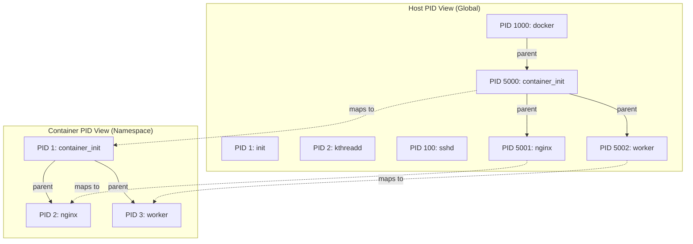
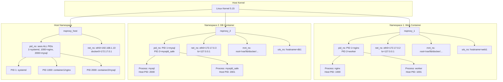

# **Linux Namespaces: Deep Dive into Process Isolation**

## **What Namespaces REALLY Do (The Core Concept)**

At its essence, a **namespace wraps a global system resource** in an abstraction that makes it appear to the processes within the namespace that they have their **own isolated instance** of that resource.

Think of it like this: **Without namespaces, every process sees the same global view.** With namespaces, **each process sees a different, tailored view** of the system.

## **The Mental Model: Building Analogy**

Imagine a **huge apartment building** (your Linux system):

### **Without Namespaces (Traditional Linux):**
```
┌─────────────────────────────────────────────────────────┐
│                     APARTMENT BUILDING                  │
│  ┌─────┐  ┌─────┐  ┌─────┐  ┌─────┐  ┌─────┐  ┌─────┐   │
│  │ Apt │  │ Apt │  │ Apt │  │ Apt │  │ Apt │  │ Apt │   │
│  │ 101 │  │ 102 │  │ 103 │  │ 104 │  │ 105 │  │ 106 │   │
│  └─────┘  └─────┘  └─────┘  └─────┘  └─────┘  └─────┘   │
│                                                         │
│  • All apartments see ALL other apartments              │
│  • Everyone shares the SAME address space               │
│  • Everyone uses the SAME plumbing system               │
│  • All mail goes to the SAME mailbox                    │
│  • Everyone hears ALL noises from others                │
└─────────────────────────────────────────────────────────┘
```

### **With Namespaces (Containerized):**
```
┌─────────────────────────────────────────────────────────┐
│                     APARTMENT BUILDING                  │
│                                                         │
│  ┌───────────────────────────────────────────────────┐  │
│  │          NAMESPACE 1: Apartment 101's View        │  │
│  │  ┌─────┐  ┌─────┐  ┌─────┐                        │  │
│  │  │ Apt │  │ Apt │  │ Apt │                        │  │
│  │  │ 101 │  │ 102 │  │ 103 │    (Only these exist!) │  │
│  │  └─────┘  └─────┘  └─────┘                        │  │
│  │  • Private plumbing                               │  │
│  │  • Private mailbox                                │  │
│  │  • Private address: 101 thinks it's the ONLY apt  │  │
│  └───────────────────────────────────────────────────┘  │
│                                                         │
│  ┌───────────────────────────────────────────────────┐  │
│  │          NAMESPACE 2: Apartment 104's View        │  │
│  │                    ┌─────┐  ┌─────┐  ┌─────┐      │  │
│  │                    │ Apt │  │ Apt │  │ Apt │      │  │
│  │                    │ 102 │  │ 104 │  │ 106 │      │  │
│  │                    └─────┘  └─────┘  └─────┘      │  │
│  │  • Different private plumbing                     │  │
│  │  • Different mailbox                              │  │
│  │  • Thinks it's Apartment 1 in its own building    │  │
│  └───────────────────────────────────────────────────┘  │
└─────────────────────────────────────────────────────────┘
```

## **How Namespaces Actually Work: Kernel Data Structures**

### **Without Namespaces (Simple Global Tables):**

```c
// Simplified kernel data structures (pre-namespace era)

// Global Process Table
Process proc_table[MAX_PROCESSES] = {
    {pid: 1,  name: "init"},
    {pid: 2,  name: "kthreadd"},
    {pid: 3,  name: "sshd"},
    {pid: 100, name: "nginx"},
    {pid: 101, name: "mysql"},
    {pid: 102, name: "bash"}
};

// Global Network Connection Table
NetworkConnection connections[] = {
    {local_ip: "192.168.1.10", local_port: 22,  remote_ip: "10.0.0.5"},
    {local_ip: "192.168.1.10", local_port: 80,  remote_ip: "any"},
    {local_ip: "192.168.1.10", local_port: 3306, remote_ip: "any"}
};

// Global Mount Table
MountPoint mounts[] = {
    {device: "/dev/sda1", mount_point: "/"},
    {device: "/dev/sda2", mount_point: "/home"},
    {device: "proc",      mount_point: "/proc"}
};
```

**Problem**: Every process sees ALL entries in ALL tables!

### **With Namespaces (Partitioned Views):**

```c
// Each namespace has its OWN set of tables

// NAMESPACE 1 (Container A)
struct namespace ns1 = {
    .pid_table = {
        {pid_ns: 1, pid_host: 1000, name: "nginx"},
        {pid_ns: 2, pid_host: 1001, name: "worker"},
        {pid_ns: 3, pid_host: 1002, name: "bash"}
    },
    .network_table = {
        {interface: "eth0", ip: "10.0.0.2"},
        {interface: "lo",   ip: "127.0.0.1"}
    },
    .mount_table = {
        {source: "overlay", target: "/"},
        {source: "tmpfs",   target: "/tmp"}
    }
};

// NAMESPACE 2 (Container B)  
struct namespace ns2 = {
    .pid_table = {
        {pid_ns: 1, pid_host: 2000, name: "mysql"},
        {pid_ns: 2, pid_host: 2001, name: "bash"}
    },
    .network_table = {
        {interface: "eth0", ip: "10.0.0.3"},
        {interface: "lo",   ip: "127.0.0.1"}
    },
    .mount_table = {
        {source: "overlay", target: "/"},
        {source: "tmpfs",   target: "/tmp"}
    }
};

// HOST NAMESPACE
struct namespace host_ns = {
    .pid_table = {
        {pid_ns: 1,   pid_host: 1,   name: "systemd"},
        {pid_ns: 100, pid_host: 100, name: "sshd"},
        {pid_ns: 1000, pid_host: 1000, name: "container1/nginx"},
        {pid_ns: 2000, pid_host: 2000, name: "container2/mysql"}
    }
};
```

## **Detailed Example: PID Namespace in Action**

### **Step 1: Host System Without Containers**
```bash
# On a regular Linux system (NO namespaces):
$ ps aux
USER       PID  PPID  COMMAND
root         1     0  /sbin/init
root         2     0  [kthreadd]
root         3     2  [rcu_gp]
root       100     1  /usr/sbin/sshd
root       101   100  sshd: john [priv]
john       102   101  -bash
john       103   102  vim app.py
mysql      200     1  /usr/sbin/mysqld
nginx      300     1  nginx: master process
nginx      301   300  nginx: worker process
```

**Key Point**: Process 102 (bash) can see ALL processes (1-301).

### **Step 2: Create a PID Namespace**
```bash
# Create a new process in a new PID namespace
# The 'unshare' command creates new namespaces
$ sudo unshare --pid --fork --mount-proc bash
```

**What happens in the kernel:**
1. Creates a new `pid_namespace` structure
2. Creates a new process table just for this namespace
3. Current process becomes PID 1 in the new namespace
4. Maps namespace PID 1 → Host PID 5000

### **Step 3: Inside the New PID Namespace**
```bash
# Inside the new bash shell (in new PID namespace)
$ ps aux
USER       PID  PPID  COMMAND
root         1     0  bash    # ← This is actually host PID 5000!
```

**Mind-blowing fact**: The process thinks it's PID 1 (like init), but on the host it's actually PID 5000!



### **Step 4: Create More Processes in Container**
```bash
# Inside container PID namespace:
$ sleep 3600 &
[1] 2  # Container sees this as PID 2

$ ps aux
USER       PID  PPID  COMMAND
root         1     0  bash
root         2     1  sleep 3600

# But on the host:
$ ps aux | grep sleep
root      5001  5000  sleep 3600
```

**The mapping**:
- Container PID 1 = Host PID 5000 (bash)
- Container PID 2 = Host PID 5001 (sleep)
- Container PID 3 = Host PID 5002 (future process)

### **Step 5: Nested Namespaces (Inception!)**
```bash
# Create a namespace inside a namespace
$ unshare --pid --fork bash  # Inside the container!

$ ps aux
USER       PID  PPID  COMMAND  
root         1     0  bash     # This is now PID 1 in NEW namespace
# Can't see the parent namespace's processes!
```

## **How Namespaces Are Implemented in Kernel**

### **Kernel Data Structures:**
```c
// Simplified kernel source (linux/nsproxy.h)

struct nsproxy {
    atomic_t count;                     // Reference count
    struct uts_namespace *uts_ns;       // Hostname namespace
    struct ipc_namespace *ipc_ns;       // IPC namespace
    struct mnt_namespace *mnt_ns;       // Mount namespace
    struct pid_namespace *pid_ns_for_children;  // PID namespace
    struct net           *net_ns;       // Network namespace
    struct cgroup_namespace *cgroup_ns; // Cgroup namespace
};

// Each process points to its nsproxy
struct task_struct {  // Process descriptor
    // ... many fields ...
    struct nsproxy *nsproxy;  // ← Namespace proxy for this process
    // ... more fields ...
};
```

### **Creating a New Namespace:**
```c
// When you call: unshare(CLONE_NEWPID | CLONE_NEWNS)

SYSCALL_DEFINE1(unshare, unsigned long, unshare_flags)
{
    struct nsproxy *new_ns;
    
    // 1. Create new nsproxy structure
    new_ns = create_new_namespaces(unshare_flags, current, current_user_ns());
    
    // 2. For PID namespace: Create new pid_namespace
    if (unshare_flags & CLONE_NEWPID) {
        new_ns->pid_ns_for_children = 
            create_pid_namespace(current->nsproxy->pid_ns_for_children);
    }
    
    // 3. Switch process to new namespace
    switch_task_namespaces(current, new_ns);
    
    return 0;
}
```

### **PID Allocation Across Namespaces:**
```c
// When a process calls getpid():
asmlinkage long sys_getpid(void)
{
    struct task_struct *task = current;  // Current process
    struct pid_namespace *ns;
    
    // Start from current namespace
    ns = task_active_pid_ns(task);
    
    // Return PID relative to current namespace
    return pid_nr_ns(task_thread_info(task)->pid, ns);
}

// The magic function that maps between namespaces
pid_t pid_nr_ns(struct pid *pid, struct pid_namespace *ns)
{
    struct upid *upid;
    pid_t nr = 0;
    
    // Walk up the namespace hierarchy
    for (upid = &pid->numbers[0]; upid <= &pid->numbers[pid->level]; upid++) {
        if (upid->ns == ns) {  // Found matching namespace
            nr = upid->nr;
            break;
        }
    }
    
    return nr;  // PID in requested namespace
}
```

## **Complete Example: Web Server in Container**

### **Step-by-Step Walkthrough:**

```bash
# HOST SYSTEM (Before container)
$ ps aux
USER       PID  COMMAND
root         1  systemd
root       500  docker daemon
... many more ...

# Step 1: Docker creates container
$ docker run -d --name web nginx

# Step 2: Docker creates namespaces via runc
$ runc create web_container

# In runc (simplified):
pid = clone(CLONE_NEWPID |    # New PID namespace
            CLONE_NEWNS  |    # New mount namespace  
            CLONE_NEWNET |    # New network namespace
            CLONE_NEWUTS |    # New UTS namespace
            CLONE_NEWIPC,     # New IPC namespace
            0);               # flags
```

### **Inside the Container:**
```bash
# Container's view:
$ hostname
web-container   # UTS namespace gives private hostname

$ ip addr
1: lo: <LOOPBACK> ... 
2: eth0: <BROADCAST> ... inet 172.17.0.2/16   # Private network

$ ps aux
USER       PID  COMMAND
root         1  nginx: master process
root         5  nginx: worker process
root         6  bash   # If we exec into container

$ ls /
bin   dev   etc   home  lib   proc  root  tmp   usr   var
# This is actually /var/lib/docker/overlay2/container_id/merged
```

### **On the Host System:**
```bash
# Host's view of same processes:
$ ps aux | grep nginx
root      6000     1  nginx: master process   # Container PID 1
root      6001  6000  nginx: worker process   # Container PID 5

$ ip addr show docker0
3: docker0: ... inet 172.17.0.1/16
# Container's eth0 is connected here via veth pair

$ ls /proc/6000/ns  # View namespaces of container process
cgroup  ipc  mnt  net  pid  pid_for_children  user  uts
# These are symlinks to namespace IDs
```

## **Visualizing Multiple Containers:**



## **Deep Technical: How Processes Are Isolated**

### **Process Lookup Across Namespaces:**
```c
// When process in container calls: kill(2, SIGTERM)

// 1. Kernel looks up PID 2 in current namespace
struct pid *find_pid_ns(int nr, struct pid_namespace *ns)
{
    // Hash table lookup for PID in specific namespace
    return idr_find(&ns->idr, nr);
}

// 2. The hash table (idr) only contains PIDs in this namespace
// Container namespace idr table:
// Key: 1 → Process struct (host PID 1000)
// Key: 2 → Process struct (host PID 1001)

// 3. Host namespace idr table:
// Key: 1    → Process struct (init)
// Key: 1000 → Process struct (container nginx)
// Key: 2000 → Process struct (container mysql)
```

### **The Illusion of Being PID 1:**
```bash
# Inside container, nginx starts as PID 1
# It receives special treatment:

# 1. Signal handling: SIGINT from docker stop
#    → PID 1 handles it gracefully (shutdown)
#    → Other PIDs might be killed immediately

# 2. Orphaned process adoption
#    If a process in container dies and leaves children,
#    PID 1 becomes their parent (like init on host)

# 3. Special responsibilities
#    PID 1 should handle shutdown signals properly
```

## **Real-World Example: Debugging Across Namespaces**

### **Problem**: You're in a container and want to debug processes:

```bash
# Inside container:
$ gdb -p 2  # Try to attach to PID 2 (worker process)
# ERROR: Permission denied
# Why? Because on host, this is PID 1001, and container
# doesn't have permission to debug host processes!

# Solution 1: Use nsenter (namespace enter)
# On host:
$ nsenter --target 1000 --pid --mount gdb -p 2
# Now gdb sees the container's PID namespace!
# PID 2 in container = the actual worker process

# Solution 2: Docker exec (does this internally)
$ docker exec -it web gdb -p 2
# Docker uses setns() syscall to enter container's namespaces
```

### **The setns() System Call:**
```c
// How docker exec works:
int enter_container_namespaces(pid_t container_pid) {
    char path[256];
    
    // Open PID namespace
    sprintf(path, "/proc/%d/ns/pid", container_pid);
    int pid_fd = open(path, O_RDONLY);
    
    // Enter PID namespace
    setns(pid_fd, 0);  // Magic happens here!
    
    // Now this process sees container's PID view
    // PID 1 = container's init process
}
```

## **Security Implications: Breaking Isolation**

### **What Happens If Namespace Isolation Fails?**
```bash
# If a container process escapes PID namespace:
# It could kill host processes!

# Example vulnerability (CVE-2019-5736 - runc escape):
# 1. Container process overwrites /proc/self/exe
# 2. Host's runc binary gets compromised
# 3. Container can now run code on host as root

# Defense: User namespaces + capabilities dropping
$ docker run --user 1000:1000 --cap-drop=ALL nginx
# Now even if escape happens, damage is limited
```

## **Performance Characteristics**

### **Namespace Operations Overhead:**
```c
// Creating a namespace: ~1000 CPU cycles
clone_with_namespaces() {
    // Mostly memory allocation for data structures
    nsproxy = kmalloc(sizeof(struct nsproxy));
    // Set up pointers to namespace objects
    // Minimal CPU overhead
}

// Process lookup in namespace: Almost zero overhead
// Why? Because kernel uses the SAME process structures
// Just different "views" via namespace pointers

// Network namespace: Some overhead
// Each namespace needs its own:
// - Routing tables
// - iptables rules  
// - Network device instances
// But: Much lighter than full VM!
```

## **Summary: What "Separate Process" Really Means**

### **Without Namespaces:**
- Process 5000 can **send signal** to process 1 (init)
- Process 5000 can **see** process 6000's memory maps (/proc/6000/maps)
- Process 5000 can **connect** to any open network port
- Process 5000 **shares** filesystem with everyone

### **With PID Namespace:**
- Process 5000 (container PID 1) **cannot see** process 1 (host init)
- Process 5000 **cannot signal** process 6000 (other container)
- Process 5000 **thinks** it's the first process in the system
- Process 5000 only sees **its children** in process list

### **With Multiple Namespaces Combined:**
- Process has **private process tree** (PID namespace)
- Process has **private filesystem** (Mount namespace)  
- Process has **private network** (Network namespace)
- Process has **private hostname** (UTS namespace)
- Process has **private IPC** (IPC namespace)
- Process has **private users** (User namespace)

**The end result**: A process that behaves as if it's running on its own dedicated machine, but it's actually sharing a kernel with hundreds of other similarly isolated processes!

### **The Ultimate Test:**
```bash
# In container A (nginx):
$ kill -9 1  # Tries to kill PID 1
# Actually kills container's init (nginx master)
# Host's init (PID 1) is completely unaffected!

# In container B (mysql):
$ netstat -tlnp
tcp6       0      0 :::3306      :::*        LISTEN      1/mysqld
# Only sees its own MySQL on port 3306
# Cannot see container A's nginx on port 80

$ mount | grep /proc
proc on /proc type proc (rw,nosuid,nodev,noexec,relatime)
# This is container's private /proc
# Not the host's /proc!
```

**This is namespace magic**: Each container lives in its own parallel universe, completely unaware of other containers or the host system, yet all sharing the same physical hardware and kernel!