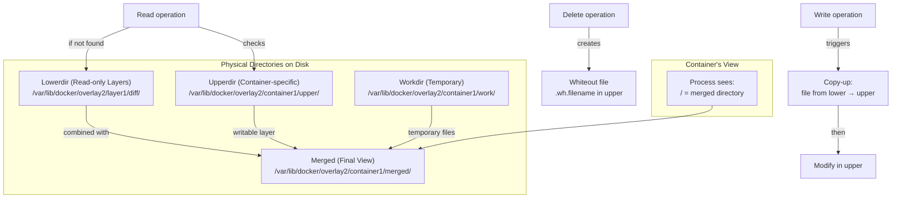
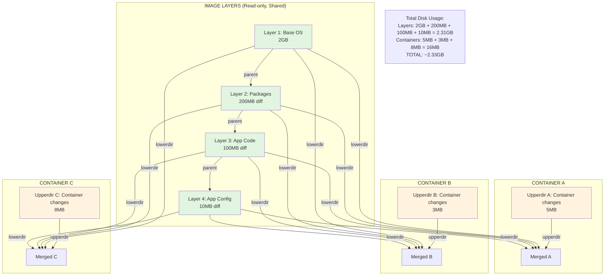

# **Union File System: The Magical Layered Filesystem**

The Problem: Why We Needed Something New. Imagine you're a librarian managing a huge library:
### **Traditional Filesystem (The Old Library):**
```
┌─────────────────────────────────────────────────────────┐
│                     TRADITIONAL LIBRARY                 │
│                                                         │
│  User A wants "Harry Potter":                           │
│  ┌─────────────────────────────────────────────────┐    │
│  │ Make FULL COPY of entire book                   │    │
│  │ 500 pages × 1000 users = 500,000 pages stored!  │    │
│  └─────────────────────────────────────────────────┘    │
│                                                         │
│  User B wants same book:                                │
│  ┌─────────────────────────────────────────────────┐    │
│  │ Make ANOTHER full copy                          │    │
│  │ Total storage: 1,000,000 pages!                 │    │
│  └─────────────────────────────────────────────────┘    │
│                                                         │
│  WASTEFUL! DUPLICATIVE! INEFFICIENT!                    │
└─────────────────────────────────────────────────────────┘
```

### **UnionFS (The Smart Library):**
```
┌────────────────────────────────────────────────────────┐
│                     UNIONFS LIBRARY                    │
│                                                        │
│  Master Book: "Harry Potter" (500 pages)               │
│                                                        │
│  User A's copy:                                        │
│  ┌─────────────────────────────────────────────────┐   │
│  │ Store ONLY changes:                             │   │
│  │ • Page 42: Drew mustache on Dumbledore          │   │
│  │ • Page 150: Added note "plot twist!"            │   │
│  │ • Page 500: Dog-eared corner                    │   │
│  │ TOTAL: 3 pages stored (not 500!)                │   │
│  └─────────────────────────────────────────────────┘   │
│                                                        │
│  User B's copy:                                        │
│  ┌─────────────────────────────────────────────────┐   │
│  │ • Page 100: Highlighted quote                   │   │
│  │ • Page 300: Coffee stain                        │   │
│  │ TOTAL: 2 pages stored                           │   │
│  └─────────────────────────────────────────────────┘   │
│                                                        │
│  SHARED BASE: 500 pages (1 copy)                       │
│  TOTAL STORAGE: 500 + 3 + 2 = 505 pages (not 1500!)    │
└────────────────────────────────────────────────────────┘
```

## **What Exactly is a Union File System?**

A **Union File System** is a filesystem that **overlays multiple directories** (called branches or layers) to present them as a **single unified directory**. It uses **copy-on-write** to store only differences.

Think of it like **Photoshop layers**:
- **Base layer**: Background image (read-only)
- **Layer 2**: Text overlay (read-only)  
- **Layer 3**: Your edits (read-write)
- **Final view**: All layers combined

## **How Docker Uses This Brilliantly**

### **Without UnionFS (The Old Way):**
```bash
# Each container needs FULL OS copy
Container1: Ubuntu 20.04 (2GB) + Nginx (50MB) + App (100MB) = 2.15GB
Container2: Ubuntu 20.04 (2GB) + Python (150MB) + App (100MB) = 2.25GB
Container3: Ubuntu 20.04 (2GB) + MySQL (300MB) + Data (500MB) = 2.8GB

TOTAL: 7.2GB (Ubuntu stored 3 times!)
```

### **With UnionFS (The Docker Way):**
```bash
# Shared base layers!
Base Layer: Ubuntu 20.04 (2GB) ← SHARED by all!

Container1: Base + Nginx layer (50MB) + App layer (100MB)
Container2: Base + Python layer (150MB) + App layer (100MB)  
Container3: Base + MySQL layer (300MB) + Data layer (500MB)

TOTAL: 2GB (Base) + 50MB + 100MB + 150MB + 100MB + 300MB + 500MB = 3.2GB
SAVINGS: 7.2GB → 3.2GB (55% less storage!)
```

## **Deep Dive: How OverlayFS Works (Docker's Default)**

### **The 4 Key Directories of OverlayFS:**



### **Real Directory Structure Example:**
```bash
# On your Docker host:
/var/lib/docker/overlay2/
├── l/                          # Short layer identifiers
│   ├── ABC123DEF... → ../layer1/diff
│   └── XYZ789UVW... → ../layer2/diff
│
├── layer1/                     # Base Ubuntu layer
│   ├── diff/                   # Actual files
│   │   ├── bin/
│   │   ├── etc/
│   │   ├── usr/
│   │   └── var/
│   ├── link                    # "ABC123DEF..." (points to l/ directory)
│   └── lower                   # Empty (no parent)
│
├── layer2/                     # Nginx installation layer
│   ├── diff/
│   │   ├── etc/nginx/         # Nginx config
│   │   ├── usr/sbin/nginx     # Nginx binary
│   │   └── var/www/html/      # Web files
│   ├── link                    # "XYZ789UVW..."
│   └── lower                   # "l/ABC123DEF..." (parent layer)
│
└── container1/                 # Container instance
    ├── diff/                   # Same as upperdir
    ├── merged/                 # Unified view (what container sees)
    ├── upper/                  # Container writes go here
    │   ├── .wh.etc            # Whiteout: deleted /etc file
    │   ├── etc/hosts          # Modified hosts file
    │   └── tmp/newfile.txt    # New file
    ├── work/                   # Temporary working directory
    └── lower                   # "l/XYZ789UVW...:l/ABC123DEF..." (all parent layers)
```

## **The Magic: Copy-on-Write (CoW) in Action**

### **Scenario 1: Reading a File**
```bash
# Container reads /etc/hosts
1. Check upperdir → NOT FOUND
2. Check lowerdir (layer2) → NOT FOUND  
3. Check lowerdir (layer1) → FOUND!
4. Return file from layer1/diff/etc/hosts
# No copy made! Just reading from base layer.
```

### **Scenario 2: Modifying a File**
```bash
# Container modifies /etc/hosts (from layer1)
1. Check upperdir → NOT FOUND
2. Found in lowerdir (layer1)
3. TRIGGER COPY-UP!:
   cp layer1/diff/etc/hosts → upperdir/etc/hosts
4. Modify the copy in upperdir
5. Future reads get file from upperdir
```

### **Scenario 3: Creating a New File**
```bash
# Container creates /home/test.txt
1. Directly create in upperdir
2. No copy-up needed (file doesn't exist in lower)
```

### **Scenario 4: Deleting a File**
```bash
# Container deletes /etc/nginx/nginx.conf (from layer2)
1. Create whiteout file in upperdir:
   touch upperdir/.wh.nginx.conf
2. File appears "deleted" in merged view
```

## **Detailed Walkthrough: From Docker Pull to Container Run**

### **Step 1: Docker Pull (Downloading Layers)**
```bash
docker pull ubuntu:20.04
```

**What happens:**
```
1. Downloads manifest: Lists 4 layers
   Layer1: sha256:abc123 (base)
   Layer2: sha256:def456 (apt updates)
   Layer3: sha256:ghi789 (package installs)
   Layer4: sha256:jkl012 (configs)

2. Creates directories:
   /var/lib/docker/overlay2/layer1/diff/  # Contains base Ubuntu
   /var/lib/docker/overlay2/layer2/diff/  # Contains changes from layer1
   /var/lib/docker/overlay2/layer3/diff/  # More changes
   /var/lib/docker/overlay2/layer4/diff/  # Final layer

3. Each layer only stores WHAT CHANGED from previous layer!
```

### **Step 2: Docker Run (Creating Container)**
```bash
docker run -it ubuntu:20.04 bash
```

**What happens:**
```bash
# 1. Create container directories
mkdir /var/lib/docker/overlay2/container_id/{upper,work,merged}

# 2. Mount OverlayFS
mount -t overlay overlay \
  -o lowerdir=layer4:layer3:layer2:layer1,upperdir=upper,workdir=work \
  merged

# 3. Container's root filesystem = 'merged' directory
# It sees unified view of all layers!
```

### **Step 3: Inside Container**
```bash
# What container sees:
$ ls /
bin   dev   etc   home  lib   media  mnt   opt   proc  root  run   sbin  srv   sys   tmp   usr   var

# This is actually:
# /var/lib/docker/overlay2/container_id/merged/
```

### **Step 4: Make Changes in Container**
```bash
# Inside container:
$ echo "Hello" > /test.txt          # Creates new file
$ rm /etc/hostname                  # Deletes file
$ echo "modified" >> /etc/hosts     # Modifies existing file
```

**On disk:**
```
/var/lib/docker/overlay2/container_id/upper/
├── test.txt                    # New file
├── .wh.hostname               # Whiteout for deleted file  
└── etc/hosts                  # Modified copy of original
```

## **The Brilliant Layering System**

### **Image Layers are READ-ONLY and SHARED:**


**Without layering:** 3 containers × 2.31GB = 6.93GB  
**With layering:** 2.31GB + 0.016GB = 2.33GB (66% savings!)

## **Different UnionFS Implementations**

### **1. OverlayFS (Current Default)**
```bash
# Mount command:
mount -t overlay overlay -o lowerdir=/lower1:/lower2,upperdir=/upper,workdir=/work /merged

# Pros:
# - In mainline Linux kernel (since 3.18)
# - Simple and fast
# - Good performance
# Cons:
# - Hard link limitations
# - NFS compatibility issues
```

### **2. AUFS (Advanced Multi-Layered Unification)**
```bash
# Mount command:  
mount -t aufs -o br=/upper=rw:/layer2=ro:/layer1=ro none /merged

# Pros:
# - More mature
# - Better handling of hard links
# Cons:
# - Not in mainline kernel
# - Need aufs-tools package
```

### **3. DeviceMapper**
```bash
# Block-level (not file-level) CoW
# Uses thin provisioning
# Pros: Better for write-heavy workloads
# Cons: More complex, needs LVM setup
```

### **4. Btrfs/ZFS**
```bash
# Uses subvolumes and snapshots
# Pros: Compression, deduplication, checksums
# Cons: Higher memory usage, more complex
```

## **Real-World Example: Building a Docker Image**

### **Dockerfile:**
```dockerfile
FROM ubuntu:20.04           # Layer 1: Base (2GB)
RUN apt update && \         # Layer 2: Apt metadata (50MB)
    apt install -y nginx    # Layer 3: Nginx binaries (100MB)
COPY app /var/www/html      # Layer 4: App code (10MB)
EXPOSE 80                   # Layer 5: Metadata (few bytes)
CMD ["nginx", "-g", "daemon off;"]  # Layer 6: Metadata
```

### **On Disk After Building:**
```
/var/lib/docker/overlay2/
├── layer1/           # ubuntu:20.04 (2GB)
│   └── diff/bin, /etc, /usr, /var...
├── layer2/           # apt update results (50MB)
│   └── diff/var/lib/apt/lists/*, /var/cache/apt...
├── layer3/           # nginx installation (100MB)
│   └── diff/usr/sbin/nginx, /etc/nginx, /var/www/html...
├── layer4/           # app code (10MB)
│   └── diff/var/www/html/index.html, /app.js...
├── layer5/           # metadata (tiny)
└── layer6/           # metadata (tiny)
```

### **Running Multiple Containers from Same Image:**
```bash
# Container 1:
# Uses: layer1 + layer2 + layer3 + layer4 + layer5 + layer6 + upper1
# upper1 contains: /tmp/session1, /var/log/nginx/access.log

# Container 2:  
# Uses: SAME layer1 + layer2 + layer3 + layer4 + layer5 + layer6 + upper2
# upper2 contains: /tmp/session2, different logs

# Storage: 2GB + 50MB + 100MB + 10MB + 1MB + 1MB = ~2.16GB
# PLUS: upper1 (5MB) + upper2 (5MB) = 2.17GB total
# NOT: (2.16GB × 2) = 4.32GB
```

## **The Copy-on-Write Process: Kernel Level**

### **What Happens During Copy-Up:**
```c
// Simplified kernel code (overlayfs)
static int ovl_copy_up_one(struct dentry *parent, struct dentry *dentry)
{
    struct path lowerpath;
    struct path upperpath;
    
    // 1. Find file in lower layer
    ovl_path_lower(dentry, &lowerpath);
    
    // 2. Create parent directories in upper
    ovl_create_overlay_dir(parent);
    
    // 3. Copy file data
    err = vfs_copy_file_range(lowerpath.file, 0,
                              upperpath.file, 0,
                              i_size_read(dentry), 0);
    
    // 4. Copy metadata (permissions, timestamps)
    ovl_copy_xattr(lowerpath.dentry, upperpath.dentry);
    
    // 5. File now exists in upper layer
    // Future reads will get it from upper
}
```

### **Read Operation Flow:**
```c
// When process reads /etc/hosts
static int ovl_read(struct file *file, char __user *buf, size_t count)
{
    // 1. Check if file exists in upperdir
    if (ovl_path_upper(file->f_path.dentry, &upperpath)) {
        // Read from upper (modified version)
        return vfs_read(upperpath.file, buf, count, &pos);
    }
    
    // 2. Check lowerdirs (in order: layer4 → layer3 → layer2 → layer1)
    for (int i = 0; i < num_lower; i++) {
        if (ovl_path_lower(file->f_path.dentry, i, &lowerpath)) {
            // Found in layer i
            return vfs_read(lowerpath.file, buf, count, &pos);
        }
    }
    
    // 3. Not found anywhere → ENOENT
    return -ENOENT;
}
```

## **Performance Characteristics**

### **Read Performance:**
- **First read**: Normal speed (checking layers has small overhead)
- **Subsequent reads**: Full speed (cached in page cache)

### **Write Performance:**
- **New file**: Normal speed (direct write to upperdir)
- **Modify existing file**: 
  - **First write**: Slower (copy-up overhead)
  - **Subsequent writes**: Normal speed (working on upperdir copy)

### **Copy-up Scenarios:**
```bash
# FAST: Small files (config files, logs)
# /etc/hosts (2KB) → copy-up instant

# SLOW: Large files (databases, videos)
# /var/lib/mysql/ibdata1 (1GB) → copy-up takes time!

# Solution for databases: Use VOLUMES!
# Mount host directory directly, bypassing UnionFS
docker run -v /host/data:/var/lib/mysql mysql
```

## **Advanced Features and Limitations**

### **Whiteout Files (How Deletion Works):**
```
# When you delete /etc/nginx/nginx.conf:
upperdir/.wh.nginx.conf  # Special file marking deletion

# Directory deletion:
upperdir/.wh..wh..opq  # Opaque directory (hides entire directory)

# Character device with device numbers 0/0
# Special meaning to OverlayFS: "this file is deleted"
```

### **Hard Link Challenges:**
```bash
# Problem: Hard links across layers
# File in layer1, hard link in layer2
# Copy-up breaks the hard link!

# OverlayFS solution: "redirect_dir" feature
# Creates "trusted.overlay.redirect" xattr
```

### **NFS Export Issues:**
```bash
# Can't directly export OverlayFS via NFS
# Workaround: Use bind mounts
mount --bind /var/lib/docker/overlay2/container/merged /export/container
```

## **Practical Examples and Commands**

### **Inspecting Layers:**
```bash
# See image layers
docker history ubuntu:20.04

# See container layers
docker inspect container_name | jq '.[0].GraphDriver'

# Output:
{
  "Data": {
    "LowerDir": "/var/lib/docker/overlay2/layer4/diff:/var/lib/docker/overlay2/layer3/diff:/var/lib/docker/overlay2/layer2/diff:/var/lib/docker/overlay2/layer1/diff",
    "MergedDir": "/var/lib/docker/overlay2/container_id/merged",
    "UpperDir": "/var/lib/docker/overlay2/container_id/upper",
    "WorkDir": "/var/lib/docker/overlay2/container_id/work"
  },
  "Name": "overlay2"
}
```

### **Checking Disk Usage:**
```bash
# Check actual disk usage of layers
docker system df

# Output:
TYPE            TOTAL     ACTIVE    SIZE      RECLAIMABLE
Images          5         3         2.31GB    1.1GB (47%)
Containers      3         3         16.32MB   0B (0%)
Local Volumes   2         2         1.45GB    0B (0%)
Build Cache     0         0         0B        0B
```

### **Cleaning Up:**
```bash
# Remove unused layers
docker image prune

# Remove everything
docker system prune -a
```

## **Security Considerations**

### **SUID Binaries:**
```bash
# Problem: SUID binaries in lower layers
# If /bin/su is SUID in base image
# Container gets SUID privilege!

# Solution: Docker defaults to removing SUID
# Or use --security-opt="no-new-privileges"
```

### **Device Files:**
```bash
# Problem: /dev/null, /dev/random in base image
# Container can access host devices!

# Solution: Docker creates fresh /dev
# Only includes essential device files
```

### **Read-only vs Read-write:**
```bash
# Run container with read-only rootfs
docker run --read-only ubuntu

# Make specific directories writable
docker run --read-only \
  --tmpfs /tmp \
  --tmpfs /run \
  ubuntu
```

## **The Evolution: From AUFS to Overlay2**

### **AUFS (The Pioneer):**
- First used by Docker
- File-level copy-on-write
- Limitations: Not in mainline kernel, page cache sharing issues

### **Overlay (v1):**
- Simpler than AUFS
- In mainline kernel
- Issues with hard links, NFS

### **Overlay2 (Current Default):**
- Multiple lower directories (not just one)
- Better page cache sharing
- Native support in kernel 4.0+
- Uses "redirect_dir" for better hard link handling

## **Summary: Why UnionFS is Revolutionary**

### **Before UnionFS (Virtual Machines):**
```
Each VM: Full OS + App + Data
10 VMs = 10 × (2GB OS + 200MB App) = 22GB
Boot time: 30-60 seconds each
Memory: Each VM needs dedicated RAM
```

### **With UnionFS (Containers):**
```
Base OS: 2GB (SHARED)
Each container: App layer + data layer
10 containers = 2GB + 10 × 200MB = 4GB
Start time: 100-500 milliseconds
Memory: Shared kernel, less overhead
```

### **The Key Innovations:**
1. **Copy-on-Write**: Store only differences
2. **Layer Sharing**: One base, many containers
3. **Fast Startup**: No OS boot needed
4. **Efficient Storage**: No duplication
5. **Immutable Layers**: Base images never change

### **The Magic Formula:**
```
Container Filesystem = 
    Base Layer (Ubuntu) + 
    Package Layer (nginx) + 
    App Layer (your code) + 
    Config Layer (settings) + 
    Container Layer (runtime changes)
    
All stacked like transparent sheets, 
giving final unified view!
```

### **Final Thought:**
Union File Systems turn storage from a **cost center** (duplicating everything) into an **efficiency engine** (sharing everything possible). This simple yet powerful idea is why Docker containers can be so lightweight, fast, and scalable compared to traditional virtual machines.

The next time you run `docker run` and it starts in milliseconds, remember: you're witnessing the magic of layered filesystems working together with namespaces and cgroups to create the modern container revolution!