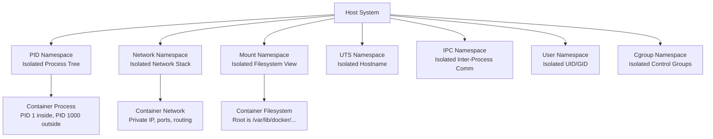
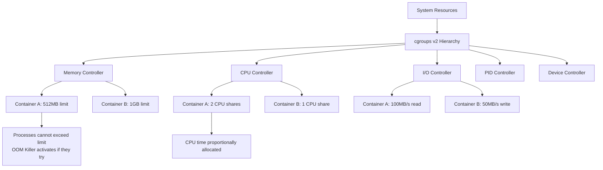
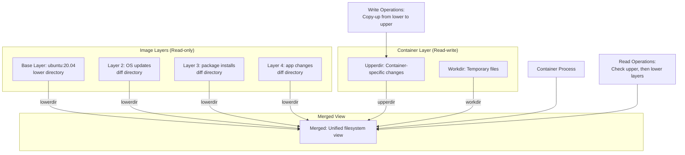
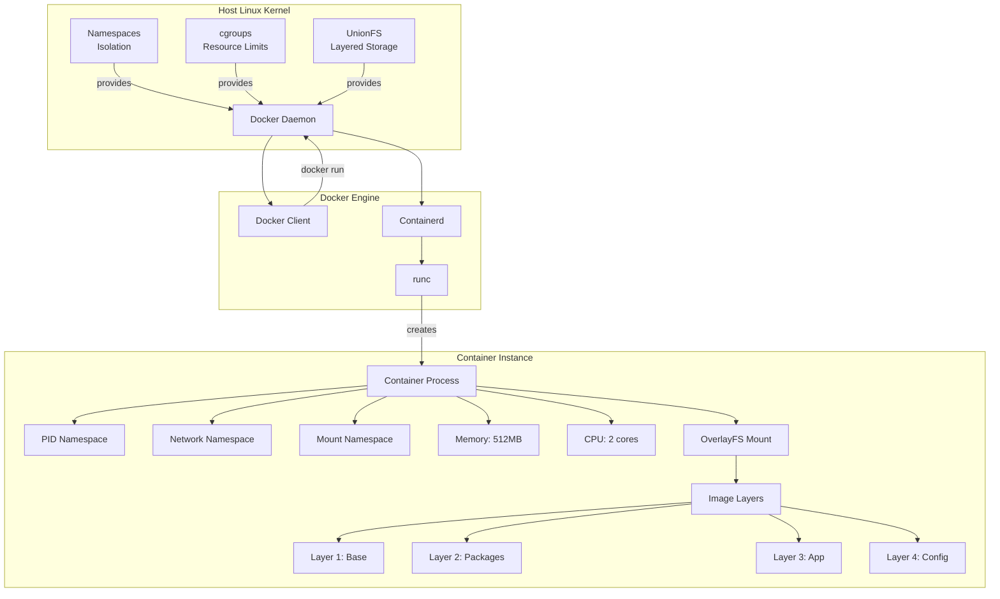

# **Linux Container Technologies: Namespaces, cgroups, and Union File Systems**

## **1. Linux Namespaces: Process Isolation**

### **What are Namespaces?**
Linux namespaces are a kernel feature that **partitions global system resources** into isolated instances, making processes in one namespace believe they have their own isolated instance of the resource. Think of it as creating **virtual partitions** within a single Linux kernel.

### **Why We Needed Namespaces?**
Before namespaces:
- All processes could see all other processes
- Every process could see the entire filesystem
- Network ports were globally visible
- System resources (users, hosts) were shared
- **Problem**: No proper isolation between applications

### **Types of Namespaces (7 Types):**



### **How Each Namespace Works:**

#### **1. PID Namespace (Process Isolation)**
```bash
# On host system
ps aux          # Shows ALL processes (1-1000+)

# Inside container (PID namespace)
ps aux          # Shows only container processes (1-20)
                # Container's PID 1 = Host's PID 1000
```

**Mechanism:**
- Each PID namespace has its own process ID numbering
- Processes can have **two PIDs**: one in container, one on host
- Parent namespace can see child namespace processes
- Child namespace cannot see parent namespace

#### **2. Mount Namespace (Filesystem Isolation)**
```bash
# Container sees:
/ (root) → /var/lib/docker/overlay2/container_id/merged

# Host sees actual root:
/ → root filesystem with all directories
```

**Working:**
- Each container gets its own root filesystem (`/`)
- Mount/unmount operations don't affect host or other containers
- Uses `pivot_root()` or `chroot()` to change root directory

#### **3. Network Namespace**
```bash
# Container gets:
eth0: 172.17.0.2
lo: 127.0.0.1

# Host sees container as:
veth12345abc → connected to docker0 bridge (172.17.0.1)
```

**Isolation Layers:**
1. **Network Interfaces**: Each container gets virtual eth0
2. **IP Addresses**: Private range (172.17.x.x, 192.168.x.x)
3. **Routing Tables**: Separate routing rules
4. **Ports**: Container can bind to port 80 without host conflict
5. **Firewall Rules**: Separate iptables rules

#### **4. UTS Namespace (Hostname Isolation)**
- Isolates `nodename` and `domainname`
- Container can have its own hostname
```bash
hostname mycontainer  # Doesn't affect host
```

#### **5. IPC Namespace (Inter-Process Communication)**
- Isolates System V IPC, POSIX message queues
- Prevents containers from interfering with each other's IPC

#### **6. User Namespace (User ID Isolation)**
```bash
# UID mapping example:
Container UID 0 (root) → Host UID 100000
Container UID 1 → Host UID 100001
```
- Maps container users to non-privileged host users
- Enhances security: root in container ≠ root on host

#### **7. Cgroup Namespace**
- Hides cgroup hierarchy from container
- Makes /proc/self/cgroup show container's cgroup as root

### **Namespace Creation Flow:**
```c
// Simplified sequence
clone() system call with namespace flags → New process in new namespaces
unshare() → Move existing process to new namespace
setns() → Join existing namespace
```

---

## **2. Control Groups (cgroups): Resource Management**

### **What are cgroups?**
Control groups are a kernel feature for **limiting, accounting, and isolating** resource usage (CPU, memory, disk I/O, network) of process groups.

### **Why We Needed cgroups?**
**Problem Scenario**: One container consumes all:
- 100% CPU → Other containers starve
- All available memory → System starts swapping or kills processes
- Disk I/O bandwidth → Other processes slow down
- Network bandwidth → Network congestion

**Solution**: cgroups provide **resource quotas and limits**

### **cgroups v2 Architecture:**



### **Key Controllers and Their Functions:**

#### **1. Memory Controller**
```bash
# Limits
memory.max = 512M          # Hard limit
memory.high = 480M         # Soft limit (pressure notification)
memory.swap.max = 1G       # Swap limit
memory.oom.group = 1       # Kill all processes in group if OOM
```

**How it works:**
- Tracks: cache, swap, kernel memory, user memory
- Enforces limits via OOM (Out-Of-Memory) killer
- Provides statistics: `memory.stat`, `memory.events`

#### **2. CPU Controller**
```bash
# Two models:
1. Weight-based (CFS):
   cpu.weight = 100        # Relative to other groups

2. Bandwidth-based (RT):
   cpu.max = "50000 100000" # 50% of CPU quota, period=100ms
```

**CPU Allocation Models:**
- **cpu.shares**: Relative weight (1024 = default)
- **cpu.cfs_quota_us**: Microseconds of CPU time per period
- **cpu.cfs_period_us**: Period length in microseconds
- **cpu.rt_runtime_us**: Real-time CPU allocation

#### **3. I/O Controller**
```bash
# Throttling example
io.max = "8:16 rbps=1048576 wbps=524288"
# Major:Minor device, read bytes/sec, write bytes/sec
```

**Controls:**
- **io.weight**: Relative I/O priority
- **io.max**: Absolute bandwidth limits
- **io.stat**: I/O statistics tracking

#### **4. PID Controller**
- Limits number of processes in cgroup
```bash
pids.max = 64  # Maximum 64 processes
```

#### **5. Device Controller**
- Controls access to devices
```bash
# Allow read/write to /dev/null, only read to /dev/zero
devices.allow = "c 1:3 rwm"
devices.deny = "c 1:5 w"
```

### **cgroups v2 Unified Hierarchy:**
```
/sys/fs/cgroup/
├── system.slice/          # System services
├── user.slice/           # User sessions
├── kubepods.slice/       # Kubernetes pods
│   ├── pod123456/        # Pod cgroup
│   │   ├── container1/   # Container limits
│   │   └── container2/
└── docker/               # Docker containers
```

### **How cgroups Enforce Limits:**
1. **Memory**: Kernel checks allocations against `memory.max`
2. **CPU**: Scheduler uses weights/quotas to allocate time slices
3. **I/O**: Block layer throttles requests exceeding limits
4. **Accounting**: All usage tracked in `*.stat` files

---

## **3. Union File Systems: Layered Storage**

### **What are Union File Systems?**
Union file systems allow **multiple directory layers** to be overlayed, appearing as a single unified filesystem. Docker uses this for **layer-based images**.

### **Why We Needed UnionFS?**
**Problems with traditional storage:**
1. **Duplication**: Each container needs full OS copy
2. **Size**: 100 containers = 100× OS storage
3. **Sharing**: No way to share common base layers
4. **Speed**: Slow container creation

**Solution**: UnionFS provides:
- **Copy-on-Write (CoW)**: Share common data, copy only when modified
- **Layering**: Base image + diff layers = container filesystem
- **Efficiency**: Share layers between containers

### **UnionFS Architecture (OverlayFS):**



### **How OverlayFS Works:**

#### **Layer Structure:**
```
/var/lib/docker/overlay2/
├── layer1/               # Base image
│   ├── diff/            # Actual files
│   └── link             # Short identifier
├── layer2/               # Second layer
│   ├── diff/            # Changes from layer1
│   └── lower            # Points to parent: "l/layer1-link"
├── layer3/               # Third layer
│   ├── diff/
│   └── lower            # "l/layer2-link:l/layer1-link"
└── container1/           # Container mount
    ├── merged/          # Unified view
    ├── upper/           # Container writes
    └── work/            # Working directory
```

#### **Key Operations:**

1. **Read Operation**:
   ```
   Process reads /etc/hosts:
   2. Check upperdir → not found
   3. Check lowerdir (layer4) → not found
   4. Check lowerdir (layer3) → not found
   5. Check lowerdir (layer2) → found! Return file
   ```

6. **Write Operation (Copy-on-Write)**:
   ```
   Process modifies /etc/hosts (from layer2):
   7. Copy file from lowerdir (layer2) to upperdir
   8. Apply modification in upperdir
   9. Future reads get file from upperdir (hides lowerdir version)
   ```

10. **Delete Operation**:
   ```
   Process deletes /etc/hosts:
   11. Create "whiteout" file in upperdir: ".wh.etc"
   12. File appears deleted in merged view
   ```

### **Types of Union File Systems:**

1. **OverlayFS** (Default in Docker):
   - Simple, fast, in mainline kernel
   - `overlay` (v1) and `overlay2` (v2)

2. **AUFS** (Advanced Multi-Layered Unification):
   - Original Docker storage driver
   - More features but not in mainline kernel

3. **DeviceMapper**:
   - Block-level storage
   - Uses thin provisioning

4. **Btrfs/ZFS**:
   - Advanced features: snapshots, compression
   - More complex setup

### **Layer Sharing Across Containers:**

```
                [Base Layer: ubuntu]
                       /   \
                      /     \
       [nginx layer]         [python layer]
            |                      |
      [Container A]          [Container B]
    
Disk usage: ubuntu(100MB) + nginx(50MB) + python(60MB) = 210MB
Not: (100+50) + (100+60) = 310MB (without sharing)
```

---

## **4. Integration with Docker Containers**

### **Complete Docker Architecture:**



### **Step-by-Step Container Creation:**

#### **Step 1: Image Pull and Storage**
```bash
docker pull nginx:alpine
```
1. Downloads manifest: lists layer digests
2. Downloads each layer to `/var/lib/docker/overlay2/`
3. Creates layer directories with `diff/` and `lower` files
4. Layers are **read-only** and **shared**

#### **Step 2: Container Creation**
```bash
docker run -d --name web -m 512MB --cpus=2 nginx:alpine
```

**What happens internally:**
1. **Image Preparation**:
   - Create read-write `upperdir` for container
   - Create `workdir` for OverlayFS internal use
   - Setup `merged` directory (final view)

2. **Namespace Creation** (via `runc`):
   ```go
   // Simplified runc sequence
   unshare(CLONE_NEWNS |    // Mount namespace
           CLONE_NEWUTS |   // UTS namespace  
           CLONE_NEWPID |   // PID namespace
           CLONE_NEWNET |   // Network namespace
           CLONE_NEWIPC)    // IPC namespace
   
   // Setup filesystem
   pivot_root("./rootfs", "./rootfs/.pivot_root")
   chdir("/")
   
   // Drop capabilities
   capset()  // Limit container privileges
   ```

3. **cgroups Setup**:
   ```bash
   # Create cgroup for container
   mkdir /sys/fs/cgroup/docker/container_id/
   
   # Set limits
   echo 536870912 > memory.max     # 512MB
   echo "200000 100000" > cpu.max  # 2 cores equivalent
   echo 1000 > pids.max            # Process limit
   
   # Add container process to cgroup
   echo $CONTAINER_PID > cgroup.procs
   ```

4. **Network Setup**:
   ```bash
   # Create veth pair
   ip link add veth0 type veth peer name veth1
   
   # Put veth1 in container network namespace
   ip link set veth1 netns $CONTAINER_PID
   
   # Configure IP addresses
   ip addr add 172.17.0.2/16 dev veth0
   ip netns exec $CONTAINER_PID ip addr add 172.17.0.3/16 dev veth1
   
   # Set up NAT for external access
   iptables -t nat -A POSTROUTING -s 172.17.0.0/16 -j MASQUERADE
   ```

5. **Filesystem Mount**:
   ```bash
   mount -t overlay overlay \
         -o lowerdir=L4:L3:L2:L1,upperdir=upper,workdir=work \
         /path/to/merged
   ```

#### **Step 3: Container Runtime**
**Process Isolation**:
- Container process thinks it's PID 1
- Sees only its own filesystem (`/`)
- Has its own network stack
- Limited resource usage by cgroups

**Filesystem Operations**:
```bash
# Inside container:
echo "test" > /newfile.txt  # Creates in upperdir
rm /etc/nginx/nginx.conf    # Creates whiteout in upperdir

# On host, you see:
# /var/lib/docker/overlay2/container_id/upper/newfile.txt
# /var/lib/docker/overlay2/container_id/upper/.wh.nginx.conf
```

#### **Step 4: Container Stop/Cleanup**
1. Send SIGTERM to container process
2. Unmount OverlayFS
3. Remove network namespace and interfaces
4. Delete cgroup directory
5. Optionally remove upperdir (container-specific changes lost)

### **Advanced Docker Features Using These Technologies:**

#### **1. Multi-Container Pods (Kubernetes)**
```yaml
# Pod shares some namespaces
apiVersion: v1
kind: Pod
spec:
  containers:
  - name: app
    image: nginx
  - name: sidecar
    image: log-collector
    # Shares network namespace with app
```

#### **2. Resource QoS Classes**:
- **Guaranteed**: Both CPU and memory limits set
- **Burstable**: Some limit set, not all
- **BestEffort**: No limits set

#### **3. Storage Drivers Comparison**:
| Driver     | Copy-on-Write | Direct IO | Memory Efficiency |
|------------|---------------|-----------|-------------------|
| overlay2   | File-level    | Yes       | Excellent         |
| devicemapper| Block-level  | Yes       | Good              |
| aufs       | File-level    | No        | Good              |
| btrfs      | Block-level   | Yes       | Excellent         |

### **Security Implications:**

1. **Namespace Escapes**: If misconfigured, container can access host
2. **cgroups Exploits**: Resource exhaustion attacks
3. **UnionFS Issues**: Symlink attacks, privilege escalation
4. **Defense**: Use User namespaces, SELinux/AppArmor, read-only roots

### **Performance Characteristics:**

1. **Namespaces**: Near-zero overhead (kernel data structure)
2. **cgroups**: Minimal overhead (scheduler decisions)
3. **OverlayFS**: 
   - Read: Small overhead (layer lookup)
   - Write: Higher overhead (copy-up)
   - Best for: Many containers sharing base layers

### **Real-World Example: Web Application Stack**
```
Container A: Nginx (Frontend)
├── Namespaces: Isolated network, PID, mount
├── cgroups: 256MB RAM, 0.5 CPU
└── UnionFS: alpine + nginx layers

Container B: Node.js App
├── Namespaces: Different network, shared volumes
├── cgroups: 1GB RAM, 2 CPU
└── UnionFS: debian + node + app code

Container C: Redis
├── Namespaces: Full isolation
├── cgroups: 512MB RAM, 1 CPU
└── UnionFS: redis alpine image
```

---

## **5. Evolution and Future**

### **Historical Context:**
1. **2002**: Linux namespaces introduced (Mount namespace first)
2. **2008**: cgroups merged into kernel
3. **2013**: Docker released, popularized containers
4. **2015**: OCI (Open Container Initiative) formed
5. **2016**: Kubernetes adopts containers
6. **2020**: cgroups v2 becomes default

### **Current Trends:**
1. **Rootless Containers**: Using user namespaces for better security
2. **eBPF Integration**: Enhanced observability and security
3. **WASM Containers**: WebAssembly as container alternative
4. **MicroVMs**: Firecracker, Kata Containers for stronger isolation

### **Limitations and Workarounds:**
1. **Linux-only**: Containers rely on Linux kernel features
2. **Windows/Mac**: Use VM with Linux kernel
3. **Stateful Data**: Use volumes, not UnionFS layers
4. **Security**: Additional layers needed (seccomp, capabilities)

---

## **Summary Table**

| Technology | Solves | Mechanism | Docker Usage |
|------------|--------|-----------|--------------|
| **Namespaces** | Isolation | Virtualize system resources | Isolate containers from each other and host |
| **cgroups** | Resource control | Limit, account, prioritize | Set CPU, memory, I/O limits |
| **UnionFS** | Storage efficiency | Layered, copy-on-write | Share image layers, efficient storage |

### **Key Takeaways:**

1. **Namespaces provide isolation** - Each container gets its own "view" of the system
2. **cgroups provide limits** - No single container can hog all resources
3. **UnionFS provides efficiency** - Share common data, store only differences
4. **Together** they create lightweight, secure, efficient containers

### **The Magic Formula:**
```
Container = Namespaces(isolation) + cgroups(limits) + UnionFS(layers) + chroot(filesystem)
```

This combination allows Docker to run **isolated, resource-controlled, portable application packages** that start in milliseconds and have near-native performance.