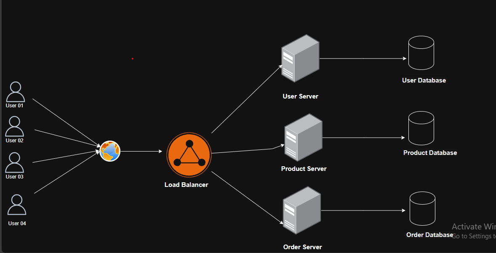

# Create load balancer in NGINX with microservice

This block is about how to create a load balancer with NGINX in micro service. We are going to use node.js, express.js and NGINX to do so.



## What will do in this blog?

Their are three microservices product service, order service and user service which are also running three different port. Those services are connected with a load balancer which is also running in a different blog. When a request is coming to `/api/product/**` it will be served to product service and also same for others. `/api/order/**` will be handled by order service and `/api/user/**` will also be served to user service.

## What is a Load balancer?

A load balancer is a system or device that distributes incoming network traffic across multiple servers to ensure no single server becomes overwhelmed. It acts as an intermediary between clients (users) and the backend servers, efficiently managing traffic and improving the application's reliability, availability, and performance.

### Why we need a load balancer?

- It improve the performance. Instance of single server dealing with all the api, now incoming request will be distribute into multiple server
- Highly available and fault tolerance. If one server goes down all the other server works properly
- Single entry point. All the request will be coming into one single entry point. So front user will never know from which server data is coming.
- Flexible. As the server is different, one server may use one stack like node.js mongoDB, other can user different stack like Java postgreSQL.

## Download Nginx

- Download Nginx from their official site. [Download](https://nginx.org/en/download.html)
- It will be a .zip file, then extract it
- Navigate to the folder, found a `nginx.exe` file
- Run this file with `./nginx.exe` command

## Basic command for controlling nginx server

- `nginx -s stop` for fast shutdown
- `nginx -s quit` for graceful shutdown
- `nginx -s reload` for reloading the config file
- `nginx -s reopen` for reopening the log files

Once the nginx server is running then start configuration. After the config is completed nginx server need to reload.

#### First create three microservice

`Product Microservice`

```javascript
const express = require("express");
const app = express();

const PORT = 3003;

app.get("/api/product", (req, res) => {
  res.status(200).json({ message: "Health checking from product ..." });
});

app.get("/api/product/hello", (req, res) => {
  res.status(200).json({
    message: `Hello from product server on ${PORT} `,
  });
});

app.listen(PORT, () => {
  console.log(`Product server is running on port ${PORT}`);
});
```

`User Service`

```javascript
const express = require("express");
const app = express();

const PORT = 3001;

app.get("/api/user", (req, res) => {
  res.status(200).json({ message: "Health checking from user ..." });
});

app.get("/api/user/hello", (req, res) => {
  res.status(200).json({
    message: `Hello from user server on ${PORT} `,
  });
});

app.listen(PORT, () => {
  console.log(`User server is running on port ${PORT}`);
});
```

`Order Service`

```javascript
const express = require("express");
const app = express();

const PORT = 3002;

app.use(express.json());

app.get("/api/order", (req, res) => {
  res.status(200).json({ message: "Health checking from order ..." });
});

app.get("/api/user/hello", (req, res) => {
  res.status(200).json({
    message: `Hello from order server on ${PORT} `,
  });
});

app.listen(PORT, () => {
  console.log(`Order server is running on port ${PORT}`);
});
```

#### Now Config the Nginx

First go to the folder where `nginx.exe` file located. Then under the `config` directory `nginx.conf` folder is located. Open that file for config.

```javascript
worker_processes 1;

events {
    worker_connections 1024;
}

http {
    include       mime.types;
    default_type  application/octet-stream;

    upstream user_api {
        server 127.0.0.1:3001;
    }

    upstream order_api {
        server 127.0.0.1:3002;
    }

    upstream product_api {
        server 127.0.0.1:3003;
    }

    server {
        listen 8081;
        server_name localhost;

        location /api/product {
            proxy_pass http://product_api;
            proxy_set_header Host $host;
            proxy_set_header X-Real-IP $remote_addr;
            proxy_set_header X-Forwarded-For $proxy_add_x_forwarded_for;
        }

        location /api/user {
            proxy_pass http://user_api;
            proxy_set_header Host $host;
            proxy_set_header X-Real-IP $remote_addr;
            proxy_set_header X-Forwarded-For $proxy_add_x_forwarded_for;
        }

        location /api/order{
            proxy_pass http://order_api;
            proxy_set_header Host $host;
            proxy_set_header X-Real-IP $remote_addr;
            proxy_set_header X-Forwarded-For $proxy_add_x_forwarded_for;
        }

    }
}

```

### Config Explanation

```javascript
worker_processes 1;
```

Defines the number of worker processes that Nginx will spawn to handle client requests. 1: Nginx will use only one worker process. This is fine for development or low-traffic scenarios but may need to be increased for production environments to handle more traffic.

```javascript
events {
    worker_connections 1024;
}
```

Each worker process can handle up to 1,024 simultaneous connections. With 1 worker process, the maximum connections will be 1,024.

```javascript
http {}
```

The http block contains settings related to HTTP requests and responses, as well as the configuration for upstream servers and routing

```javascript
include mime.types;
```

`mime.types` files contains the list of all file extensions. like html, css, .js file. Ensures that Nginx correctly identifies and serves files with appropriate content types.

```javascript
default_type application/octet-stream;
```

Specifies the default MIME type for files if their type cannot be determined. application/octet-stream means "unknown binary data." Used as a fallback when no mime.types mapping exists for a requested file

```javascript
upstream user_api {
    server 127.0.0.1:3001;
}

upstream order_api {
    server 127.0.0.1:3002;
}

upstream product_api {
    server 127.0.0.1:3003;
}
```

Defines upstream servers, which are backend servers that Nginx will forward requests to. Those are kind of variable which contain values of forwarded request.
user_api: Handles requests for the User service, running on 127.0.0.1 (localhost) at port 3001.
order_api: Handles requests for the Order service, running on 127.0.0.1 at port 3002.
product_api: Handles requests for the Product service, running on 127.0.0.1 at port 3003

```javascript
server {
    listen 8081;
    server_name localhost;
```

The server block defines the configuration for handling incoming requests. `listen 8081` Specifies the port Nginx will listen on for incoming HTTP requests. `server_name localhost` Specifies the hostname or domain name for the server.

```javascript
location /api/product {
    proxy_pass http://product_api;
    proxy_set_header Host $host;
    proxy_set_header X-Real-IP $remote_addr;
    proxy_set_header X-Forwarded-For $proxy_add_x_forwarded_for;
}
```

- `location /api/product {}:` Matches all requests that start with `/api/product`.
- proxy_pass http://product_api;: Forwards the request to the product_api upstream, which is `127.0.0.1:3003` that is defined in up.
- proxy_set_header Directives:
  - `Host $host`: Sets the Host header in the request forwarded to the backend. `$host` is the original hostname requested by the client. In express.js every request comes with a header which is located at request. for example in controller. `async(req, res) => {}` req has the that header.
  - `X-Real-IP $remote_addr`: Adds the X-Real-IP header, which contains the original client's IP address. As nginx is also a server which pass the request to main microservice server. Problem is main microservice will never know the ip address for user, because request comes from another server not from user directly.
  - `X-Forwarded-For $proxy_add_x_forwarded_for` : Adds the X-Forwarded-For header, which includes the original client's IP address and any other proxies the request passed through.

For User API Route

```javascript
location /api/user {
    proxy_pass http://user_api;
    proxy_set_header Host $host;
    proxy_set_header X-Real-IP $remote_addr;
    proxy_set_header X-Forwarded-For $proxy_add_x_forwarded_for;
}
```

For Order API Route

```javascript
location /api/order {
    proxy_pass http://order_api;
    proxy_set_header Host $host;
    proxy_set_header X-Real-IP $remote_addr;
    proxy_set_header X-Forwarded-For $proxy_add_x_forwarded_for;
}
```

### Checking the config

```javascript
nginx - t;
```

If the config is okay then return successful.

```txt
PS F:\Research\Learn_Nginx\nginx> .\nginx.exe -t
nginx: the configuration file F:\Research\Learn_Nginx\nginx/conf/nginx.conf syntax is ok
nginx: configuration file F:\Research\Learn_Nginx\nginx/conf/nginx.conf test is successful
```

### Now Testing Time

First run those three micro service with node.js in three different port.

Product Server

```javascript
PS F:\Research\Learn_Nginx> node product_server.js
Product server is running on port 3003
```

User Server

```javascript
PS F:\Research\Learn_Nginx> node user_server.js
User server is running on port 3001
```

Order Server

```javascript
PS F:\Research\Learn_Nginx> node order_server.js
Order server is running on port 3002
```

Now try to hit each server hello get api with.
From Product Server

```text
$ curl localhost:8081/api/product/hello
{"message":"Hello from product server on 3003 "}
```

From User Server

```text
$curl localhost:8081/api/user/hello
{"message":"Hello from user server on 3001 "}
```

From Order Server

```text
$curl localhost:8081/api/order/hello
{"message":"Hello from order server on 3002 "}
```

### Works Flow

- Incoming Request:
  Requests to http://localhost:8081/api/product, /api/user, or /api/order arrive at Nginx.
  -Location Matching:
  Based on the URL, Nginx matches the appropriate location block (e.g., /api/product).
- Proxy Pass:
  Nginx forwards the request to the corresponding upstream (e.g., http://product_api for /api/product).
- Headers:
  Nginx adds headers (Host, X-Real-IP, and X-Forwarded-For) to preserve client information in the forwarded request.
- Response:
  The backend server (e.g., product_api) processes the request and sends a response back to Nginx, which then forwards it to the client

##### Happy Coding
